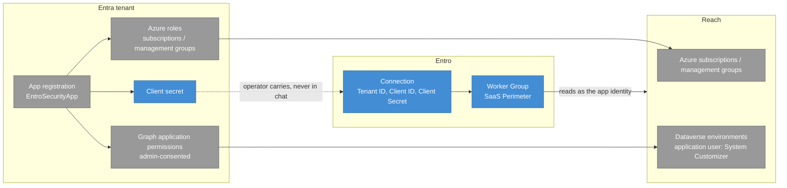

# Intro

Deliver this brief **twice**: in chat, and the same brief into the Connect log that Lock created — both before tools, inputs, or any Typed action. After Lock, open only that Lock's `catalogPath` Row catalog. Show the whole picture from that row and locked Integration path. No configuration has been performed yet, and no input has been collected yet.

## What the Integration is

- The row `summary`.
- The locked Integration path when not implicit.
- Optional capabilities on the row: name what is available; do not pre-select them.
- Connector deployment named from [connector-deployment.md](connector-deployment.md) using the locked path's `hosting` when set, else the row `hosting`.

## What connecting it needs

- **Access the operator must already hold** — the vendor console, role, or admin scope each locked path `prepSteps[].instruction` and `connectionFields[].obtainedHow` assumes.
- **Configuration tools** — locked path `configurationTools` when set, else row `configurationTools`, with `kind`, `binary` or `id`, and Fit, plus probe status once tools.md has run (unknown at first Intro).
- **Operator inputs** — name each cataloged input the run will need from the locked Integration path. Values wait for [operator-inputs.md](operator-inputs.md) after authentication.
- **Prep outline** — how many steps on the locked path, each `title` in order. Do not show the executable Typed action list.
- **Connection details** — shared tile `connectionFields` plus the locked path's `connectionFields`, secret ones marked, plus the Worker Group (Connector) named as the kind the form needs. Values stay blank at this point.

## Safety boundary

Capabilities and names only. No mutation, no install, no login, no Typed action execution.

## Intro C4

Draw the locked Integration's Configuration topology — what must exist on the vendor side for Entro to connect, and how Entro reaches it — as a mermaid `flowchart` fence in chat and in the Connect log. The node roles below are fixed; the nodes are not. Two Integrations MUST NOT draw the same fence.

| Role | What it draws | Take it from |
|---|---|---|
| Identity object | The vendor principal Entro authenticates as — app registration, IAM role, API service app | Typed action `expectedChange` and `target` |
| Permission grants | Roles, scopes, and consents attached to that principal | Typed action `expectedChange` and `mutation` |
| Reach | The vendor scopes the locked path covers | Locked Integration path Typed action `target` plus enabled optional capabilities |
| Credential | What the operator carries to Entro | Tile plus locked path `connectionFields` |
| Entro side | The Connection and its Worker Group (Connector) kind | Row plus locked Integration path `connectionFields`; `hosting` via [connector-deployment.md](connector-deployment.md) |

Rules:

- A role the locked row does not name is left out. Never invent a node to fill a role.
- Optional capabilities never appear as reach until the operator enables them during Prep.
- Secret Connection details appear as field names only — never a value.
- One subgraph for the vendor boundary, one for Entro; add a reach subgraph when the row names more than one scope.
- C4 roles via `classDef`: vendor objects `external`, Entro-side nodes `container`, the credential `store`. No Person node — the Connect run machinery (Operator, Agent + entro-connect, Skill catalog, Vendor CLI / MCP) is not in this picture.

Example — one run's output, Microsoft ecosystem with Copilot Studio enabled during Prep. Derive your own from the locked row; do not copy this fence:

**Done when:** purpose (`summary`), optional capabilities, Connector deployment, prerequisites, tools, names, fields, Prep outline, safety boundary, and an Intro C4 drawing this Integration's Configuration topology have been written in chat **and** in the Connect log. Playbook-only batch still persists this Intro; skip tools only.
