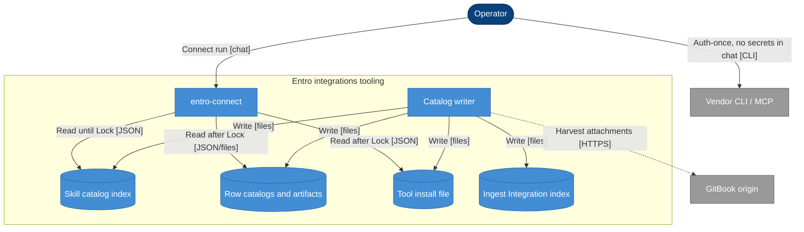

## Context

entro-connect is one model-invoked skill. The writer already emits `documentation/integrations.json` (ingest Integration index, may include page paths) and a Skill catalog copy the skill must use without opening `documentation/`. That copy is a single JSON of every full row plus inline `toolInstall`, with Skill-held files under `vendor/<gitbook-slug>/`. ADR-0001 chose generated self-contained data over per-integration skills. This change keeps that choice and splits only the Skill catalog on disk so Orientation and Lock do not load other targets' instructions.

## Architecture

%% Person: dark blue stadium #08427B
%% Container: blue rectangle #438DD5
%% Database: blue cylinder #438DD5
%% External: grey rectangle #999999
%% Solid arrow: synchronous
%% Dotted arrow: asynchronous

- **Person** — dark blue stadium (`#08427B`)
- **Container** — blue rectangle (`#438DD5`)
- **Database** — blue cylinder (`#438DD5`)
- **External system** — grey rectangle (`#999999`)
- **Solid arrow** — synchronous
- **Dotted arrow** — asynchronous

## Goals / Non-Goals

**Goals:**

- After Lock, a Connect run has one target's Row catalog in context, not the other tiles.
- One `entro-connect` skill; catalog remains generated data.
- Row catalog schema stays today's full row object.
- Ingest Integration index stays one file.
- Skill-held artifacts live in the row folder; skill-side `vendor/` is gone.
- Both skill trees stay byte-identical generated copies.

**Non-Goals:**

- Per-integration `SKILL.md` files.
- Splitting `documentation/integrations.json`.
- Splitting a row by Setup method or Coverage.
- Changing Typed action / Operator-only / checksum-at-Connect semantics except paths.
- Secrets in agent context or GitBook download at Connect time.

## Decisions

### D1: Thin index plus folders, not read-rules on one JSON

- **Choice**: Filesystem split of the Skill catalog.
- **Reason**: Opening `integrations.json` is what the skill tells the agent to do; a thinner file is the reliable disclosure boundary.
- **Considered alternatives**: Keep one JSON and instruct Grep/jq — rejected, agents still Read the file. Per-tile skills — rejected, ADR-0001 one-skill rule. Move `vendor/` only — rejected, instructions stay in the fat JSON.

### D2: One folder per Add New Account target

- **Choice**: `integrations/<kebab(tile)>[-<kebab(targetSelection)>]/catalog.json` plus artifacts at that folder's root.
- **Reason**: Catalog identity is tile + targetSelection; Coverages are not Locks.
- **Considered alternatives**: One folder per tile with several JSON files — extra lookup. Coverage folders — schema change, false Locks.

### D3: Index is a projection; Row catalog is the full object

- **Choice**: Index fields: `tile`, `targetSelection`, `summary`, `setupMethodNames`, `authenticationMethodNames`, `coverageNames`, `catalogPath`. `catalog.json` is today's complete row (including identity fields duplicated from the index).
- **Reason**: Lock and Orientation need names and summary without the heavy lists; Intro/Prep need the same object as today. Writer generates both; tests require identity fields to match.
- **Considered alternatives**: Sparse same-schema index with empty `prepSteps` — still a fat-shaped file. Omit identity from `catalog.json` — two schemas for the row. Fat stubs in the index — fake disclosure.

### D4: Tool install file sibling, not in the index

- **Choice**: `tool-install.json` at the skill root with today's `toolInstall` object. tools.md opens it after Lock and reads only keys named by the locked row's `configurationTools`.
- **Reason**: Inline `toolInstall` would make Lock load every CLI probe.
- **Considered alternatives**: Keep in index file — violates the architecture bar. Copy into each Row catalog — `az` duplicated. One file per binary — extra layout, not chosen.

### D5: Open Row catalog only after Lock

- **Choice**: Orientation uses index `summary`. Coverage names on the parent index entry resolve Copilot Studio → Microsoft Ecosystem without opening a folder.
- **Reason**: A wrong Orientation candidate must not load the wrong row.
- **Considered alternatives**: Open on candidate match — undoes the bar. Intro from index only — would rewrite Intro and drop field/step detail.

### D6: Ingest JSON stays fat; Skill catalog only splits

- **Choice**: `documentation/integrations.json` unchanged as one array of full rows (plus page paths). Writer emits the skill tree in the same run.
- **Reason**: Smaller contract; Connect already must not read `documentation/`.
- **Considered alternatives**: Split both — extra ingest consumers. Folders as the only catalog — breaks ingest index tests and README.

### D7: Explicit catalogPath; Entro-identity slugs; skill-root-relative skillPath

- **Choice**: Index carries `catalogPath` (e.g. `integrations/github-cloud-new/catalog.json`). Folder names from kebab of Entro tile and targetSelection. `skillPath` like `integrations/microsoft-ecosystem/Entro-Azure-Onboarding.ps1`.
- **Reason**: Skill never re-implements slug rules; prep.md still resolves under the skill folder; GitBook slugs go away with `vendor/`.
- **Considered alternatives**: Convention-only paths — silent misses. Folder-relative skillPath — second resolution rule. Keep GitBook folder names — fights Entro identity.

### D8: After Lock, whole Row catalog

- **Choice**: One `catalog.json` includes all Setup methods, Authentication methods, and nested Coverages.
- **Reason**: Same schema as today; AWS still ~6–8KB, which is acceptable once it is the only row loaded.
- **Considered alternatives**: Method-sliced files — more disclosure, not the same object.

### D9: ADR-0001

- **Choice**: Keep generated Skill catalog and one skill. Apply writes ADR-0002 that supersedes the “single skill JSON file” layout, not the one-skill or no-documentation-tree rules.
- **Reason**: Layout is hard to reverse and surprising without the grill record.

## Risks / Trade-offs

[Risk] Index and Row catalog identity fields drift → Mitigation: writer is sole source; validation fails on mismatch or missing `catalogPath` file.

[Risk] Agent Reads `tool-install.json` whole → Mitigation: tools.md MUST name the locked `binary`/`id` keys only (Grep/jq), not Read the file.

[Risk] Duplicate AWS trees missed in collapse → Mitigation: tests: no `vendor/` under skill trees; every pin `skillPath` exists; both trees identical.

[Trade-off] Duplicate `summary`/tile on index and Row catalog → Reason: index must serve Orientation without opening the folder; Row catalog stays a complete object.

[Trade-off] Ingest and Skill catalog are different shapes → Reason: Connect disclosure vs docs-tree consumers.

## Migration Plan

Same catalog write as today: regenerate Skill catalog tree and ingest JSON; delete leftover `vendor/` in both skill trees. No runtime deploy. Rollback: revert the writer and restore previous generated files from git.

Acceptance: ingest/catalog tests pass; every ingest target has a Row catalog; index has no `prepSteps`/`typedActions`/`connectionFields`/`toolInstall`; `toolInstall` only in `tool-install.json`; Connect skill steps name index then `catalogPath`; both skill trees identical; `./` project test command used by the repo still passes.

## Open Questions

None. Filename `tool-install.json` and directory `integrations/` are the propose assumptions from discovery.
