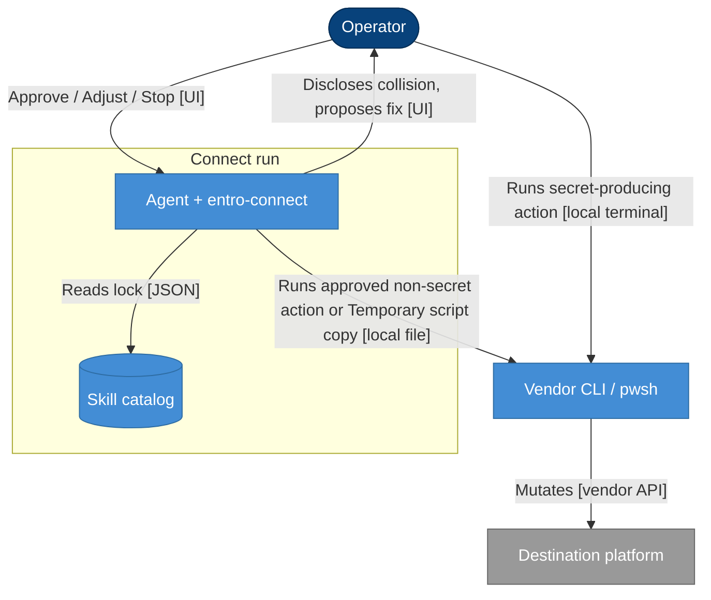

## Context

entro-connect already discloses each Typed action and gates Approve / Adjust / Stop. Execution was split by mode and by `secretProducing`. Skill-held scripts are pinned by SHA-256; the Azure onboarding script is interactive and hardcodes `EntroSecurityApp` and related names.

## Architecture

- **Person** — dark blue stadium (`#08427B`)
- **Container** — blue rectangle (`#438DD5`)
- **Database** — blue cylinder (`#438DD5`)
- **External system** — grey rectangle (`#999999`)
- **Solid arrow** — synchronous
- **Dotted arrow** — asynchronous

## Goals / Non-Goals

**Goals:**

- Skill runs non-secret-producing cataloged mutations after Approve in supervised and automated
- State the exact command or script path in the disclosure before the gate
- Keep one-time secrets out of agent context, chat, and Connect log
- Collision/replace: notify, propose, gate, retry via Temporary script copy
- Interactive vendor menus: unattended copy, or stop that step

**Non-Goals:**

- Playbook execution
- Invented commands
- In-place edits to Skill-held files
- Putting Client Secret (or login secret) into agent session
- Changing catalog `secretProducing` meaning beyond redaction
- Connector Docker/Helm

## Decisions

### D1: Same execution for supervised and automated
- **Choice**: Both Approve, then the skill runs and verifies non-secret-producing actions. Secret-producing actions stay operator-executed. Playbook is write-only.
- **Reason**: The execute modes should share behavior without crossing the credential boundary
- **Considered alternatives**: Supervised waits on evidence confirm; drop supervised

### D2: Operator runs secret-producing actions
- **Choice**: The skill discloses and gates; the operator runs the action in their terminal and vaults the secret; the skill verifies non-secret identifiers
- **Reason**: Cursor captures skill-run command output into agent context before redaction
- **Considered alternatives**: Skill-run with output redaction; a separate secret-delivery channel

### D3: Collision retry is gated
- **Choice**: Disclose existing object and proposed fix; Approve / Adjust / Stop; then re-run
- **Reason**: Replacement is destructive
- **Considered alternatives**: Auto-apply; keep only reuse/rename/stop with no temp copy

### D4: Temporary script copy
- **Choice**: Checksum original; copy; edit copy only; run copy; discard. Never write `script.skillPath`
- **Reason**: Pin stays the source of truth
- **Considered alternatives**: In-place restore; args/env only (Azure script has no args for names)

### D5: Interactive menus
- **Choice**: Bind the chosen path on the Temporary script copy so it can run unattended. If that is not possible, stop the step and have the operator run the original
- **Reason**: `Read-Host` menus cannot complete in an unattended shell
- **Considered alternatives**: Drive prompts from chat; always operator-run interactive scripts

## Risks / Trade-offs

[Risk] Skill-run terminal capture includes a Client Secret → Mitigation: keep secret-producing actions operator-executed
[Risk] Temp copy drifts from vendor intent → Mitigation: change only names/menu binding disclosed in the gate; discard after the step
[Risk] Unattended rewrite of a large interactive script is wrong → Mitigation: stop that step rather than guess
[Trade-off] Supervised and automated behave the same for execution → Reason: operator chose same-execution; playbook remains the non-running mode

## Migration Plan

N/A — skill and spec text. Apply updates both skill trees and tests. Existing Connect logs stay historical.

## Open Questions

None.
