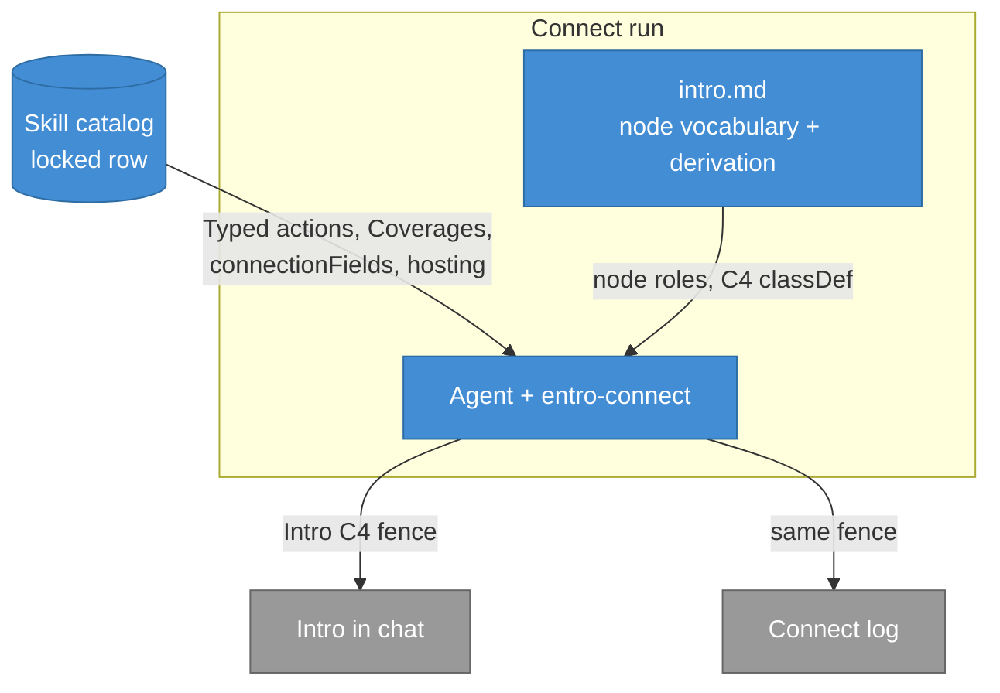
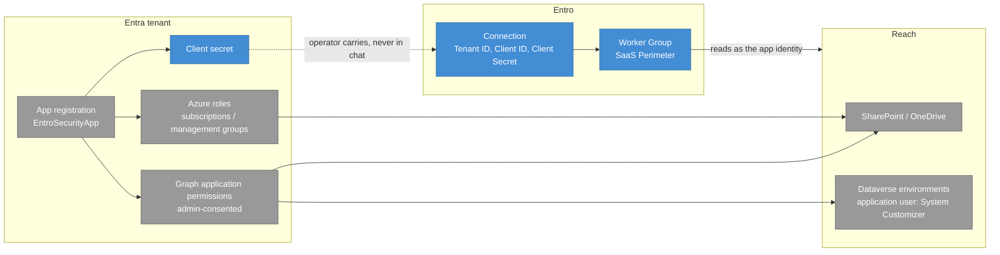

## Context

`intro.md` holds a literal mermaid fence and tells the agent to copy it every
run, and `openspec/specs/integration-automation/spec.md` pins that topology as a
MUST. The picture therefore cannot vary with the locked Integration. Discovery
settled the direction: draw the Configuration topology instead, derive it per run
from the locked row, and drop the run machinery entirely.

Constraints: the Skill catalog is the only source of Integration facts during a
Connect run (`documentation/` is off-limits), `intro.md` exists twice in lockstep
(`.agents/skills/entro-connect/` and `skills/entro-connect/`), and Intro runs
before tools, inputs, and any Typed action — so the diagram may only show what
the row already states, never a probed or configured fact.

## Architecture

The agent composes the fence from two inputs: the locked row supplies the facts,
`intro.md` supplies the roles and the C4 styling. Nothing else feeds the picture.

## Goals / Non-Goals

**Goals:**
- An operator reading the Intro sees which vendor objects must exist, what they
  can reach, and what Entro receives — before any mutation.
- Two different Integrations produce visibly different diagrams.
- The diagram is derivable from the locked row alone, with no catalog authoring.
- Locked and skipped Coverages are distinguishable: skipped ones are absent.

**Non-Goals:**
- Per-row authored diagrams or a catalog override field.
- Drawing the Connect run machinery, the vendor CLI, or the Skill catalog.
- Any change to `design.md` diagrams, the c4-diagram skill, or
  `architecture-diagrams`.
- Showing secret values, probed identifiers, or post-configuration state.

## Decisions

### D1: Node vocabulary is five roles
- **Choice**: every Intro C4 draws, in this order — **Identity object** (the
  principal Entro authenticates as), **permission grants** attached to it,
  **reach** (the vendor scopes and locked Coverages those grants cover),
  **credential** (the Connection details the operator carries to Entro), and the
  **Entro side** (the Connection and its Connector / Worker Group).
- **Reason**: fixed roles keep runs comparable and reviewable while the contents
  vary per Integration; the operator learns one picture, not 38.
- **Considered alternatives**: free-form per-Integration drawing (unreviewable,
  drifts run to run); mirroring the Prep step list as a sequence (that is already
  the Prep outline in prose).

### D2: Derivation sources are named per role
- **Choice**: Identity object and permission grants come from Typed action
  `expectedChange` and `target`; reach comes from locked Coverages and their own
  Typed action targets; credential comes from `connectionFields` with secret ones
  marked by name; the Connector comes from `hosting` via
  `connector-deployment.md`.
- **Reason**: each role maps to a field that already exists on every row, so the
  agent never invents a node.
- **Considered alternatives**: deriving from `summary` prose (unstructured,
  invites invention); deriving from `prepSteps[].instruction` only (misses the
  scopes named in Typed action `target`).

### D3: A role with no row material is omitted, not guessed
- **Choice**: if the row names no reach beyond the Identity object, the reach
  subgraph is left out; the agent MUST NOT invent a node to fill a role.
- **Reason**: Intro precedes probing; an invented node would read as a fact.
- **Considered alternatives**: placeholder nodes marked unknown (noise on thin
  rows); blocking the Intro until the row is enriched (blocks the run over a
  picture).

### D4: Two boundaries, vendor and Entro
- **Choice**: one subgraph for the vendor tenant / account / org, one for Entro;
  reach may be a third subgraph when the row names more than one scope.
- **Reason**: the credential arrow crossing from the vendor boundary to Entro is
  the point of the picture.
- **Considered alternatives**: flat node list (loses the boundary); a subgraph per
  Coverage (fragments small rows).

### D5: C4 roles keep the existing classDef palette
- **Choice**: reuse `person` / `container` / `store` / `external` classDefs from
  the current fence — vendor objects `external`, Entro-side nodes `container`,
  the credential `store`; no Person node, since the run machinery is gone.
- **Reason**: consistent with `C4 flowchart` as defined in the glossary and with
  `design.md` diagrams.
- **Considered alternatives**: a bespoke palette for Connect (diverges from the
  canonical C4 flowchart Term).

### D6: Reference rendering is Microsoft Ecosystem
- **Choice**: `intro.md` carries one worked example — Microsoft Ecosystem with
  the Copilot Studio Coverage locked — labelled as an example, not a template to
  copy.
- **Reason**: the failure mode being fixed is agents copying a literal fence; the
  example must be unmistakably illustrative.
- **Considered alternatives**: no example (derivation quality drops); several
  examples (invites copying whichever row looks closest).

Worked example, matching D1–D5:

## Risks / Trade-offs

[Risk] Derivation quality varies with row richness; a thin row draws a thin
picture → Mitigation: D3 omits empty roles rather than inventing them, and the
deferred catalog override stays available if a row derives badly.

[Risk] The agent copies the worked example instead of deriving → Mitigation: the
example is labelled as one run's output, the vocabulary is stated as roles rather
than node names, and the spec scenario asserts two Integrations differ.

[Trade-off] Runs are no longer byte-identical in their Intro C4, so the fence
cannot be diffed as a regression check → accepted: the roles and the C4 classDef
are still fixed, which is what review needs.

[Trade-off] Drawing the Configuration topology before probing means the picture
shows intent, not verified state → accepted: Intro is explicitly pre-mutation and
already states this in its safety boundary.

## Migration Plan

Documentation-only; no deployment. Sequence: rewrite `intro.md` in
`.agents/skills/entro-connect/`, mirror to `skills/entro-connect/`, land the two
delta specs, then redraw the fence in the existing `entro-microsoft-ecosystem.md`
Connect log. Rollback is reverting the commit — no run state depends on the old
fence. Acceptance: `openspec validate --all --json` passes, the repo's pytest
suite passes, both `intro.md` copies are byte-identical, and no `intro.md`
contains the old seven-node topology.

## Open Questions

None. Deferred (from discovery): a catalog override field for rows whose Typed
actions cannot name an Identity object — revisit only when such a row appears.
