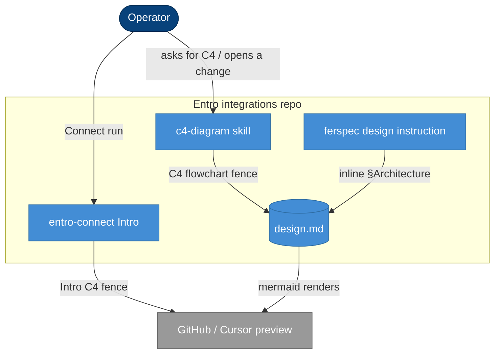

## Context

C4 pictures in this repo are either draw.io XML (linked from `design.md`) or ASCII
arrows in Connect Intro. Neither draws in GitHub or Cursor Markdown preview.
Discovery locked Mermaid `flowchart` as the only format, inline in design docs
and as a mermaid fence for Intro C4. This design.md is itself a C4 flowchart —
ferspec still documents `.drawio` until apply rewrites the schema.

## Architecture

Operator and agent author architecture in markdown. The c4-diagram skill and
ferspec write a C4 flowchart into `design.md`. entro-connect writes the Intro C4
into chat and the Connect log. Preview is an external renderer (GitHub / Cursor),
not draw.io.

## Goals / Non-Goals

**Goals:**

- One syntax: mermaid `flowchart` with C4 roles (`classDef` + subgraphs).
- `design.md` §Architecture contains the fence; no new `diagrams/*.drawio`.
- Connect Intro uses the same five-arrow topology as today, as a mermaid fence.
- c4-diagram and ferspec (including openspec-init copies in this repo) stop
  teaching draw.io as the default.

**Non-Goals:**

- Converting existing `.drawio` files.
- Native `C4Container` / `C4Context` mermaid.
- PNG/SVG export or Kroki.
- Per-Integration Intro diagrams.
- Publishing an external skill pack (this repo’s skill files only).

## Decisions

### D1: Flowchart, not C4Container
- **Choice**: mermaid `flowchart TB` with Person / Container / Database / External
  via shapes and `classDef`; system boundary as `subgraph`.
- **Reason**: GitHub (and often Cursor) does not reliably render experimental
  `C4Container`.
- **Considered alternatives**: native C4 mermaid; flowchart plus a C4Container
  sidecar. Rejected — dual syntax and broken GitHub preview.

### D2: Inline in design.md
- **Choice**: fence lives in §Architecture. No `diagrams/<change>.md` / `.mmd`.
- **Reason**: one file to preview.
- **Considered alternatives**: sidecar mermaid file. Rejected — extra click.

### D3: Drop draw.io generation
- **Choice**: skill and schema do not write or link `.drawio`.
- **Reason**: operator chose Mermaid-only.
- **Considered alternatives**: optional sidecar; always both. Rejected.

### D4: Intro C4 stays one topology
- **Choice**: same arrows as `intro.md` today, mermaid fence in chat and Connect
  log. Nodes: Operator, Agent + entro-connect, Skill catalog, Vendor CLI / MCP,
  Entro UI, Connector, Integration.
- **Reason**: D8 already rejected per-run draw.io; mermaid only changes the
  renderer.
- **Considered alternatives**: fuller C4 per run; drop Intro diagram.

### D5: Leave historical .drawio
- **Choice**: do not rewrite archived or in-flight change diagrams.
- **Reason**: conversion is out of scope.
- **Considered alternatives**: convert all. Deferred forever for this change.

### D6: Skill still named c4-diagram
- **Choice**: keep the skill name; replace XML templates with mermaid templates.
- **Reason**: triggers stay “C4 / architecture”; format is an implementation
  detail.
- **Considered alternatives**: rename to mermaid-c4. Rejected — churn without
  new meaning.

## Risks / Trade-offs

[Risk] Some viewers still show mermaid source. -> Mitigation: fences stay readable
as labeled boxes and arrows.

[Risk] Large Container diagrams get messy under mermaid auto-layout. ->
Mitigation: skill keeps layered TB layout and gap guidance; split diagrams
rather than mix C4 levels.

[Trade-off] Loss of pixel-perfect draw.io editing. -> Reason: preview in git
matters more than drag-handles.

## Migration Plan

1. Rewrite c4-diagram templates and SKILL.md to emit mermaid into `design.md`.
2. Update ferspec `schema.yaml` + `templates/design.md` and the openspec-init
   copies in this repo.
3. Replace ASCII in `entro-connect` `intro.md` (and the `skills/` copy if still
   duplicated) with the Intro C4 fence.
4. Do not touch existing `.drawio` files.
5. Validate with `openspec validate --all --json` and `.venv/bin/python -m pytest`.

Rollback: revert the skill/schema/intro commits; historical `.drawio` still
work.

## Open Questions

None.
