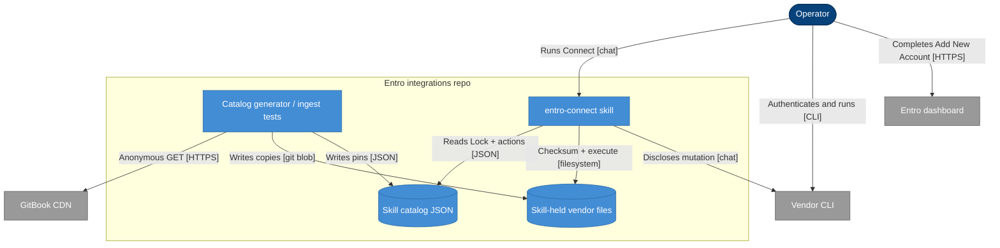

## Context

Connect approved Azure onboarding and stalled because the catalog treated Entro's
PowerShell as a GitBook download. That attachment now GETs anonymously
(`?alt=media`, no token). Other integration pages ship zips and in-page
snippets; Copilot Studio still names a customer-supplied `Entro-Onboard.ps1`.
The Integration index and `entro-connect` must hold obtainable bytes in the
skill, and every Prep step must own a Skill-held artifact action, a Doc-derived
Typed action, or an Operator-only reason.

`catalog_contracts.py` is the writer. Both skill trees receive identical vendor
files and catalogs. `documentation/` pages stay read-only source.

## Architecture

%% Person: dark blue stadium #08427B
%% Container: blue rectangle #438DD5
%% Database: blue cylinder #438DD5
%% External: grey rectangle #999999
%% Solid arrow: synchronous
%% Dotted arrow: asynchronous

- **Person** — dark blue stadium (`#08427B`)
- **Container** — blue rectangle (`#438DD5`)
- **Database** — blue cylinder (`#438DD5`)
- **External system** — grey rectangle (`#999999`)
- **Solid arrow** — synchronous
- **Dotted arrow** — asynchronous

GitBook is ingest-only. Connect never downloads from it.

## Goals / Non-Goals

**Goals:**
- Harvest GitBook attachments under integration documentation; anonymous GET; commit bytes + SHA-256 into both `entro-connect` trees
- Capture in-page onboarding snippets the same way
- Connect checksums and runs skill-local files only
- Every Prep step has a Skill-held action, Doc-derived Typed action, or Operator-only classification
- Correct Fit `preferred` when a selected path still has a silent step
- Ingest fails on unpinned attachments, tokenized origin URLs, or origin/skill checksum drift
- Port catalog hand-edits into `catalog_contracts.py`

**Non-Goals:**
- Entro API account creation, Connector deployment, per-integration skills
- Secrets in agent context
- Approve / Operation mode / Orientation beyond local checksum before Approve
- Admin, legal, SSO, connector, API-reference, and release-note attachments
- Git LFS
- Invented vendor commands

## Decisions

### D1: Vendor layout and dual trees
- **Choice**: Store files under `vendor/` in both `.agents/skills/entro-connect/` and `skills/entro-connect/`. Paths are stable, relative to that skill root (e.g. `vendor/azure/Entro-Azure-Onboarding.ps1`). Generator copies the same tree to both roots.
- **Reason**: Connect reads the skill folder; the extra `skills/` copy is packaging. One layout, two emissions.
- **Considered alternatives**: `.agents/` only (rejected — operator chose both); Git LFS (rejected — normal blobs including ~22MB Azure Continuous).

### D2: Catalog pin shape
- **Choice**: A Typed action that runs a Skill-held artifact carries `script.skillPath`, `script.checksum` (`sha256:` + 64 hex), `script.version`, and `script.originUrl` when the bytes came from GitBook. `originUrl` MUST be anonymous (`?alt=media`, no `token=`). Snippets omit `originUrl` and record `script.captureSource` as the documentation page path. Runtime uses `skillPath` only.
- **Reason**: Origin is for ingest drift. Connect must not depend on GitBook.
- **Considered alternatives**: Fetch `script.url` at Approve (rejected); keep tokenized URLs if GET works (rejected).

### D3: Harvest set
- **Choice**: Scan markdown under integration sections of `documentation/`: `cloud-and-infrastructure/`, `collaboration-and-saas/`, `code-and-ci-cd/`, `ai-and-agents/`, `security-and-identity/`, `container-registries/`, `gemini-instructions/`. Collect `files.gitbook.io` attachment URLs. Strip `token`. Require anonymous GET of `?alt=media` to match committed bytes.
- **Reason**: Matches “integration docs, not admin/legal.”
- **Considered alternatives**: Whole `documentation/` (rejected); catalog `docs_url` pages only (rejected).

### D4: Snippets
- **Choice**: Onboarding script bodies embedded in those pages (fenced or “save as `name`”) become skill files. Checksum is SHA-256 of the captured file. Ingest re-extracts and fails on drift.
- **Reason**: GCP pre-check and similar have no attachment URL.
- **Considered alternatives**: Typed actions only for snippets (rejected after operator reversal).

### D5: Unpublished names
- **Choice**: During apply, tell the operator when a page names a file with no anonymous attachment (Copilot `Entro-Onboard.ps1`, GitHub `onboard-script.zip`). If they cannot supply a public URL, author Doc-derived Typed actions. Never emit `sha256:verify-after-download`.
- **Reason**: A fake pin is how Azure stalled.
- **Considered alternatives**: Operator-only until Entro publishes (rejected).

### D6: Prep coverage and Fit
- **Choice**: Every Prep step binds exactly one of: Skill-held artifact action, Doc-derived Typed action, or Operator-only `{ reason, evidence }`. Credential-minting (including a script that prints a Client Secret) stays operator-executed. Fit `preferred` with any uncovered step fails validation until Fit is `usable` or `none` with rationale.
- **Reason**: Silence is not a decision.
- **Considered alternatives**: Cover script inventory only (rejected).

### D7: Connect runtime
- **Choice**: Before Approve, SHA-256 the skill-local file at `script.skillPath`. Mismatch → stop. Do not GET GitBook. After Approve, `mutation` runs that path (`pwsh -File` / unzip as cataloged). Root `.gitignore` may still ignore stray repo-root `.ps1` copies; committed `vendor/` files are tracked.
- **Reason**: Skill-only bytes.
- **Considered alternatives**: Re-download on checksum fail (rejected); token refresh from live page (rejected).

### D8: Ingest tests
- **Choice**: Tests (1) list GitBook attachments in the harvest set and require a matching skill file + catalog pin; (2) anonymous GET origin and compare checksum; (3) reject `token=` in stored origin URLs; (4) require every Prep step to have coverage; (5) both skill trees byte-identical for `vendor/` and `integrations.json` script pins.
- **Reason**: Generator is authority; next crawl must not drop files.

## Risks / Trade-offs

[Risk] Azure Continuous ~22MB inflates clone size → Mitigation: accepted as normal git; no LFS.
[Risk] Anonymous GET fails later (ACL change) → Mitigation: ingest fails; operator can vendor a new copy or fall back to Typed actions; Connect still has last committed bytes.
[Risk] Dual trees drift if someone edits one → Mitigation: generator writes both; test equality.
[Risk] Snippet extraction is heuristic → Mitigation: fail ingest on checksum drift; authors fix capture in contracts.
[Trade-off] Committing Entro vendor binaries vs pin-fetch → Reason: Connect must run without GitBook.
[Trade-off] CrowdStrike/Gemini zips in the skill though not every Connect Lock uses them → Reason: harvest width is all integration attachments.

## Migration Plan

1. Extend `PinnedScript` / catalog JSON (`skillPath`, anonymous `originUrl`, checksum).
2. Harvest, anonymous GET, write `vendor/` into both skill trees, record pins in `catalog_contracts.py`.
3. Capture snippets; Copilot/GitHub: inform then Typed actions if no URL.
4. Fill remaining Prep coverage; correct Fit.
5. Change `entro-connect` Prep from GitBook fetch to local checksum.
6. Stop gitignoring committed vendor paths (keep repo-root script names if still used as accidentals).
7. Regenerate both catalogs. Ingest tests green.
8. Changelog.

Rollback: revert the change commit; Connect would regain URL fetch only if that commit is restored — not required as a runtime feature flag.

Acceptance: `pytest tests/test_ingest_docs.py` (and repo test command in tasks) passes; every harvest attachment has a skill file; Connect instructions no longer download GitBook.

## Open Questions

- Copilot `Entro-Onboard.ps1` and GitHub `onboard-script.zip`: operator supplies a public URL during apply, or Typed actions ship. Owner: operator at apply.
- `entro-connect-skill` Orientation / playbook / Worker Group drift stays in that change.
