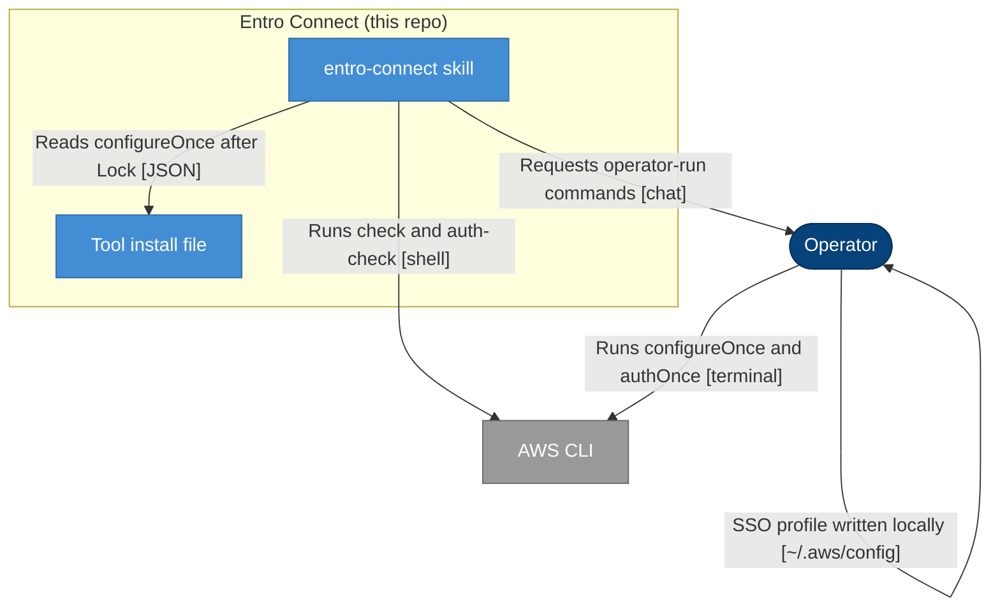

## Context

Connect already catalogs `authOnce` (`aws sso login` for AWS) and runs auth-check
before asking the operator to sign in. `aws sso login` only refreshes an IAM
Identity Center profile that already exists in the AWS config file. The operator
writes that profile with `aws configure sso`. Constraint: the wizard and login
stay in the operator’s terminal; tokens never enter chat or the Connect log.
`integration_catalog.py` is the writer for ingest `toolInstall` and both Skill
Tool install files.

## Architecture

- **Person** — dark blue stadium (`#08427B`)
- **Container** — blue rectangle (`#438DD5`)
- **External system** — grey rectangle (`#999999`)
- **Solid arrow** — synchronous

The skill does not call Entro’s API. AWS CLI is the vendor tool; `~/.aws/config`
is local to the operator, not a repo store.

## Goals / Non-Goals

**Goals:**

- Optional nested `configureOnce` on Tool install entries
- Tools step: failed auth-check → Configure once check → operator wizard if needed → auth-check again → `authOnce` only if still invalid
- AWS fills the object; other binaries omit it
- Same object in ingest `toolInstall` and Skill `tool-install.json` via the catalog writer
- Operator-run wizard and login in every Operation mode

**Non-Goals:**

- `aws_profile` / `AWS_PROFILE` as an Operator input
- Filling Configure once for `az`, `gh`, Snowflake, or MCP entries
- Agent-run `aws configure sso`
- Reading `~/.aws/credentials`
- Entro form fields
- A new ADR (additive catalog field; decisions live here)
- Terraform duplicating the AWS wizard

## Decisions

### D1: Nested `configureOnce` object

- **Choice**: Optional key `configureOnce` on a Tool install entry:

  `{ command, check: { command, sourceUrl, retrievedAt }, suitableWhen, sourceUrl, retrievedAt }`

  Omission means skip. Do not store a parallel top-level `configureCheck`.
- **Reason**: Mirrors Capability probe (`suitableWhen` + sourced command) and keeps
  the prior step next to `authOnce` instead of a second sibling that can drift.
- **Considered alternatives**: Parallel `configureCheck` + string `configureOnce` —
  rejected, two keys to keep in sync. Stretching `authOnce` into two commands —
  rejected in discovery. AWS-only schema — rejected, Snowflake can fill later.

### D2: AWS check does not read credentials

- **Choice**: `check.command` is a non-secret test of the AWS *config* file (not
  `credentials`): file exists and a line matches `sso_session` or `sso_start_url`
  (`AWS_CONFIG_FILE` or `$HOME/.aws/config`). `suitableWhen`: that file already
  has an IAM Identity Center session or start URL. `command`: `aws configure sso`.
  Source: AWS CLI IAM Identity Center profile docs; `retrievedAt` `2026-09-03`.
- **Reason**: Those keys are what `aws sso login` needs. Access keys in
  `credentials` must not be grepped. `aws configure list-profiles` alone cannot
  tell SSO from IAM user.
- **Considered alternatives**: Default-profile `aws configure get sso_start_url`
  only — misses named profiles. Parsing with Python — heavier than a cataloged
  shell check.

### D3: Writer emits both copies

- **Choice**: Add the object on `TOOL_INSTALL["aws"]` in `integration_catalog.py`
  (and `catalog_contracts.py` schema). Regenerating the catalog writes
  `documentation/integrations.json` `toolInstall` and both skill trees’
  `tool-install.json`. Hand-edits of generated JSON are overwritten.
- **Reason**: ADR-0002 already forbids a Skill-only fork of `toolInstall`.
- **Considered alternatives**: Skill file only — rejected, ingest validation
  would drift.

### D4: Tools step order

- **Choice**: After presence and Capability probe (unchanged): run auth-check.
  Valid → skip Configure once and `authOnce`, confirm environment. Invalid and
  no `configureOnce` → today’s `authOnce` gate. Invalid and `configureOnce`
  present → run `check`; suitable → skip wizard, request `authOnce`; unsuitable →
  request `configureOnce.command` in the operator terminal (every mode), then
  Continue/Help; on Continue, re-run auth-check; if valid, skip `authOnce`; if
  still invalid, request `authOnce`. Help still diagnoses non-secret output.
- **Reason**: The wizard often completes the first login; a second `sso login`
  is noise. IAM user keys that already pass auth-check never see the wizard.
- **Considered alternatives**: Always run the wizard — rejected. Help-only
  recovery — rejected in discovery.

### D5: Shared credential chain (Terraform)

- **Choice**: Terraform’s Tool install entry omits `configureOnce`. When the
  picked tool has no `configureOnce` but a *locked* Configuration tool’s
  `authCheck.command` is identical and that other entry has `configureOnce`,
  use that object (AWS before any other match). AWS CloudFormation / Assume Role
  pick `aws` directly and use the AWS object.
- **Reason**: Terraform auth-check is already `aws sts get-caller-identity`.
  Duplicating the wizard on `terraform` would ask twice when both tools are locked.
- **Considered alternatives**: `configureOnce.ref: aws` — extra schema for one
  consumer. Copy the object onto `terraform` — duplicate catalog.

### D6: No profile Operator input in this change

- **Choice**: `aws configure sso` and `aws sso login` run without a cataloged
  `--profile`. Wrong-profile failures stay Help.
- **Reason**: Discovery deferred `aws_profile`.
- **Considered alternatives**: Collect profile during Tools — follow-up.

## Risks / Trade-offs

- [Risk] Operator already has IAM user keys; auth-check succeeds and SSO is never
  configured → Mitigation: existing continue-with-this-environment gate; they can
  re-authenticate.
- [Risk] SSO lives only on a named profile; check passes but default login fails →
  Mitigation: Help diagnoses; profile Operator input is a follow-up.
- [Risk] `grep` on config is a heuristic (comments, unused sessions) → Mitigation:
  `suitableWhen` is documented; failed login still reaches Help and the wizard.
- [Trade-off] Terraform inherits Configure once by matching `authCheck.command` →
  Reason: avoids a second schema key for one chain.

## Migration Plan

1. Extend catalog contracts and `TOOL_INSTALL["aws"]`; regenerate JSON.
2. Update `tools.md` in both skill trees (and SKILL.md only if the tools-step
   summary needs one line).
3. Tests: optional object; AWS present; `az` omitted; writer copies both trees;
   auth-flow fixtures for skip / wizard / skip-login-after-wizard / terraform inherit.
4. Changelog at apply (changelog-generator). Rollback: omit `configureOnce` and
   revert `tools.md`; auth-check → `authOnce` remains valid.

N/A for services or databases — catalog and skill docs only.

## Open Questions

None blocking. Follow-up: `aws_profile` Operator input.
