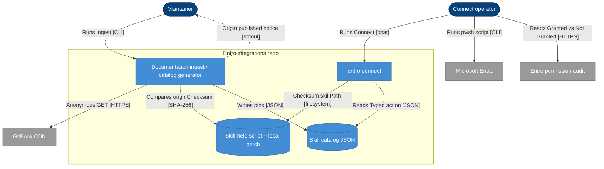

## Context

Microsoft Ecosystem Automated PowerShell can report success while Entro’s
permission audit still shows Teams, SharePoint, Copilot, and Agentic AI as Not
Granted. Create-app only assigns Mandatory plus Azure Cloud; menu 2 pre-selects
already-granted groups. The Skill-held script already diverges from GitBook for
Az.Resources 9 (`Actions`/`NotActions`). Origin drift today fails ingest when
remote bytes differ from the Skill-held copy, which fights a maintained fork.
Connect must keep checksumming `script.skillPath` and must not GET GitBook.

`catalog_contracts.py` remains the pin writer. Both `entro-connect` trees stay
byte-identical. `documentation/` stays read-only source.

## Architecture

%% Person: dark blue stadium #08427B
%% Container: blue rectangle #438DD5
%% Database: blue cylinder #438DD5
%% External: grey rectangle #999999
%% Solid arrow: synchronous
%% Dotted arrow: asynchronous

- **Person** — dark blue stadium (`#08427B`)
- **Container** — blue rectangle (`#438DD5`)
- **Database** — blue cylinder (`#438DD5`)
- **External system** — grey rectangle (`#999999`)
- **Solid arrow** — synchronous
- **Dotted arrow** — asynchronous

GitBook is ingest-only. Connect never downloads from it. The Connect operator is
never asked remote vs local.

## Goals / Non-Goals

**Goals:**
- Maintain a Local onboarding fork of `Entro-Azure-Onboarding.ps1` that grants the
  Entro permission-audit Graph/Defender set on create and as menu 2’s default
- Keep Az.Resources 9 role-definition assignment (`Actions` / `NotActions`)
- Align Teams Bot names with docs (`TeamsAppInstallation.ReadWriteSelfForUser.All`)
- Record `originChecksum` separately from Skill-held `checksum`
- When origin bytes change, ingest keeps local files, reports origin published,
  and the maintainer chooses keep-local or rebase-then-pin
- Connect still stops on Skill-held checksum mismatch and never fetches origin

**Non-Goals:**
- Connect-time GitBook fetch or a Connect remote-vs-local gate
- Making the whole script non-interactive
- Forking other vendors’ Skill-held artifacts in this change
- Secrets in agent runtime, Entro API account creation, Connector deployment

## Decisions

### D1: Pin fields for a Local onboarding fork
- **Choice**: Keep `checksum` as SHA-256 of the Skill-held bytes (what Connect
  verifies). Add `originChecksum` (`sha256:` + 64 hex of the last recorded origin
  GET). Add `localFork: true` on that pin only. Unforked pins omit both extras;
  their origin GET MUST still match `checksum`.
- **Reason**: Today origin is compared to the skill copy, which cannot stay true
  for a fork. Connect needs one checksum: the file it runs.
- **Considered alternatives**: Compare origin to skill copy and special-case
  version strings (already happens for Az.Resources) — too implicit. Store a
  second copy of Entro’s bytes in git — duplicate blobs.

### D2: Origin published vs origin drift
- **Choice**: Unforked pin: remote ≠ skill copy → validation error (unchanged).
  Local fork: remote == `originChecksum` and remote ≠ `checksum` → success, no
  notice. Local fork: remote ≠ `originChecksum` → success for catalog validity,
  do not overwrite Skill-held files, emit an origin-published notice naming
  keep-local vs take-remote (rebase). Ingest does not apply rebase by itself.
- **Reason**: Maintainer chose succeed-and-ask, not fail-closed. Connect
  end-users never see the notice.
- **Considered alternatives**: Fail ingest until a flag is passed (rejected).
  Auto-rebase on every origin change (rejected).

### D3: Rebase storage
- **Choice**: Commit
  `integrations/microsoft-ecosystem/Entro-Azure-Onboarding.local.patch` (unified
  diff against the origin bytes at `originChecksum`) in both skill trees. Take-
  remote: anonymous GET to a temp file, `patch`/`git apply` the local patch, on
  success write both trees, set `originChecksum` to the new origin hash,
  `checksum` to the patched file, refresh `version`. Conflict → stop; maintainer
  resolves the patch, then re-runs. Keep-local: leave files; set `originChecksum`
  to the new origin hash only when the maintainer explicitly records “aware,
  still forked” so the notice does not repeat — recorded as updating
  `originChecksum` without changing Skill-held bytes.
- **Reason**: Rebase is mechanical when Entro’s edits do not collide with ours.
- **Considered alternatives**: Hand-written edit steps in prep.md (drift-prone).
  Three-way merge of whole scripts in Python (heavier).

### D4: Permission set in the script
- **Choice**: Hardcode the audit set in create-app and as menu 2’s default
  selection (all groups, Mandatory always on). Source: ingested Azure
  permissions-reference plus the 2026-09-02 Entro audit gap
  (`Application.ReadWrite.All`, `Device.Read.All` as Graph application
  permissions). Teams Bot group uses `ReadWriteSelfForUser.All`, not
  `ReadWriteForChat.All`. Include docs-only `SignInLogs.Read.All`. Include
  Copilot and Defender ATP groups. Typed action `expectedChange` MUST say the
  Entro permission-audit Graph/Defender grants are present, not only
  EntroSecurityApp exists.
- **Reason**: Create-app is why the audit looked empty after a “successful” run.
- **Considered alternatives**: Coverage-driven grants (rejected). Leave menu 2
  as the only path (rejected).

### D5: Connect runtime
- **Choice**: No change to never-fetch, checksum-before-announce, Temporary
  script copy for names/menus only. Pin refresh for cmdlet shape stays “edit
  Skill-held + checksum”; this fork is that pin, plus `localFork`.
- **Reason**: Discovery locked Connect as always-local.
- **Considered alternatives**: Fetch origin at Connect (rejected).

## Risks / Trade-offs

[Risk] Entro’s next script diverges so the local patch will not apply →
Mitigation: stop rebase; maintainer updates the patch; ingest notice stays until
resolved.

[Risk] Origin-published notice is easy to miss if ingest is treated as green →
Mitigation: tests assert the notice string when `originChecksum` is stale;
README / prep.md say the maintainer must answer keep vs rebase before treating
the pin as current.

[Trade-off] Keep-local updates `originChecksum` so the notice stops, while the
fork may lag Entro’s new grants → Reason: maintainer explicitly chose local;
next origin change notifies again.

[Trade-off] `Application.ReadWrite.All` is write-scope and docs claim read-only
→ Reason: operator supplied the live Entro audit as the gap; grant it as
Optional on the audit screen.

## Migration Plan

N/A — no service deployment. Apply sequence: extend pin model and validation;
edit both copies of the script and commit the local patch; regenerate catalogs;
adjust tests that currently require origin == skill copy for this pin; changelog.

Rollback: revert the change commit; Connect again checksums the previous pin.

## Open Questions

None blocking. Keep-local’s `originChecksum` bump is the notice-ack (D3).
