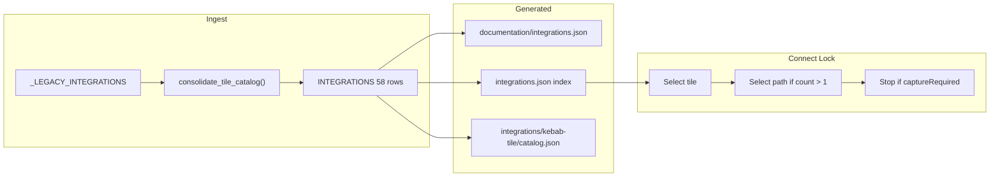

# Design — tile-path-catalog

## Context

Connect reads a thin Skill catalog index at Lock, then one row folder. Today index rows multiply when documentation split targets (GitHub ×3, Atlassian ×4) or setup methods (AWS ×1 row with 3 setups). Entro's Select Provider shows 58 tiles; connection forms show path radio cards (AWS, Atlassian) or implicit single paths.

## Goals

- One `IntegrationDefinition` per UI tile (58 total)
- `integrationPaths` own prep, tools, fields, inputs, typed actions, hosting overrides
- Optional capabilities are not Lock-selected; just-in-time consent during Prep
- Capture-required stubs stop Connect before Lock
- Preserve documented behavior for 27 integrations via consolidation, not deletion

## Non-Goals

- Full UI capture for all 58 tiles
- Renaming ingested GitBook pages
- Changing Operation modes or secret handling

## Architecture

## Decisions

### D1 — Consolidation layer

Keep `_LEGACY_INTEGRATIONS` tuple unchanged; `consolidate_tile_catalog()` produces runtime `INTEGRATIONS`. Reduces hand-editing risk and keeps git history on row definitions.

### D2 — Path construction from legacy rows

| Legacy shape | Path names |
|---|---|
| `target_selection` set | Renamed selection (Atlassian UI labels) |
| setup × auth | `{setup} — {auth}` |
| setup only | setup method name |
| auth only | auth method name |
| neither | implicit singleton (empty `integrationPathNames` on index) |

### D3 — Folder slug

`integrations/{kebab(tile)}/` only. ADR-0003 supersedes ADR-0002 target-based slugs. Migrate Skill-held artifacts (e.g. `aws/`, `microsoft-ecosystem/`) via slug alias map during generation.

### D4 — Optional capabilities

Former `coverages` become `optionalCapabilities` on the tile row. Microsoft ecosystem drops SharePoint/OneDrive (now tiles). AWS adds Vault management / NHI Management from UI; CloudTrail S3 stays optional.

### D5 — Capture-required stubs

31 tiles have `captureRequired: true`, `pathEvidence: capture-required`, summary only,
portal-only tools, and no paths: 29 additional UI tiles plus the newly split SharePoint
and OneDrive tiles.

## Risks

- Documentation-derived paths may diverge from live forms → operator screenshot verification prompt
- Large test rewrite in `test_ingest_docs.py`
- Concurrent `complete-gcp-connect-actions` may conflict on GCP paths — rebase after merge

## Migration Plan

1. Add migration module + new types/serializers/validators
2. Regenerate JSON + migrate row folders (aliases for renamed slugs)
3. Update entro-connect procedure files (both trees)
4. Rewrite tests; run full suite + `openspec validate`

## Open Questions

None.
