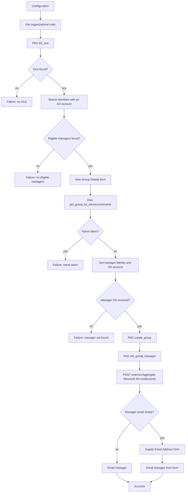
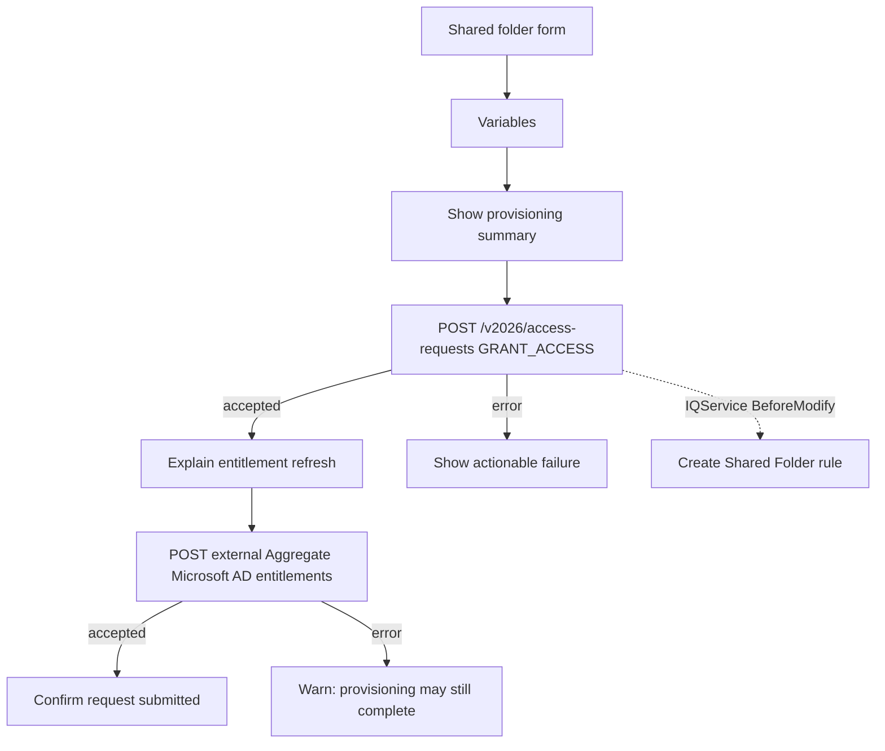

# Active Directory Privileged Tasks

## Purpose

Interactive ISC workflows that let an operator create an Active Directory **security group** (via Privileged Action Gateway) or a **CIFS shared folder** (access request plus an IQService BeforeModify rule), extracted from a working demo tenant.

`ConnectorBeforeModify - Create Shared Folder in Active Directory.ps1` is built from [PowerShell Rule Template](../PowerShell%20Rule%20Template/README.md). Bootstrap, logging, redaction, and exit handling come from the template. Folder, share, and group work live in the custom process section.

## Overview

Two operator-facing interactive processes:

1. **Create a Group in Active Directory** — Collects name, manager, group type, and OU. Privileged Action Gateway (PAG) lists OUs, checks the name is free, creates the group, sets `managedBy`, and emails the manager. The manager dropdown only offers identities that already have an account on the configured AD source, because `managedBy` needs their distinguished name.
2. **Create a Shared Folder in Active Directory** — Collects folder, parent path, and share name. Submits a short-lived access request whose `memberOf` comments carry folder metadata. The AD source **ConnectorBeforeModify - Create Shared Folder in Active Directory** rule creates the directory, SMB share, and three permission groups. A child workflow then aggregates AD entitlements.

## Artifacts

| File | Type | Purpose |
|---|---|---|
| `Workflow - Create a Group in Active Directory.json` | Workflow export | Interactive group creation (PAG) |
| `Workflow - Create a Shared Folder in Active Directory.json` | Workflow export | Interactive shared-folder request |
| `Workflow - Aggregate Microsoft Active Directory entitlements.json` | Shared workflow export | External trigger: wait, then aggregate the configured AD source |
| `Forms - Active Directory Privileged Tasks.json` | Form export (array) | All three forms for VS Code form import |
| `ConnectorBeforeModify - Create Shared Folder in Active Directory.ps1` | ConnectorBeforeModify rule | IQService script (PowerShell Rule Template) that creates the share from access-request comments |

> **Form import format:** The SailPoint VS Code extension expects a **JSON array** (`[{ version, self, object }, …]`). Import `Forms - Active Directory Privileged Tasks.json` first. Fields must sit inside a **SECTION**. HTML ampersands are already escaped as `&#39;` / `&nbsp;` where the tenant stored them.
>
> Two rules the forms import enforces, each rejecting the whole form definition:
>
> - `object.owner` is required (`{ type: IDENTITY, id, name }`). Omitting it fails with `owner seems empty`. Point the `id` at a valid identity in the target tenant before importing.
> - `REGEX` validation patterns are compiled with Go RE2, so lookahead (`(?=…)`), lookbehind, and backreferences fail with `incorrect validation config value for validation type 'REGEX'`. Express length limits with quantifiers instead — `^[A-Za-z0-9]([A-Za-z0-9 _.-]{0,62}[A-Za-z0-9])?$`.

### Exported objects

- **Workflows:** `Create a Group in Active Directory`, `Create a Shared Folder in Active Directory`, `Aggregate Microsoft Active Directory entitlements`
- **Form definitions:** `New Security Group Details`, `Supply Email Address`, `Create Shared Folder in Active Directory`
- **Connector rule:** `ConnectorBeforeModify - Create Shared Folder in Active Directory`, attached as `nativeRules` on the AD source

Tenant-specific values (PAG instance, Parameter Storage ids, source id, domain controller) are placeholders. Re-bind them after import. The **emea-tes-team** working values below are examples only.

## Architecture

### Create a Group in Active Directory



**Trigger:** `idn:interactive-process-launched` (interactive process event).

PAG commands on this workflow:

| Command | Role |
|---|---|
| `pag:active_directory:list_ous` | Populate the Location dropdown |
| `pag:active_directory:get_group_by_samaccountname` | Duplicate name check |
| `pag:active_directory:create_group` | Create the group |
| `pag:active_directory:set_group_manager` | Set `managedBy` |

### Create a Shared Folder in Active Directory



**Trigger:** `idn:interactive-process-launched`.

The access request uses a **requestable dummy entitlement** on the AD source. The request item `comment` is JSON (`folderName`, `parentFolder`, `shareName`). The rule reads that JSON from the `memberOf` attribute request comments, validates the parent against the source allowlist, then:

1. Creates `{parentFolder}\{folderName}` if missing.
2. Creates an SMB share named `shareName` with Full Access for `BUILTIN\Administrators`.
3. Creates three global groups in the configured OU and grants NTFS **Read**, **Modify**, and **FullControl**:
   - `{shareName} - Read Only Users`
   - `{shareName} - Read Write Users`
   - `{shareName} - Full Access Users`

**Aggregate Microsoft Active Directory entitlements** is a shared component used by both interactive workflows. Its **external HTTP** trigger waits 1 minute, then calls `POST /v2026/sources/{sourceId}/load-entitlements`. The tenant may use a source-specific name such as `Aggregate Microsoft Active Directory @emea-tes-team (Users) entitlements`.

## Workflow configuration (Set / Variables steps)

PAG and HTTP actions take credentials from **Parameter Storage**, not the workflow Credential Provider (`secrets://`). Create the parameters in the tenant, then bind the placeholder ids.

### Group workflow

PAG steps use `param_credentialType` `paramSPS` and a **Username and Password** parameter (`type` `1.1`) mapped as `auth_username` → `username`, `auth_password` → `password`. Bind `YOUR_AD_CREDENTIAL_PARAMETER_ID` on every PAG action (`list_ous`, `get_group_by_samaccountname`, `create_group`, `set_group_manager`).

| Variable | Placeholder | Purpose |
|---|---|---|
| Domain Controller Address | `YOUR_DOMAIN_CONTROLLER` | Host for PAG LDAP (port **636**; `verify_cert` is **false** in the export) |
| Domain FQDN | `ad.example.com` | AD DNS name |
| Search Base DN | `OU=Demo,DC=example,DC=com` | OU listing scope (One Level) |
| Active Directory Source Name | `YOUR_AD_SOURCE_NAME` | Exact source display name. Drives the eligible-manager search on **Get Eligible Managers** |

`YOUR_AD_SOURCE_NAME` appears **twice**, and both must carry the same value:

1. The **Active Directory Source Name** configuration variable, read by the `sp:get-identities` search query `@accounts(source.name:"{{ $.defineVariable.activeDirectorySourceName }}")`.
2. The JSONPath filter on **Get Active Directory Manager Account**: `$.getAccounts.accounts[?(@.sourceName == 'YOUR_AD_SOURCE_NAME')].nativeIdentity`. A JSONPath filter cannot read a workflow variable, so this one is a literal.

Get the exact name from the tenant rather than typing it:

```bash
sail api get '/v3/sources?filters=type eq "active-directory-direct"' --env <env> --jsonpath '$[*].name'
```

Also replace `YOUR_PAG_INSTANCE_ID`, `YOUR_PAG_SPEC_ID`, `YOUR_GROUP_WORKFLOW_ID`, `YOUR_AGGREGATION_WORKFLOW_ID`, and `YOUR_AGGREGATION_EXTERNAL_TRIGGER_TOKEN`. The selected form value drives PAG `groupType` (Global, Universal, or Domain Local).

### Shared-folder and aggregation workflows

Tenant API calls (the access request and the aggregation `load-entitlements` call) are HTTP **v3** and share one OAuth pair from Parameter Storage: `YOUR_OAUTH_PARAMETER_ID` (**OAuth 2.0 Client Credentials Grant**, `type` `1.4`) and `YOUR_OAUTH_SCOPES_PARAMETER_ID` (**OAuth 2.0 Scopes**, `type` `3.1`).

Calls that start the shared aggregation workflow are different. An external trigger issues its own ad hoc client credentials, so both parent workflows post to `.../workflows/execute/external/{id}` with `param_authenticationRef` `none` and a static `Authorization: Bearer …` header. Copy that token from the aggregation workflow's external trigger and replace `YOUR_AGGREGATION_EXTERNAL_TRIGGER_TOKEN` in the group and shared-folder workflows; it is not a Parameter Storage value.

| Variable | Placeholder | Purpose |
|---|---|---|
| Active Directory Source | `YOUR_AD_SOURCE_ID` | Source UUID (shared-folder and aggregation) |
| Entitlement | `YOUR_TRIGGER_ENTITLEMENT_ID` | Requestable dummy entitlement that triggers BeforeModify |
| url | `https://{tenant}.api.identitynow-demo.com` | ISC API base |
| sunset | now + 3 minutes | Access-request `removeDate` in the demo export |

Replace `YOUR_SHARED_FOLDER_WORKFLOW_ID` in the interactive trigger filter and `YOUR_AGGREGATION_WORKFLOW_ID` in the child-workflow URL.

### emea-tes-team example

Working bind values from tenant `emea-tes-team` (`company24509-poc`). Copy the pattern, not the ids, unless you are targeting that tenant.

| Setting | Example |
|---|---|
| Domain Controller Address | `10.0.0.250` |
| Domain FQDN | `seri.sailpointdemo.com` |
| Search Base DN | `OU=emea-tes-team,OU=Demo,DC=seri,DC=sailpointdemo,DC=com` |
| AD source name (config variable and JSONPath) | `Microsoft Active Directory @emea-tes-team (Users)` |
| AD source id | `a67f790e42c04da3bdba05d7dd7ccdd9` |
| Trigger entitlement | `a99894dc5bf937d093b1c081c636f111` (`Folder Request`, requestable) |
| `SharedFolderAllowedParentPaths` | `["C:\\Shared folders"]` |
| `SharedFolderGroupOU` | `OU=Groups,OU=emea-tes-team,OU=Demo,DC=seri,DC=sailpointdemo,DC=com` |
| API url | `https://company24509-poc.api.identitynow-demo.com` |
| PAG instance id | `10eb65ee-c9b7-498d-9f98-59cf9ac4624b` |
| PAG spec id | `7e479f41-e367-4e20-85c8-9e2936aa4658` |
| AD bind credential (`1.1`) | `c4c32517-5573-4dc1-adbb-536723e01304` (`SERI\Administrator`) |
| OAuth client credentials (`1.4`) | `b1ac0177-b66b-4ada-840e-73f500f4822b` (`Mr Robot - PAT`; token URL `{api}/oauth/token`, credentials in **HEADER**) |
| OAuth scopes (`3.1`) | `4b5bad41-562e-4622-b3df-1cd7b1e5ccb2` (`sp:scopes:all`) |
| Group workflow id | `98e59c88-577d-4e91-8e6b-ddd46328a49c` |
| Shared-folder workflow id | `0ccad25f-b46b-441a-91e6-3b5462a49ba4` |
| Aggregation workflow id | `8eafc1ce-8310-4283-afc2-d37e75f08574` |

Secrets stay in Parameter Storage. The export never stores the bind password or the PAT client secret.

## Forms

### New Security Group Details

| Field | Type | Notes |
|---|---|---|
| Group name | TEXT | Required; 1–64 safe characters. Used as sAMAccountName and CN |
| Group manager | SELECT | Required FORM_INPUT `managers` from `sp:get-identities` (`label` = `displayName`, `value` = identity `id`) |
| Group type | SELECT | Required: Global / Universal / Domain Local Security; passed to PAG |
| Organizational unit | SELECT | Required FORM_INPUT `locations` from PAG `list_ous` (`label` = name, `value` = distinguishedName) |

The guidance is embedded in this form rather than shown on a separate introduction screen, reducing the flow by one click.

### Supply Email Address

Shown when the manager identity has no email. The EMAIL field is required and includes clear notification guidance.

### Create Shared Folder in Active Directory

| Field | Type | Notes |
|---|---|---|
| Folder name | TEXT | Required; 1–64 safe characters |
| Parent folder | SELECT | Static in the export (`C:\Shared folders`). Change to your IQService-visible path |
| SMB share name | TEXT | Required; 1–40 letters, numbers, hyphens, or underscores |

## Installation

Import order matters. Workflows reference form definition IDs from this export; after import, ISC assigns new form IDs — update the workflow form steps to match.

1. Import **`Forms - Active Directory Privileged Tasks.json`**.
2. Create the **ConnectorBeforeModify - Create Shared Folder in Active Directory** connector rule from `ConnectorBeforeModify - Create Shared Folder in Active Directory.ps1`. The `$ConnectorRuleName` constant must match the ISC display name. Add it to the AD source `nativeRules` list (keep every other native rule that source already uses). Configure:
   - `SharedFolderAllowedParentPaths`: list (or semicolon/newline-delimited string) of exact parent paths the rule may write to.
   - `SharedFolderGroupOU`: distinguished name where the permission groups are created.
   - Optional `SharedFolderDebugEnabled`: `true` adds process debug lines.
3. Import the three workflow JSON files.
4. Create a requestable dummy entitlement on the AD source and put its id in the shared-folder workflow **Entitlement** variable.
5. Bind PAG instance/spec, Parameter Storage AD credential (`1.1`) and OAuth/scopes (`1.4` / `3.1`) ids, domain, API URL, shared aggregation workflow ID and external trigger token in both parent workflows, and imported form IDs. Set the AD source name in both places listed under [Group workflow](#group-workflow).
6. Create two **interactive processes** that launch the group and shared-folder workflows.
7. Enable the workflows. Put the aggregation workflow id into the group and shared-folder execute URLs (`.../execute/external/{id}`) and its external trigger token into their `Authorization` headers.

### IQService (shared folder only)

On each IQService host that may run the rule:

- The IQService Windows Service **Run As** account must be able to create and write under `<IQService>\scripts`.
- That account must be able to create directories, SMB shares, AD groups, and NTFS ACLs on the parent folder.
- RSAT **ActiveDirectory** module and SMB cmdlets (`New-SmbShare`) must be available.
- PowerShell execution policy must allow the generated runtime script to run.

Request XML is parsed through `$ctx` and `Get-SharedFolderRequestComments`. `Utils.dll` is not required. The ActiveDirectory module is imported only when `memberOf` comments contain shared-folder JSON.

Template source attributes control failure reporting and diagnostics:

| Attribute | Default | Behavior |
|---|---:|---|
| `PwshSilentError` | `false` | `false` exits 1 so IQService reports a failed rule; `true` exits 0 and leaves the failure only in the log |
| `PwshUnsafePayloadLogging` | `false` | Keep `false`; `true` writes unredacted request/application payloads |
| `PwshReplay` | `false` | `true` writes a replay script for the invocation under `<IQService>\scripts` |
| `SharedFolderDebugEnabled` | `false` | Adds validated metadata and process detail to the per-run log |

## Post-import checklist

- [ ] Forms imported; workflow `formDefinitionId` values updated to the new ids.
- [ ] PAG instance, spec, DC, FQDN, base DN, workflow ids, Parameter Storage AD credential (`1.1`), and OAuth/scopes (`1.4` / `3.1`) set on the group workflow.
- [ ] AD source name set in **both** places: the **Active Directory Source Name** variable and the **Get Active Directory Manager Account** JSONPath. Launch the process once and confirm the manager dropdown is populated; an empty dropdown means the name is wrong.
- [ ] AD source id, dummy entitlement, API URL, workflow id, and aggregation workflow id set on the shared-folder workflow.
- [ ] Tenant API HTTP Request actions are v3 and bind Parameter Storage OAuth (`1.4`) and scopes (`3.1`) ids; the two `execute/external` calls use the aggregation external trigger token. Secrets stay in the tenant, not git.
- [ ] `ConnectorBeforeModify - Create Shared Folder in Active Directory` exists in the tenant **and** its exact name is in the AD source `nativeRules`; confirm a per-run log under `<IQService>\scripts`.
- [ ] `SharedFolderAllowedParentPaths` and `SharedFolderGroupOU` set on the AD source. Both are required; the rule throws without them.
- [ ] Parent folder options on the form exist on the IQService host and exactly match `SharedFolderAllowedParentPaths`.
- [ ] Interactive processes linked; workflows enabled.
- [ ] Test group path: unique name creates a group and emails the manager; duplicate name fails.
- [ ] Test group recovery: manager lookup, PAG creation, manager assignment, and email failures show the intended actionable message.
- [ ] Test share path: folder and three groups appear; entitlement aggregation runs after the wait.
- [ ] Test share recovery: access-request failure creates nothing; refresh failure explains that provisioning may still complete.

## Troubleshooting

### `Null Object XML returned from cloud for type [Rule] with identifier[…]`

The access request fails on the AD source before any PowerShell runs. IQService resolves every `connectorAttributes.nativeRules` entry by name against the tenant, and one name resolved to nothing. The rule was never created, was deleted, or its ISC display name does not match the `nativeRules` string exactly.

List the tenant's rules and compare against the source:

```bash
sail api get /beta/connector-rules --env <env> --jsonpath '$[*].name'
sail api get /v3/sources/<sourceId> --env <env> --jsonpath '$.connectorAttributes.nativeRules'
```

Every entry in the second list must appear in the first, character for character. If the rule is missing, create it from the `.ps1`; if the name differs, fix whichever side is wrong. The script body is not implicated — check it separately with `POST /beta/connector-rules/validate` (`{"version":"1.0","script":"…"}`), which returns `{"state":"OK"}` for a well-formed rule.

### `Parent folder '…' is not listed in SharedFolderAllowedParentPaths`

`SharedFolderAllowedParentPaths` is unset or does not contain the value the form submitted. Matching is exact after trimming whitespace and trailing separators, and is case-insensitive. The form's **Parent folder** options and this allowlist must be kept in sync.

### `SharedFolderGroupOU must be an organizational-unit distinguished name…`

`SharedFolderGroupOU` is unset or does not match `OU=…,DC=…`. Set it to an OU that already exists; the rule creates groups in it but does not create the OU itself.

### `supplied distinguished name input value must not be empty` when setting the manager

The group was created and `set_group_manager` was called with an empty `manager_distinguishedName`. The manager-account JSONPath on **Get Active Directory Manager Account** matched none of the manager's accounts, almost always because its `sourceName` literal is still `YOUR_AD_SOURCE_NAME` or does not match the source display name character for character. Compare the filter against the accounts the step actually returned:

```bash
sail api get /beta/workflow-executions/<executionId>/history --env <env> \
  --jsonpath '$[?(@.attributes.stepName == "getAccounts")].attributes.result'
```

An unresolved JSONPath leaves the variable as an **empty string**, not null, so `IsPresent` and `IsNull` both wave it through. The gate before `create_group` therefore compares the value with `StringStartsWith` `CN=`; keep it that way, or a manager without an AD account will leave an unmanaged group behind in the directory.

### A failure message shows `{{ $.someStep.error.… }}` literally

The JSONPath did not resolve, so the engine printed the template instead of a value. Step references use the **runtime step key**, which is the display name with separators removed and only the *first character* lowercased. An acronym keeps its remaining capitals:

| Step name | Runtime key |
|---|---|
| `Define Variable` | `defineVariable` |
| `HTTP Request` | `hTTPRequest` |
| `HTTP Request 2` | `hTTPRequest2` |
| `HTTP Request - Schedule Entitlement Refresh` | `hTTPRequestScheduleEntitlementRefresh` |

`$.httpRequest` looks right and is wrong. Read the authoritative key from an execution history entry, where each event carries `stepName`:

```bash
sail api get /beta/workflow-executions/<executionId>/history --env <env> --jsonpath '$[*].attributes.stepName'
```

### PAG returns `auth_username.$ is not a valid input`

A PAG step has `inputForPag_auth_username` / `inputForPag_auth_password` attributes pointing at variables that do not exist. An unresolvable `.$` reference is passed through with the key intact, so PAG receives an input literally named `auth_username.$` and rejects it as Bad Configuration.

Delete both attributes. When `param_credentialType` is `paramSPS`, Parameter Storage already supplies those two inputs through `param_credential.mapping`; the step must not also set them itself. The workflow builder can reintroduce them when you edit a PAG step in the UI, so re-diff against this export after UI edits.

### Access request fails immediately with no provisioning

Check that the **Entitlement** variable holds an entitlement id and not the source id — they are easy to transpose, and the export ships both as placeholders. The entitlement must also be requestable:

```bash
sail api get '/beta/entitlements?filters=source.id eq "<sourceId>"&limit=250' --env <env> \
  --jsonpath '$[?(@.requestable == true)].name'
```

### Dummy **Folder Request** entitlement is not removed after sunset

IQService runs this BeforeModify rule on every Modify, including the later `memberOf` Remove for the trigger group. A non-empty comment that is not shared-folder JSON (ISC often sends `fix` on generated revokes) used to make `ConvertFrom-Json` throw, `Exit-Rule 1`, and abort the pending Remove. The rule now skips those comments with exit 0. Re-upload the updated script to ISC, then retry the revoke or wait for the next sunset.

### No log under `<IQService>\scripts`

Follow the [PowerShell Rule Template troubleshooting steps](../PowerShell%20Rule%20Template/README.md). A missing log means the script never ran, which usually points back to the rule-resolution failure above rather than to the script.

## Limitations

- **Manager dropdown size** — `sp:get-identities` returns a single search page, so at most 250 identities are offered as managers. Large directories need a narrower query (an identity attribute or a saved search) instead of `@accounts(source.name:…)`.
- **Dummy entitlement** from the source tenant was not present at export time (`404`). You must create a requestable stand-in on your AD source.
- **PAG duplicate lookup contract** — The exported `get_group_by_samaccountname` action treats its success path as “group exists” and its catch path as “name available.” Confirm that your PAG command reports a missing group through catch; do not enable the workflow if other command errors use the same catch path.
- **Create Shared Folder** skips non-Modify operations, Modify plans with no `memberOf` comments, and Modify plans whose comments are not shared-folder JSON (`folderName`, `parentFolder`, `shareName`). Ordinary access-request comments such as `fix` must skip with exit 0 so IQService still applies the pending `memberOf` change (for example, sunset removal of the dummy **Folder Request** group). It still rejects unsafe folder/share names, relative or non-allowlisted parent paths, and an invalid `SharedFolderGroupOU` (`PwshSilentError` still applies). Existing groups get inheritable NTFS ACLs applied again rather than being skipped.
- **Sunset of 3 minutes** on the access request is demo-oriented; lengthen it if IQService may not finish before access is removed.
- **PAG** is not exported as an object. You need a Privileged Action Gateway instance that supports the four Active Directory commands above.
- **Owner identity references** in the JSON are placeholders (`YOUR_OWNER_IDENTITY_ID`, `YOUR_OWNER_NAME`).

## Related patterns

- [PowerShell Rule Template](../PowerShell%20Rule%20Template/) — IQService bootstrap used by `ConnectorBeforeModify - Create Shared Folder in Active Directory.ps1`.
- [Active Directory Home Folders](../Active%20Directory%20Home%20Folders/) — AfterCreate folder + NTFS ACLs from source attributes.
- [Active Directory OU Management](../Active%20Directory%20OU%20Management/) — BeforeCreate/BeforeModify OU (and optional group) creation.
- [Identity Match & Onboard](../Identity%20Match%20%26%20Onboard/) — Interactive process + form import format.
