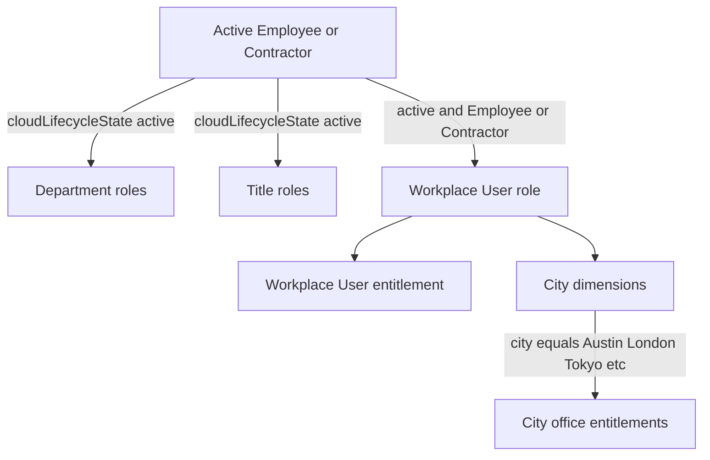

# Demo Data

## Purpose

Reusable bootstrap for a small ISC access model seeded from the **emea-tes-team** tenant catalog: delimited-file sources, creative entitlements, source applications, birthright title and department roles, and one dimensional **Workplace User** role with city dimensions.

## Overview

| Domain | Source / application | Roles |
| --- | --- | --- |
| Departments | **Department Services** | `<department> Department` (13) |
| Job titles | **Workforce Access** | `<title>` (81) |
| Offices | **Workplace Access** | Dimensional **Workplace User** + one city dimension each |
| Customer relationship management | **Customer 360** | 10 requestable access profiles |

Entitlement names describe related capabilities and are never identical to the role or attribute value (except the shared **Workplace User** entitlement). Each department role, title role, and city dimension carries **one or two** entitlements.



## Artifacts

| File | Purpose |
| --- | --- |
| [`config/demo-access-model.json`](config/demo-access-model.json) | Declarative catalog: sources, entitlements, roles, dimensions |
| [`config/demo-sod-policies.json`](config/demo-sod-policies.json) | Conflicting-access SoD policies, mitigating controls, and policy↔control assignments |
| [`csv/department-services.csv`](csv/department-services.csv) | Department capability entitlements |
| [`csv/workforce-access.csv`](csv/workforce-access.csv) | Job-title capability entitlements |
| [`csv/workplace-access.csv`](csv/workplace-access.csv) | Workplace User + city entitlements |
| [`csv/customer-360.csv`](csv/customer-360.csv) | Requestable Customer 360 entitlements |
| [`Demo Data.ps1`](Demo%20Data.ps1) | Bootstrap entry script (PSSailpoint) |
| [`modules/ISC.DemoData.psm1`](modules/ISC.DemoData.psm1) | Model load, payloads, reconcile helpers |
| [`tests/Test-DemoData.ps1`](tests/Test-DemoData.ps1) | Offline invariant and payload tests |

## Tenant catalog snapshot

Seeded from identity search on `emea-tes-team` (250 identities):

- **Departments:** Accounting, Engineering, Human Resources, Information Technology, Finance, Inventory, Asset Management, Sales, Call Center, Nursing, Regional Operations, Doctors, Executive Management
- **Titles:** 81 distinct values from `titleHistory` (for example Call Center Representative, Accounts Payable Analyst, Information Security Analyst)
- **Cities:** Austin, San Jose, Brussels, London, Sao Paulo, Singapore, Tokyo, Taipei, Munich, New York
- **userType:** Employee, Contractor, Internal (Workplace User uses Employee or Contractor)
- **Lifecycle:** `cloudLifecycleState == active`

### Title attribute

Birthright title roles use **`titleHistory`** (multi-value / bracketed tokens such as `[Accounts Payable Analyst]`), which is where current titles live on this tenant. Membership is `CONTAINS` on `attribute.titleHistory`.

## Assignment criteria

| Role | Criteria |
| --- | --- |
| `<department> Department` | `cloudLifecycleState == active` AND `department == <value>` |
| `<title>` | `cloudLifecycleState == active` AND `titleHistory CONTAINS [<value>]` |
| **Workplace User** | `cloudLifecycleState == active` AND (`userType == Employee` OR `userType == Contractor`) |
| City dimension | `city == <city>` (applies only to Workplace User members) |

Enable **city** as a dimension attribute for Dynamic Access Roles before creating dimensions.

## Prerequisites

- PowerShell 5.1+ or PowerShell 7+
- [PSSailpoint](https://www.powershellgallery.com/packages/PSSailpoint) module
- Named environment in `~/.sailpoint/config.yaml` plus `SAIL_*` env vars or a local `config.json`
- Operator PAT with rights to manage sources, entitlements, source apps, and roles

## Usage

Dry run (no tenant writes):

```powershell
cd "ISC/Demo Data"
./Demo` Data.ps1 -Environment emea-tes-team -WhatIf
```

Apply (skip existing objects):

```powershell
./Demo` Data.ps1 -Environment emea-tes-team
```

Reconcile existing objects:

```powershell
./Demo` Data.ps1 -Environment emea-tes-team -ExistingItemAction Update
```

Optional owner override:

```powershell
./Demo` Data.ps1 -Environment emea-tes-team -OwnerId <identity-id>
```

### Offline tests

```powershell
pwsh -File "./tests/Test-DemoData.ps1"
```

## Bootstrap order

1. Create or reuse Delimited File sources and upload/import entitlement CSVs
2. Attach a **Create Account** provisioning policy (maps `uid`/`displayName` and profile fields)
3. Aggregate entitlements (required before roles can resolve entitlement ids)
4. Create 10 requestable **Customer 360** access profiles
5. Create source applications
6. Create standard title and department roles with entitlements attached directly
7. Create dimensional **Workplace User** role, then city dimensions
8. Create / update **SoD mitigating controls**, then conflicting-access **SoD policies**, from `config/demo-sod-policies.json`

If entitlements are not yet searchable after import, the script reports `missing` / `manual` rows. Re-aggregate, then re-run with `-ExistingItemAction Update`.

## SoD policies

Twenty preventive **CONFLICTING_ACCESS_BASED** policies cover Finance, HR/Payroll, Security/IT, Engineering, and Supply chain. Each policy is an entitlement-vs-entitlement conflict owned by **slpt.services**, with manager violation assignment. Allowed mitigating controls are assigned as `allowedControls` with type `COMPENSATING_CONTROL`.

| ID | Left entitlement(s) | Right entitlement(s) | Associated roles | Allowed controls |
| --- | --- | --- | --- | --- |
| SOD-FIN-01 | Invoice Settlement Queue | Vendor Payment Release | Accounts Payable Analyst *(same-role bundle)* | Manager dual review, Treasury dual control, Remediate |
| SOD-FIN-02 | Vendor Master Desk | Vendor Payment Release | Accounting Department ↔ Accounts Payable Analyst | Manager dual review, Treasury dual control, Remediate |
| SOD-FIN-03 | Vendor Payment Release | Bank Portal Access | Accounts Payable Analyst ↔ Treasury Analyst | Treasury dual control, Manager dual review, Remediate |
| SOD-FIN-04 | Credit Memo Desk | Cash App Desk | Accounts Receivable Analyst ↔ AR Accounting Manager | Manager dual review, Remediate |
| SOD-FIN-05 | Ledger Close Desk | Audit Workpaper Desk | Accounting Department ↔ Internal Auditor | Audit independence attestation, Remediate |
| SOD-FIN-06 | ERP Config Desk | Control Test Desk | Financial Systems Analyst ↔ Internal Auditor | Audit independence attestation, Remediate |
| SOD-HR-01 | Payroll Run Desk | Comp Band Desk | Payroll Analyst I ↔ Compensation | Compensation committee exception, Manager dual review, Remediate |
| SOD-HR-02 | Payroll Run / Exception / Calendar desks | Equity Plan Desk | Payroll Analyst I, Senior Payroll Analyst, Payroll Manager ↔ Compensation & Benefits Manager | Compensation committee exception, Remediate |
| SOD-HR-03 | Offer Desk | Payroll Calendar Desk | Employment Manager ↔ Payroll Manager | Compensation committee exception, Manager dual review, Remediate |
| SOD-HR-04 | ER Case Desk | Payroll Exception Desk | Employee Relations Manager ↔ Senior Payroll Analyst | Manager dual review, Remediate |
| SOD-SEC-01 | Domain Ops Console | Audit Workpaper Desk | Windows Administrator ↔ Internal Auditor | Audit independence attestation, Remediate |
| SOD-SEC-02 | Mainframe Access Desk | Audit Plan Desk | RACF Security Administrator ↔ Internal Audit Manager | Audit independence attestation, Remediate |
| SOD-SEC-03 | Firewall Change Desk | Control Blueprint Desk | Network Systems Administrator ↔ Security Architect | Privileged change with CAB approval, Remediate |
| SOD-SEC-04 | Schema Change Desk | Backup Restore Desk | Oracle Administrator ↔ SQL Server Administrator | Privileged change with CAB approval, Remediate |
| SOD-ENG-01 | Hotfix Desk | Release Signoff Desk | Production Developer II ↔ QA Analyst | Privileged change with CAB approval, Manager dual review, Remediate |
| SOD-ENG-02 | Build Pipeline Gate | Release Signoff Desk | Engineering Department ↔ QA Analyst | Privileged change with CAB approval, Remediate |
| SOD-ENG-03 | Staging Code Bench | Staging Release Board | Staging Developer I ↔ Staging Manager | Privileged change with CAB approval, Manager dual review, Remediate |
| SOD-SCM-01 | Purchase Requisition Desk | Contract Desk | Procurement Buyer ↔ Procurement Manager | Manager dual review, Remediate |
| SOD-SCM-02 | Inbound Dock Desk | Stock Movement Desk | Receiving Analyst ↔ Inventory Department | Blind count with second verifier, Manager dual review, Remediate |
| SOD-SCM-03 | Stock Movement Desk | Cycle Count Desk | Inventory Department *(same-role bundle)* | Blind count with second verifier, Manager dual review, Remediate |

**Same-role bundles:** `SOD-FIN-01` and `SOD-SCM-03` will violate for every assignee of those birthright roles until the entitlements are split onto separate roles. Enable them for demo visibility, or split first for clean preventive SoD.

Workplace / city entitlements are intentionally excluded (not meaningful SoD boundaries).

## Mitigating controls

Seven Active SOD Controls (experimental `/controls/v1`) are available for violation owners:

| ID | Name | Type | Expiration | Typical use |
| --- | --- | --- | --- | --- |
| CTRL-MGR-DUAL | Manager dual review | Mitigation | 14d | General manager attestation |
| CTRL-TREASURY | Treasury dual control | Mitigation | 7d | Payment / bank portal conflicts |
| CTRL-AUDIT | Audit independence attestation | Mitigation | 30d | Audit vs operational / privileged access |
| CTRL-CAB | Privileged change with CAB approval | Mitigation | 7d | Change-controlled privileged conflicts |
| CTRL-COMP | Compensation committee exception | Mitigation | 30d | Payroll / compensation conflicts |
| CTRL-BLIND | Blind count with second verifier | Mitigation | 14d | Inventory receiving / movement conflicts |
| CTRL-REMEDIATE | Remediate conflicting access | Remediation | 30d | Remove one side of the conflict |

## Post-bootstrap checklist

- Entitlement aggregation completed on all three sources
- Each delimited source has a Create Account provisioning policy (`uid`/`displayName` + profile fields)
- Title and department roles list the expected capability entitlements (no intermediate access profiles)
- Title and department roles show STANDARD membership with `active` plus department `EQUALS` / titleHistory `CONTAINS [value]`
- Workplace User is dimensional, carries the **Workplace User** entitlement, and has ten city dimensions
- Set dimension criteria to **city** on Workplace User in the UI (the roles API accepts `dimensionSchema` but does not persist it on this tenant)
- SoD policies from `demo-sod-policies.json` exist and are **ENFORCED**
- Mitigating controls exist and each policy lists the expected **allowed controls**
- Identity processing has run; sample active Employee/Contractor identities receive Workplace User and matching city access

## Notes

- Role membership evaluation is asynchronous after identity processing.
- SoD violation detection follows policy scheduling / identity refresh.
- Entitlement names are intentional capability labels (for example Accounts Payable Analyst → `Invoice Settlement Queue` / `Vendor Payment Release`).
- Source apps and SOD Controls use experimental APIs (`X-SailPoint-Experimental`).
- Objects are owned by **slpt.services** by default (override with `-OwnerId`).
- Cleanup is manual: delete SoD policies, controls, roles, dimensions, source apps, and sources in reverse dependency order if you need to remove the sample.
