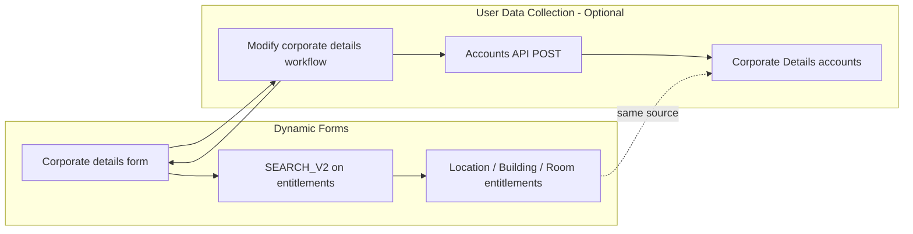

# Dynamic Forms and User Data Collection

Reference implementation for SailPoint ISC showing how entitlement-backed **dynamic dropdowns** in forms can be combined with an optional **user data persistence** pattern via a supporting delimited-file source and interactive workflow.

## Two Separate Use Cases

These patterns are often deployed together, but they solve different problems and can be used independently.

| Use case | What it does | Artifacts involved |
|---|---|---|
| **Dynamic forms** | Presents context-sensitive dropdown options to users by querying the entitlements index and scoping results based on prior selections | Form definition, entitlement data on a source |
| **User data collection and persistence** | Captures user input from an interactive workflow and stores it as account data on a supporting source | Workflow, source account schema, provisioning/API write |

You can use dynamic forms without persisting responses (for example, to drive an approval decision or provisioning plan inline). You can also persist user-supplied data without dynamic dropdowns (for example, free-text fields written to a custom source). This sample demonstrates both patterns end-to-end.

## Overview

The **Corporate Details** form collects location hierarchy selections and communication preferences from an identity during an interactive workflow. Dropdown options for **Location**, **Building**, and **Room** are loaded dynamically from entitlements aggregated from a delimited-file source. After submission, the **Modify corporate details** workflow optionally writes the collected values back to the same source via the Accounts API.

A demo recording of the end-to-end flow is included as `Dynamic forms and user data collection.mov`.

## Artifacts

| File | Type | Purpose |
|---|---|---|
| `Dynamic forms and user data collection.json` | SP-Config export | Form definition, source, and workflow |
| `locations.csv` | Sample entitlement feed | Top-level location reference data |
| `buildings.csv` | Sample entitlement feed | Building reference data scoped to a location |
| `rooms.csv` | Sample entitlement feed | Room reference data scoped to a building |
| `Dynamic forms and user data collection.mov` | Demo video | Walkthrough of the interactive experience |

### Exported objects

- **Form definition:** `Corporate details`
- **Source:** `Corporate Details` (Delimited File)
- **Workflow:** `Modify corporate details`

## Architecture

The **Corporate Details** source plays a dual role in this sample:

1. **Reference data** — entitlement schemas (`location`, `building`, `room`) feed the dynamic dropdowns after aggregation.
2. **Persistence store** — the account schema holds per-identity values submitted through the workflow (`location`, `building`, `room`, phone numbers, language preference).

Using one source for both concerns is a **design choice**, not a platform requirement. Reference data could live on a dedicated source while user responses are written elsewhere (identity attributes, a separate application source, an external system, etc.).

## Entitlement Hierarchy for Dynamic Dropdowns

ISC form SELECT fields can populate options from the entitlements search index (`SEARCH_V2`). For cascading dropdowns, each level must be distinguishable and relatable to its parent.

This sample uses a **prefix-encoded entitlement value hierarchy**:

| Level | Example value | Example display name | Relationship |
|---|---|---|---|
| Location | `L001` | HQ Campus | Root level |
| Building | `L001-B001` | Tower A | Value prefixed with parent location id |
| Room | `L001-B001-R001` | Boardroom | Value prefixed with parent building id |

The sample CSV feeds (`locations.csv`, `buildings.csv`, `rooms.csv`) follow this convention. Each file provides `id`, `name`, and `description` columns. The `id` becomes the entitlement **value** indexed by search; `name` is the user-facing label.

### Why a hierarchy is required

Dynamic dropdowns do not hard-code option lists. Each SELECT field queries entitlements at runtime and must know:

1. **Which entitlements belong to this field** — scoped by entitlement attribute (`attribute:location`, `attribute:building`, `attribute:room`).
2. **Which entitlements are valid given prior selections** — scoped by a filter bound to the parent field's current value.

Without an encoded parent-child relationship in entitlement data, a child dropdown would either show all entitlements of that type or require unrelated filtering logic. The prefix hierarchy makes parent selection mechanically constrain child options.

> **Note:** This sample encodes hierarchy in entitlement **values** (id prefixes). The [Organizational Hierarchy Path](../Organizational%20Hierarchy%20Path/) pattern uses the entitlement **description** field to store parent references instead. Either approach works; choose the one that fits your source data and maintenance model.

## Search Logic and Cascading Behavior

The **Corporate details** form defines three entitlement-backed SELECT fields. Each uses `SEARCH_V2` against the `entitlements` index.

### Location (root dropdown)

- **Query:** `attribute:location`
- **Label / value:** `displayName` / `value`
- **Filter:** none — all location entitlements are eligible

### Building (depends on Location)

- **Query:** `attribute:building`
- **Filter:** `value.exact` = `{{$.form.data.location}}`
- When the user selects a location, the building dropdown re-queries entitlements scoped to that location

### Room (depends on Building)

- **Query:** `attribute:room`
- **Filter:** `value.exact` = `{{$.form.data.building}}`
- When the user selects a building, the room dropdown re-queries entitlements scoped to that building

The inline variable `{{$.form.data.<fieldKey>}}` binds each child field to the parent field's currently selected **value** (not display name). Because child entitlement values in the sample data are prefixed with their parent's value (`L001` → `L001-B001` → `L001-B001-R001`), passing the parent value into the filter scopes each child dropdown to the correct subset. If your tenant requires explicit prefix matching, append a wildcard to the filter value (for example, `{{$.form.data.location}}*`) so search treats the parent value as a prefix rather than a full exact match.

Communication fields (`phoneNumber`, `mobileNumber`, `preferredDisplayLanguage`) use standard input types and a static SELECT respectively — they do not depend on entitlement search.

## Workflow and Optional Persistence

The **Modify corporate details** workflow is triggered by an interactive process launch event and executes:

1. **Define Variable** — stores the Corporate Details source id
2. **Get Identity** — resolves the launching user's identity
3. **Interactive Form** — presents the Corporate details form
4. **HTTP Request** — `POST` to `https://{tenant}.api.identitynow.com/accounts/v1` with form data
5. **Success**

The HTTP step maps form fields to account attributes on the supporting source:

| Form field | Account attribute |
|---|---|
| `location` | `location` |
| `building` | `building` |
| `room` | `room` |
| `phoneNumber` | `phoneNumber` |
| `mobileNumber` | `mobileNumber` |
| `preferredDisplayLanguage` | `preferredDisplayLanguage` |

The account is keyed by `accountName` (set to the identity name). This creates or updates a delimited-file account record holding the user's submitted values.

**Persistence is optional.** The form and entitlement-backed dropdowns work without this step. Common alternatives:

- Write selected values to identity attributes instead of a source account
- Pass form output directly into a provisioning plan or approval payload
- Forward data to an external system rather than the Accounts API
- Stop after collection when no durable store is needed

## Configuration

### Source setup

1. Import or recreate the **Corporate Details** delimited-file source from the SP-Config export.
2. Configure entitlement aggregation for the `location`, `building`, and `room` group schemas.
3. Upload or provision the sample CSV files (or equivalent data following the same id-prefix convention).
4. Run entitlement aggregation so options appear in the entitlements search index.
5. Ensure the account schema attributes align with the form field keys if you enable persistence.

### Form setup

1. Import the **Corporate details** form definition.
2. Verify each SELECT field's `SEARCH_V2` query targets the correct entitlement attribute.
3. Confirm child field filters reference the correct parent field keys (`location`, `building`).
4. Adjust labels, validation, and static options as needed.

### Workflow setup (optional persistence)

1. Import the **Modify corporate details** workflow.
2. Replace the **Source ID** workflow variable with your Corporate Details source UUID.
3. Configure OAuth credentials on the HTTP Request step for the Accounts API.
4. Replace `TENANT` in the API URL with your tenant name.
5. Bind the workflow to an interactive process trigger (or adapt the trigger to your launch mechanism).

### Post-import checklist

- Entitlement aggregation has run and location/building/room entitlements are searchable
- Selecting a location narrows buildings; selecting a building narrows rooms
- Workflow OAuth and source id are tenant-specific
- If persisting data, confirm account correlation on `accountName` behaves as expected

## Notes

- Entitlement option lists depend on aggregation freshness. Update CSV feeds and re-aggregate when reference data changes.
- The prefix hierarchy must stay consistent. A building id that does not start with its parent location id will not appear when that location is selected.
- Child dropdown filters use the parent's selected entitlement **value**. If you change how hierarchy is encoded, update both the data and the search filters accordingly.
- The HTTP Request step requires a configured OAuth client with permission to create or update accounts on the target source.
- Sample CSV `description` columns are informational only in this pattern; hierarchy is carried by entitlement values, not descriptions.
