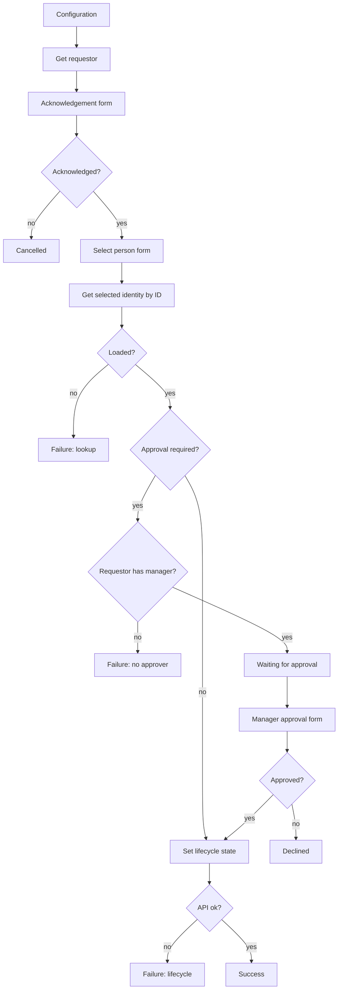

# Emergency Termination

## Purpose

Interactive ISC process that lets a manager immediately set one of their **active direct reports** to an **Emergency Termination** lifecycle state when HR cannot be updated in time. A second-level manager approval step is enabled by default.

This package is a hardened, reusable export. Tenant IDs, OAuth Parameter Storage bindings, and the Emergency Termination lifecycle state ID are placeholders. Re-bind them after import.

## Overview

1. The operator acknowledges that the action is audited.
2. They select an active direct report (identity ID via `SEARCH_V2`) and supply a required justification.
3. If **Approval Required** is `true` (default), the requestor's manager receives a standalone approval form.
4. On approval (or when approval is skipped), the workflow calls `POST /v3/identities/{id}/set-lifecycle-state` with the configured Emergency Termination lifecycle state ID.

Downstream disablement and access removal follow whatever that lifecycle state is configured to do on the identity profile.

## Artifacts

| File | Type | Purpose |
|---|---|---|
| `Forms - Emergency Termination.json` | Form export (array) | All three forms for VS Code form import |
| `Workflow - Emergency Termination.json` | Workflow export | Interactive emergency termination process |
| `Emergency Termination.sp-config.json` | Combined SP-Config | Forms + workflow in one import package |

> **Form import format:** The SailPoint VS Code extension expects a **JSON array** (`[{ version, self, object }, …]`). Import `Forms - Emergency Termination.json` first. Fields must sit inside a **SECTION**.
>
> `object.owner` is required (`{ type: IDENTITY, id, name }`). Point `YOUR_OWNER_IDENTITY_ID` / `YOUR_OWNER_IDENTITY_NAME` at a valid identity before importing.

### Exported objects

- **Workflow:** `Emergency Termination` (disabled by default)
- **Form definitions:** `Emergency Termination - Instructions`, `Emergency Termination - Select User`, `Emergency Termination - Approval`

## Architecture



**Trigger:** `idn:interactive-process-launched` (interactive process event). Update the workflow ID filter after import.

## Workflow configuration

HTTP actions take credentials from **Parameter Storage**, not inline client secrets. Create the parameters in the tenant, then bind the placeholder IDs.

| Variable | Placeholder | Purpose |
|---|---|---|
| url | `https://{tenant}.api.identitynow-demo.com` | ISC API base (no trailing slash) |
| ET LCS ID | `YOUR_ET_LCS_ID` | Lifecycle state UUID for Emergency Termination |
| Approval Required | `true` | `true` requires the requestor's manager; any other value skips approval |

Also replace:

| Placeholder | Where |
|---|---|
| `YOUR_OAUTH_PARAMETER_ID` | OAuth 2.0 Client Credentials (`type` `1.4`) on **API: Set ET lifecycle state** |
| `YOUR_OAUTH_SCOPES_PARAMETER_ID` | OAuth scopes (`type` `3.1`) on the same HTTP action |
| `YOUR_WORKFLOW_ID` | Workflow `id` and interactive-process trigger filter |
| `YOUR_OWNER_IDENTITY_ID` / `YOUR_OWNER_IDENTITY_NAME` | Workflow and form owners |
| Form definition IDs | After form import, ISC assigns new IDs — update the three form steps |

Resolve the lifecycle state ID:

```bash
sail api get '/v3/identity-profiles' --env <env> --jsonpath '$[*].{id:id,name:name}'
sail api get '/v3/identity-profiles/<profile-id>/lifecycle-states' --env <env> --jsonpath '$[*].{id:id,name:name,enabled:enabled}'
```

Use the **enabled** Emergency Termination (or equivalent) state on the HR / authoritative identity profile.

## Forms

### Emergency Termination - Instructions

| Field | Type | Notes |
|---|---|---|
| I understand this is audited | TOGGLE | Yes/No. Workflow continues only on Yes |

### Emergency Termination - Select User

| Field | Type | Notes |
|---|---|---|
| Selected person | SELECT | `SEARCH_V2` on identities; label display name, value **identity ID**; filtered to active direct reports of the requestor |
| Justification | TEXTAREA | Required; shown to the approver |

### Emergency Termination - Approval

Standalone form for the requestor's manager. Shows a read-only summary table (name, title, department, requestor, justification), then:

| Field | Type | Notes |
|---|---|---|
| Approve this emergency termination | TOGGLE | Yes/No |
| Comments | TEXTAREA | Optional |

## Installation

Import order matters. Workflows reference form definition IDs from this export; after import, ISC assigns new form IDs — update the workflow form steps to match.

1. Import **`Forms - Emergency Termination.json`**.
2. Import **`Workflow - Emergency Termination.json`** (or the combined `Emergency Termination.sp-config.json`).
3. Set form owner identities if import rejected empty/placeholder owners.
4. Bind Parameter Storage OAuth (`1.4`) and scopes (`3.1`), API `url`, and `YOUR_ET_LCS_ID`.
5. Update the three form definition IDs on the workflow steps and the interactive-process trigger filter / workflow `id`.
6. Create an **interactive process** that launches this workflow and grant it to the operators who may run emergency terminations.
7. Leave the workflow **disabled** until configuration is verified, then enable it.

## Operation notes

- Selection returns an exact identity ID. The workflow does not search by display name or take `body[0]` from a search result.
- Direct-report filtering uses `manager.displayName` equal to the requestor's display name, plus `attributes.cloudLifecycleState:active`. If your tenant stores manager correlation differently, adjust the form search filter.
- When approval is required and the requestor has no `managerRef`, the workflow fails without changing lifecycle state.
- Opt-out (acknowledgement No) and manager decline end successfully with no lifecycle change.
- API failures surface Status and Detail to the operator and end in a failure step.

## Rollback / recovery

Emergency Termination only sets the configured lifecycle state. To reverse a mistaken run:

1. Set the identity back to the correct lifecycle state (UI or `POST /v3/identities/{id}/set-lifecycle-state`).
2. Confirm HR source data still reflects employment status so the next aggregation does not re-apply termination.
3. Re-enable or re-provision accounts according to your leaver/rehire process.

## Test plan

- [ ] Acknowledgement No → cancelled message; no lifecycle change
- [ ] Select person + approval required + manager approves → lifecycle state applied; success summary shown
- [ ] Manager declines → declined summary; no lifecycle change
- [ ] Approval Required = `false` → immediate lifecycle update after select
- [ ] Requestor with no manager and approval required → failure; no lifecycle change
- [ ] Invalid OAuth or ET LCS ID → Status/Detail error; no confirmed lifecycle change
- [ ] Selected person list only shows active direct reports of the operator

## Security

- Do not commit real OAuth client secrets. Keep them in Parameter Storage.
- Restrict the interactive process to operators who are authorized to initiate emergency terminations.
- Prefer keeping **Approval Required** = `true` outside controlled demos.
