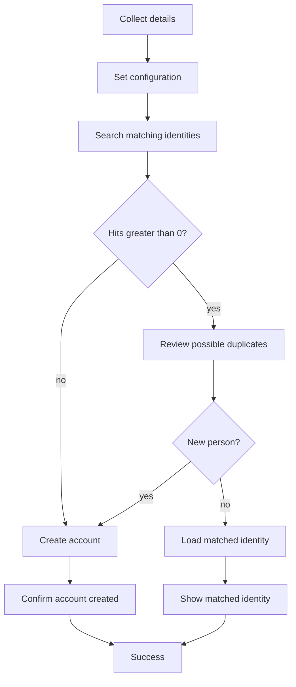

# Identity Match & Onboard

## Purpose

Reference implementation for ISC **interactive identity onboarding** with a **duplicate check** before account creation. An operator collects personal details, ISC searches for similar identities, and the flow either creates a source account or confirms an existing match — all using native workflows, forms, and the Accounts API.

## Overview

The **Identity Match & Onboard** workflow is launched from an interactive process. It:

1. Collects first name, last name, work email, and manager.
2. Searches ISC for identities with a fuzzy name match or exact email.
3. If matches exist, presents a review form to pick an existing identity or mark the person as new.
4. Creates a source account via `POST /accounts/v1`, or shows the matched identity with a deep link to the ISC admin UI.

Forms use HTML **DESCRIPTION** widgets for operator guidance. The duplicate-review form includes an **Open selected identity in ISC** link because SELECT fields can only show name and email from the search results.

## Artifacts

| File | Type | Purpose |
|---|---|---|
| `Workflow - Identity Match & Onboard.json` | Workflow export | Interactive onboarding workflow |
| `Forms - Identity Match & Onboard.json` | Form export (array) | Both forms — use for VS Code form import |
| `Form - Identity Match & Onboard - Details input.json` | Form export (array) | Step 1 — personal details and manager |
| `Form - Identity Match & Onboard - Identity deduplication.json` | Form export (array) | Step 2 — duplicate review and new-person toggle |

> **Form import format:** The SailPoint VS Code extension expects form exports as a **JSON array** (`[{ version, self, object }, …]`), not a single object. Import `Forms - Identity Match & Onboard.json` to load both forms at once, or either individual form file. All fields (including DESCRIPTION widgets) must be nested inside a **SECTION** element. HTML ampersands must be escaped as `&amp;`.

### Exported objects

- **Workflow:** `Identity Match & Onboard`
- **Form definitions:** `Identity Match & Onboard - Details input`, `Identity Match & Onboard - Identity deduplication`

## Architecture



## Workflow steps

| Step | Operator | What it does |
|---|---|---|
| Collect Details | Interactive form | Details input form |
| Set Configuration | — | Builds search query, display name, sanitized username, tenant URLs |
| Search Identities | — | `sp:get-identities` with identity search query |
| Check Duplicate Count | — | Branches on match count |
| Review Duplicates | Interactive form | Deduplication form (only when matches found) |
| Check New Identity | — | Branches on “This is a new person” toggle |
| Create Account | — | `POST /accounts/v1` with OAuth |
| Load Matched Identity | — | `sp:get-identity` for selected duplicate |
| Show Matched Identity | Interactive message | Summary + ISC admin link |
| Show Account Created | Interactive message | Confirmation summary |
| End Success | — | Workflow complete |

**Trigger:** `idn:interactive-process-launched` (interactive process event).

## Forms

### Details input

Collects:

| Field | Type | Source |
|---|---|---|
| First name | TEXT | User input |
| Last name | TEXT | User input |
| Work email | TEXT | User input |
| Manager | SELECT | `SEARCH_V2` on identities, query `isManager:true` |

The manager field stores the identity **name** (uid). Display name and email are shown in the dropdown.

### Identity deduplication

Shown only when the search returns one or more matches.

| Field | Type | Notes |
|---|---|---|
| Existing identity | SELECT | Populated from workflow search results (label: name, sublabel: email, value: id) |
| This is a new person | TOGGLE | Yes/No — when Yes, the identity picker is hidden |
| Open selected identity in ISC | DESCRIPTION (HTML) | Deep link using `iscUiUrl` form input + selected id |

**Form conditions:**

- `newIdentity = true` → hide identity picker and link; field is optional.
- `newIdentity = false` → require identity picker.

## Duplicate search

The **Identity Query** variable combines fuzzy name and exact email:

```
(attributes.firstname:{firstName}~2 AND attributes.lastname:{lastName}~2) OR attributes.email:"{email}"
```

The `~2` operator allows approximate name matches. Email is matched exactly. Tune the query if your tenant indexes different attribute names.

## Username generation

**Account Name** is derived from `firstName.lastName` and sanitized with Define Variable **Replace** transforms:

1. Remove spaces.
2. Remove characters outside `[A-Za-z0-9.]`.
3. Lowercase A–Z (26 individual replace steps — ISC workflows have no native `toLower`).

Accented characters are stripped rather than transliterated. Adjust transforms if your naming policy differs.

## Account creation

The **Create Account** HTTP step posts to:

```
{ISC API URL}/accounts/v1
```

Request body (attribute keys must match your **Accounts Source** schema):

| Source | Account attribute |
|---|---|
| Configuration variable | `sourceId` |
| Form | `firstname`, `lastname`, `email`, `manager` |
| Derived variable | `displayName`, `name` (username) |

`manager` is the selected manager identity **name** (uid), suitable for manager correlation on a delimited-file source.

> **Important:** The Accounts API creates a record **in ISC** on the named source. It does not provision downstream connector targets. On connector sources, aggregation may remove API-created accounts that do not exist on the target. Flat-file sources are the typical use case.

## Configuration

### Tenant values (Set Configuration step)

| Variable | Example | Purpose |
|---|---|---|
| ISC API URL | `https://{tenant}.api.identitynow-demo.com` | Accounts API base URL |
| ISC UI URL | `https://{tenant}.identitynow-demo.com` | Identity admin deep links |
| Accounts Source | Source UUID | Replace `xxx` with your target source id |

### OAuth

Configure OAuth credentials on the **Create Account** HTTP step (`paramID`, client id/secret, token URL). The client needs permission to create accounts on the target source.

### Prerequisites

- Managers must be discoverable with `isManager:true` in the identities search index.
- A delimited-file (or compatible) **Accounts Source** with attributes aligned to the HTTP body.
- An **interactive process** that launches this workflow.
- Identity profile on the source if you expect identities to be created after aggregation.

### Post-import checklist

- [ ] Replace `Accounts Source` placeholder (`xxx`) with your source UUID.
- [ ] Set **ISC API URL** and **ISC UI URL** for your tenant.
- [ ] Bind OAuth on the Create Account HTTP step.
- [ ] Import both form definitions before the workflow (form definition IDs are referenced by the workflow).
- [ ] Enable the workflow and link it to your interactive process.
- [ ] Confirm account schema attribute names match the HTTP body (`firstname`, `lastname`, `email`, `name`, `manager`, etc.).
- [ ] Test: no-match path creates account; match path shows review form and identity link.

## Limitations

- **Match path is informational** — selecting an existing identity does not correlate accounts, request access, or update records.
- **No HTTP error branch** — failed account creation is not handled in this sample.
- **Fuzzy name search** can over-match; there is no birthdate or employee-id tie-breaker.
- **Form identity link** may not refresh live when the dropdown changes; the confirmation message always includes a reliable deep link.
- **OAuth `paramID`** is tenant-specific and left empty in the export.

## Related patterns

- [Dynamic forms and user data collection](../Dynamic%20forms%20and%20user%20data%20collection/) — Accounts API persistence and `SEARCH_V2` form dropdowns.
- [Generic Manager Correlation](../Generic%20Manager%20Correlation/) — manager lookup and correlation across sources.
