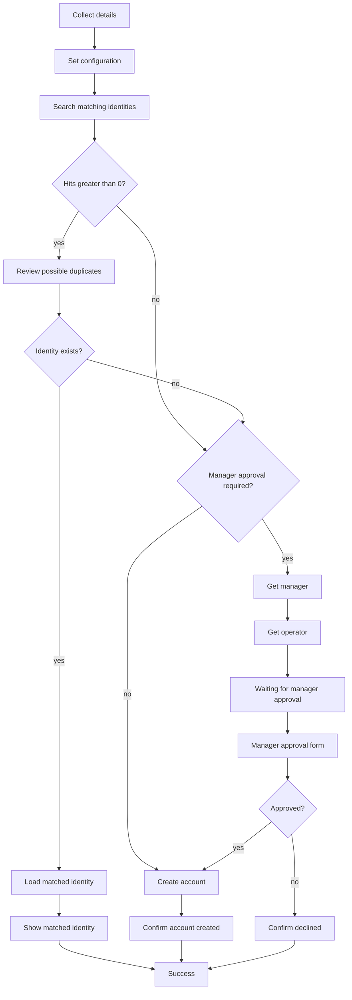

# Identity Match & Onboard

## Purpose

Reference implementation for ISC **interactive identity onboarding** with a **duplicate check** and **manager approval** before account creation. An operator collects personal details, ISC searches for similar identities, and the flow either asks the selected manager to approve a new source account or confirms an existing match — all using native workflows, forms, and the Accounts API.

## Overview

The **Identity Match & Onboard** workflow is launched from an interactive process. It:

1. Collects first name, last name, work email, location, and manager.
2. Searches ISC for identities with a fuzzy name match or exact email.
3. If matches exist, presents a review form to pick an existing identity or mark the person as new.
4. If the person is new, optionally sends a standalone approval form to the selected manager (`Manager Approval Required` in Set Configuration). On approve — or when the flag is not `true` — creates a source account via `POST /accounts/v1`. On reject, tells the operator that nothing was created. Existing matches skip approval and show a deep link to the identity attributes page.

Forms use HTML **DESCRIPTION** widgets for operator guidance. The duplicate-review form lists name and email only; the full profile link appears after a match is confirmed.

A demo recording of the end-to-end flow is included as [`Identity Match & Onboard.mov`](Identity%20Match%20%26%20Onboard.mov).

## Artifacts

| File | Type | Purpose |
|---|---|---|
| `Workflow - Identity Match & Onboard.json` | Workflow export | Interactive onboarding workflow |
| `Forms - Identity Match & Onboard.json` | Form export (array) | All three forms — use for VS Code form import |
| `Identity Match & Onboard.mov` | Demo video | Walkthrough of the interactive experience |

> **Form import format:** The SailPoint VS Code extension expects form exports as a **JSON array** (`[{ version, self, object }, …]`), not a single object. Import `Forms - Identity Match & Onboard.json` to load all forms at once. All fields (including DESCRIPTION widgets) must be nested inside a **SECTION** element. HTML ampersands must be escaped as `&amp;`.

### Exported objects

- **Workflow:** `Identity Match & Onboard`
- **Form definitions:** `Identity Match & Onboard - Onboarding`, `Identity Match & Onboard - Identity deduplication`, `Identity Match & Onboard - Manager approval`

## Architecture



## Workflow steps

| Step | Operator | What it does |
|---|---|---|
| Collect Details | Interactive form | Onboarding form |
| Set Configuration | — | Builds search query, display name, sanitized username, tenant URLs, approval flag |
| Search Identities | — | `sp:get-identities` with identity search query |
| Check Duplicate Count | — | Branches on match count |
| Review Duplicates | Interactive form | Deduplication form (only when matches found) |
| Check Identity Exists | — | Branches on the “This is a new hire” toggle — true when the toggle is No |
| Check Manager Approval Required | — | Branches on `Manager Approval Required` (`true` → approval form) |
| Get Manager | — | `sp:get-identities` by selected manager **uid** |
| Get Operator | — | `sp:get-identity` for the interactive process launcher |
| Notify Waiting For Approval | Interactive message | Tells the operator who will approve |
| Manager Approval | Standalone form | `sp:forms` assigned to the manager identity |
| Check Approved | — | Branches on the approval toggle |
| Create Account | — | `POST /accounts/v1` with OAuth (after approval, or immediately when the flag is off) |
| Show Approval Rejected | Interactive message | Decline summary; no account created |
| Load Matched Identity | — | `sp:get-identity` for selected duplicate |
| Show Matched Identity | Interactive message | Summary + ISC admin link |
| Show Account Created | Interactive message | Confirmation summary |
| End Success | — | Workflow complete |

**Trigger:** `idn:interactive-process-launched` (interactive process event).

## Forms

### Onboarding

Collects:

| Field | Type | Source |
|---|---|---|
| First name | TEXT | User input |
| Last name | TEXT | User input |
| Work email | EMAIL | User input; required + email format |
| Location | TEXT | User input |
| Manager | SELECT | `SEARCH_V2` on identities, query `isManager:true` |

The manager field stores the identity **uid** (`attributes.uid`). Display name and email are shown via `attributes.displayName` and `attributes.email`.

### Identity deduplication

Shown only when the search returns one or more matches. The form is **decision-first**: choose whether this is a new hire, then (if not) pick the matching person.

| Field | Type | Notes |
|---|---|---|
| This is a new hire | TOGGLE | Leads the form. Yes = send for manager approval; No = choose a match |
| Matching person | SELECT | Shown only when the toggle is No. Populated from search results (label: name, sublabel: email, value: id) |

Path-specific DESCRIPTION widgets:

- **New hire** (toggle Yes): confirms the selected manager will be asked to approve before a record is created
- **Match helper** (toggle No): short prompt above the person picker

**Form conditions:**

- `newIdentity = true` → hide match helper + person picker; picker optional
- `newIdentity = false` → hide new-hire confirmation; require person picker

After a match is confirmed, the **Already in the directory** message includes a profile link:

```
{ISC UI URL}/ui/a/admin/identities/{identityId}/details/attributes
```

### Manager approval

Standalone form (`sp:forms`), not part of the operator's interactive process. Used only when **Manager Approval Required** is `true`. Assigned to the identity resolved from the selected manager **uid**. Deadline is **2 days**, with a reminder after **1 hour**.

| Field | Type | Notes |
|---|---|---|
| Proposed details | DESCRIPTION | Name, email, sign-in name, and location from form inputs |
| Approve this new hire | TOGGLE | Yes creates the account; No declines |
| Comments | TEXTAREA | Optional note returned to the operator |

The operator sees **Waiting for manager approval** before this form is sent, and either **Onboarding request submitted** or **Onboarding declined** afterwards.

## Duplicate search

The **Identity Query** variable combines fuzzy name and exact email:

```
(attributes.firstname:{firstName}~2 AND attributes.lastname:{lastName}~2) OR attributes.email:"{email}"
```

The `~2` operator allows approximate name matches. Email is matched exactly. Tune the query if your tenant indexes different attribute names.

## Username generation

**Account Name** is derived from `firstName.lastName` and sanitized with Define Variable **Replace** transforms:

1. Remove spaces.
2. Remove characters outside `[A-Za-z0-9.]`.
3. Lowercase A–Z (26 individual replace steps — ISC workflows have no native `toLower`).

Accented characters are stripped rather than transliterated. Adjust transforms if your naming policy differs.

## Account creation

The **Create Account** HTTP step runs after the manager approves, or immediately when **Manager Approval Required** is not `true`. It posts to:

```
{ISC API URL}/accounts/v1
```

Request body attribute keys match this **Accounts Source** schema:

| Form / variable | Account attribute | Notes |
|---|---|---|
| Configuration | `sourceId` | Target source UUID (API field, not a schema attribute) |
| Account Name (derived) | `id`, `name` | Unique account id and username (same generated value) |
| First name | `givenName` | |
| Last name | `familyName` | |
| Work email | `e-mail` | Hyphenated schema name |
| Location | `location` | |
| Manager | `manager` | Identity **uid** (`attributes.uid`) |

`groups` is an entitlement attribute and is not set by this workflow.

`manager` is the selected manager identity **uid**, suitable for manager correlation on a delimited-file source.

> **Important:** The Accounts API creates a record **in ISC** on the named source. It does not provision downstream connector targets. On connector sources, aggregation may remove API-created accounts that do not exist on the target. Flat-file sources are the typical use case.

## Installation

Import order matters. The workflow references form definition IDs, so forms must exist in the tenant first.

1. Import **`Forms - Identity Match & Onboard.json`** (all three form definitions).
2. Import **`Workflow - Identity Match & Onboard.json`**.
3. Complete the tenant configuration below (source id, API/UI URLs, OAuth).
4. Enable the workflow and link it to your interactive process.

## Configuration

### Tenant values (Set Configuration step)

| Variable | Example | Purpose |
|---|---|---|
| ISC API URL | `https://{tenant}.api.identitynow-demo.com` | Accounts API base URL |
| ISC UI URL | `https://{tenant}.identitynow-demo.com` | Base URL for post-match profile links |
| Accounts Source | Source UUID | Replace `xxx` with your target source id |
| Manager Approval Required | `true` | `true` sends the manager form; any other value skips approval |

### OAuth

Configure OAuth credentials on the **Create Account** HTTP step (`paramID`, client id/secret, token URL). The client needs permission to create accounts on the target source.

### Prerequisites

- Manager search uses `isManager:true` so operators only see identities flagged as managers.
- The selected manager **uid** must resolve to an ISC identity (`attributes.uid`) so the approval form can be assigned.
- A delimited-file (or compatible) **Accounts Source** with attributes aligned to the HTTP body.
- An **interactive process** that launches this workflow.
- Identity profile on the source if you expect identities to be created after aggregation.

### Post-import checklist

- [ ] Forms imported before the workflow.
- [ ] Replace `Accounts Source` placeholder (`xxx`) with your source UUID.
- [ ] Set **ISC API URL** and **ISC UI URL** for your tenant.
- [ ] Bind OAuth on the Create Account HTTP step.
- [ ] Enable the workflow and link it to your interactive process.
- [ ] Confirm account schema attribute names match the HTTP body (`id`, `name`, `givenName`, `familyName`, `e-mail`, `location`, `manager`).
- [ ] Set **Manager Approval Required** (`true` or skip).
- [ ] Test: with the flag on, no-match waits for manager then creates account and reject creates nothing; with it off, no-match creates immediately; match path shows review form and identity link.

## Limitations

- **Match path is informational** — selecting an existing identity does not correlate accounts, request access, or update records.
- **Interactive process stays open** on the approval path until the manager submits the form (or the 2-day deadline expires). When **Manager Approval Required** is not `true`, the operator is not blocked.
- **No HTTP error branch** — failed account creation is not handled in this sample.
- **Fuzzy name search** can over-match; there is no birthdate or employee-id tie-breaker.
- **Match confirmation** includes a reliable profile link using the loaded identity id (`…/identities/{id}/details/attributes`).
- **OAuth `paramID`** is tenant-specific and left empty in the export.

## Related patterns

- [Dynamic forms and user data collection](../Dynamic%20forms%20and%20user%20data%20collection/) — Accounts API persistence and `SEARCH_V2` form dropdowns.
- [Generic Manager Correlation](../Generic%20Manager%20Correlation/) — manager lookup and correlation across sources.
