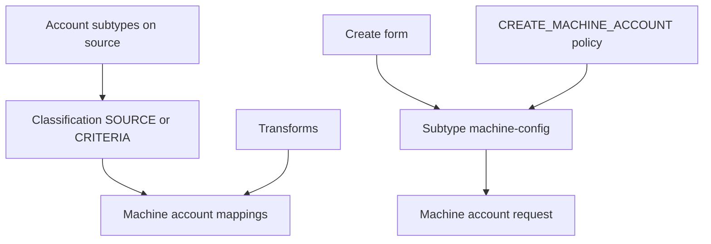

# Machine Identity Security

## Purpose

Reusable Machine Identity Security (MIS) package for **Active Directory** and **Microsoft Entra ID** NHI sources: account subtypes, classification, attribute mappings (with transforms), create forms, and `CREATE_MACHINE_ACCOUNT` provisioning policies.

Seeded from the **emea-tes-team** demo tenant. Replace source names, IDs, owners, and OUs before using in another tenant.

## Overview

| Connector | Source example | Subtypes (examples) | Create form | Mapping transforms |
| --- | --- | --- | --- | --- |
| Active Directory | `Microsoft Active Directory @emea-tes-team (NHI)` | Service Account, Bot Account | AD machine account form | Subtype ← `employeeType`; Environment ← `department` |
| Microsoft Entra ID | `Microsoft Entra ID @emea-tes-team.cloud (NHI)` | Service Principal, Managed Identity, … | Entra SPN form | Subtype + Machine Identity transforms from SPN attributes |



## Artifacts

### Active Directory

| Path | Purpose |
| --- | --- |
| [`Active Directory/source-subtypes.json`](Active%20Directory/source-subtypes.json) | `service-account`, `bot-account` |
| [`Active Directory/machine-classification-config.json`](Active%20Directory/machine-classification-config.json) | Classify **all** accounts on the NHI source (`SOURCE`) |
| [`Active Directory/Transforms/`](Active%20Directory/Transforms/) | Subtype + environment mapping transforms |
| [`Active Directory/machine-account-mappings.json`](Active%20Directory/machine-account-mappings.json) | Maps subtype, environment, description |
| [`Active Directory/Forms - Machine Account AD.json`](Active%20Directory/Forms%20-%20Machine%20Account%20AD.json) | Shared create form (VS Code form import array) |
| [`Active Directory/Provisioning Policies/`](Active%20Directory/Provisioning%20Policies/) | Per-subtype `CREATE_MACHINE_ACCOUNT` profiles |
| [`Active Directory/machine-config-*.json`](Active%20Directory/) | Enable create, form link, password setting examples |

### Microsoft Entra ID

| Path | Purpose |
| --- | --- |
| [`Microsoft Entra ID/source-subtypes.json`](Microsoft%20Entra%20ID/source-subtypes.json) | User- and system-managed subtypes from the demo tenant |
| [`Microsoft Entra ID/machine-classification-config.json`](Microsoft%20Entra%20ID/machine-classification-config.json) | Criteria on `spn_servicePrincipalType` |
| [`Microsoft Entra ID/Transforms/`](Microsoft%20Entra%20ID/Transforms/) | Subtype classifier + machine-identity naming |
| [`Microsoft Entra ID/machine-account-mappings.json`](Microsoft%20Entra%20ID/machine-account-mappings.json) | Full mapping set including identity correlation |
| [`Microsoft Entra ID/Forms - Machine Account Entra ID.json`](Microsoft%20Entra%20ID/Forms%20-%20Machine%20Account%20Entra%20ID.json) | Service principal create form |
| [`Microsoft Entra ID/Provisioning Policies/`](Microsoft%20Entra%20ID/Provisioning%20Policies/) | Service Principal create policy |
| [`Microsoft Entra ID/machine-config-service-principal.json`](Microsoft%20Entra%20ID/machine-config-service-principal.json) | Create enablement example |
| [`Microsoft Entra ID/Demo Data/`](Microsoft%20Entra%20ID/Demo%20Data/) | Gallery category / publisher / template CSVs for form dropdowns |

> **Form import format:** SailPoint VS Code expects a **JSON array** (`[{ version, self, object }, …]`). Replace `YOUR_OWNER_IDENTITY_ID` / `YOUR_OWNER_IDENTITY_NAME` before import. Fields must sit inside a **SECTION**.

## Setup

Use env **`emea-tes-team`** (or your own `--env`) with the SailPoint CLI. Experimental MIS endpoints need `-H 'X-SailPoint-Experimental: true'`.

### 1. Prerequisites

1. Dedicated NHI sources (or clearly scoped search DNs / filters).
2. Machine Identity Security licensed and visible under **Admin → Connections → Sources → Machine Accounts**.
3. For AD create: IQService healthy, NHI OU exists (demo: `OU=NHI,OU=emea-tes-team,OU=Demo,DC=seri,DC=sailpointdemo,DC=com`).
4. For Entra create: SaaS connector with app registration permissions for service principal create.

### 2. Transforms

Import or create the transforms under each connector folder, then fix `sourceName` to match your source display name.

```bash
sail transform create -f "Active Directory/Transforms/Machine Account Subtype - Active Directory.json" --env <env>
sail transform create -f "Active Directory/Transforms/Machine Account Environment - Active Directory.json" --env <env>
sail transform create -f "Microsoft Entra ID/Transforms/Machine Account Subtype - Entra ID.json" --env <env>
sail transform create -f "Microsoft Entra ID/Transforms/Machine Identity - Entra ID.json" --env <env>
```

If a transform already exists: `sail transform update -f … --env <env>`.

### 3. Account subtypes

Create subtypes per source (`POST /v2026/source-subtypes`). Technical names are immutable and must match mapped attribute values (AD: `employeeType`).

Example body:

```json
{
  "sourceId": "<source-id>",
  "technicalName": "service-account",
  "displayName": "Service Account",
  "description": "Standard Active Directory service account.",
  "type": "MACHINE"
}
```

Creating a subtype auto-creates a stub `CREATE_MACHINE_ACCOUNT` provisioning policy (often gMSA-shaped on AD). Replace it with the policies in this package.

### 4. Classification

```bash
sail api put /v2026/sources/<source-id>/machine-classification-config \
  --env <env> -H 'X-SailPoint-Experimental: true' \
  -f "Active Directory/machine-classification-config.json"
```

- **AD NHI OU-only sources:** `classificationMethod: SOURCE` (all accounts).
- **Entra mixed:** use the criteria export (service principal types).

Then open the source → **Machine Accounts → Classification → Process Classification**.

### 5. Mappings

Update `sourceName` / transform `id` values in `machine-account-mappings.json`, then:

```bash
sail api put /v2026/sources/<source-id>/machine-account-mappings \
  --env <env> -H 'X-SailPoint-Experimental: true' \
  -f "Active Directory/machine-account-mappings.json"
```

#### Active Directory mapping targets

| Target | Transform / attribute |
| --- | --- |
| Account Subtype | `Machine Account Subtype - Active Directory` ← `employeeType` |
| Environment | `Machine Account Environment - Active Directory` ← `department` |
| Description | Account attribute `description` |
| Machine Identity | Leave unmapped (uncorrelated application identity per account) |

#### Entra ID mapping targets

| Target | Transform / attribute |
| --- | --- |
| Account Subtype | `Machine Account Subtype - Entra ID` |
| Machine Identity / business application | `Machine Identity - Entra ID @…` (first-party org IDs → shared identity name) |
| Environment | Account attribute `description` |
| Description | Account attribute `displayName` |

### 6. Create form

1. Import the form JSON via VS Code SailPoint forms, or `POST /beta/form-definitions`.
2. Note the new form ID.
3. AD form field `upnUsername` is username-only; policies append `@<domain>`.

Optional Entra gallery dropdowns: load CSVs from [`Microsoft Entra ID/Demo Data/`](Microsoft%20Entra%20ID/Demo%20Data/) as entitlements (or keep static/search sources as in the live form).

### 7. Provisioning policies

List stub policies, then `PUT` the package bodies (set `subtypeId` to your subtype IDs):

```bash
sail api get /v2027/sources/<source-id>/provisioning-policies \
  --env <env> -H 'X-SailPoint-Experimental: true' \
  -q 'filters=usageType eq "CREATE_MACHINE_ACCOUNT"'

sail api put /v2027/sources/<source-id>/provisioning-policies/<policy-id> \
  --env <env> -H 'X-SailPoint-Experimental: true' \
  -f "Active Directory/Provisioning Policies/CREATE_MACHINE_ACCOUNT - Service Account.json"
```

AD policies create **User** objects (not gMSA): `ObjectType=User`, DN under the NHI OU, static `employeeType` matching the subtype technical name, UPN `${userInput.upnUsername}@seri.sailpointdemo.com`.

### 8. Enable machine account creation

`PATCH /v2026/source-subtypes/<subtype-id>/machine-config` with `Content-Type: application/json-patch+json`:

```json
[
  {
    "op": "replace",
    "path": "/machineAccountCreate",
    "value": {
      "accountCreateEnabled": true,
      "approvalRequired": false,
      "approvalConfig": { "approvers": null, "comments": "OFF" },
      "formId": "<form-id>",
      "passwordSetting": "DO_NOT_SET_PASSWORD",
      "passwordAttribute": null
    }
  }
]
```

Set the AD password in the `CREATE_MACHINE_ACCOUNT` policy (`password` field). Do **not** also use `SET_TO_EXISTING_ATTRIBUTE` / `SET_TO_NEW_ATTRIBUTE` with `passwordAttribute: password` — IQService then fails with `Key in dictionary: 'password'` (duplicate attribute in the plan). That mismatch previously surfaced as a Temporal `RETRY_STATE_TIMEOUT` on `sp:machine-account-provision-workflow`.

ISC generates a request entitlement on the IdentityNow source (`assignedMacSubtype`). With `DO_NOT_SET_PASSWORD`, the policy supplies the password to AD; Parameter Storage reveal may not apply.

For Entra service principals, demo config also uses `passwordSetting: DO_NOT_SET_PASSWORD`.

### 9. Verify

1. Re-read subtypes, classification, mappings, form `usedBy`, machine-config, and policies.
2. Submit a low-risk create (e.g. Service Account) only when you intend to create a real directory object.
3. Confirm aggregation → classification → subtype → ownership (and AD object attributes).

## Demo tenant references (emea-tes-team)

| Object | ID / name |
| --- | --- |
| AD NHI source | `4327b3e911174ab5b5bb75f9c82764b8` |
| Entra NHI source | `1f3680fd99094e4bb70c4880542caf2a` |
| AD form | `19ebbb17-0344-4719-bb7b-8fea39e64c38` |
| Entra SPN form | `10469eae-009f-41d0-bf3b-5f33e4c736db` |
| AD subtypes | `service-account`, `bot-account` |

## Notes

- Do not invent entitlement-backed form dropdowns unless you also ship the supporting entitlements/CSVs (Entra gallery data is included under Demo Data).
- Technical names on subtypes must stay stable; recreate the subtype if you need a different technical name.
- `GET` of AD classification may still show leftover criteria while `classificationMethod` is `SOURCE`; the method controls behaviour.
