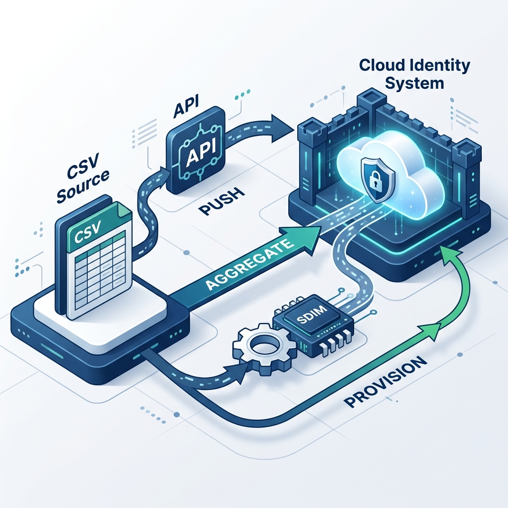

# Generic SDIM Configuration Guide (Optimistic Provisioning)

Follow these instructions to configure the Generic SDIM integration in SailPoint Identity Security Cloud (ISC). These instructions are mapped directly to the fields presented in the configuration UI, utilizing a public echo service (`postman-echo.com`) to seamlessly fake the ticket lifecycle.

To avoid issues with how the connector serializes payload bodies (which can cause JSON parsing errors on the receiving end), we pass the required dummy values natively via the URL query parameters.

---

### 1. Connectivity Authentication

Configure the basic connectivity to the echo service.

* **Base URL** (`slpt_url`): `https://postman-echo.com`
* **Authentication Type** (`slpt_authenticationType`): Select **Basic**
* **Username** (`slpt_username`): `dummy`
* **Password** (`slpt_password`): `dummy`

---

### 2. Ticket Creation

Configure how ISC requests a "fake" ticket to be created. The integration uses a `POST` request for ticket creation by default.

* **Resource** (`slpt_resource`): `/post?ticketId=REQ-12345`
  *(This passes a static dummy ticket ID in the query string directly, safely bypassing URI parsing issues that arise with Velocity syntax.)*
* **Sample Description** (`slpt_sampleDescription`): `dummy` 
  *(The body payload is ignored by our setup, so any simple string will do to pass UI validation)*
* **Response Element** (`slpt_responseElement`): `$.args.ticketId`

*(Note: When the integration POSTs this request, `postman-echo` parses the query parameters and echoes them back inside an `args` object. The JSONPath `$.args.ticketId` successfully extracts the dummy ticket number, completely bypassing any body payload serialization issues!)*

---

### 3. Status Mapping

Configure the integration so that the "Closed" status generated by our fake backend translates to a successful provisioning action in ISC.

* **Select IdentityNow Status** (`slpt_inow_Sample_Status_Commited`): `Commited` (or your equivalent success status like `Queued`/`Success`)
* **Enter the Generic SDIM Status** (`slpt_sdim_Sample_Status_Commited`): `Closed`

#### Advanced Options (Status Check Configuration)

Configure how ISC checks the status of the ticket. The `std:ticket:read` (Status Check) operation uses a `GET` request by default. We inject the status directly into the query string, just like we did for ticket creation.

* **Resource** (`slpt_resource`): `/get?status=Closed`
* **Response Element** (`slpt_responseElement`): `$.args.status`

*(Note: Since this is a GET request, `postman-echo` parses query parameters and returns them inside the `args` object. When ISC calls this endpoint, it extracts `$.args.status`, which equals `Closed`. This perfectly matches the status mapping configured above, completing the optimistic provisioning loop!)*

---

### 4. Source Account Schema & Provisioning Policy

For optimistic provisioning to properly generate user accounts with a correct Display Name and Native Identity in the UI, you must configure the managed source's **Account Schema** and **Create Account** provisioning policy carefully.

> [!WARNING]
> If a single attribute serves as both the **Account ID** and **Account Name** in the schema, ISC will consume that attribute to build the Native Identity during optimistic provisioning. This removes it from the final attribute list, resulting in accounts with blank names (`--`) in the Accounts UI.

To prevent this:

1. **Separate the Account ID and Account Name in the Schema:**
   - Define a unique attribute (e.g., `id`, `uid`, or `username`) and mark it **only** as the **Account ID**.
   - Define a separate attribute (e.g., `displayName` or `name`) and mark it as the **Account Name**.
2. **Map Both in the Create Account Policy:**
   - In the **Create Account** provisioning policy, ensure both the Account ID attribute and the Account Name attribute are mapped. 
   - Add any other attributes you want to optimistically populate on the new account (like standard entitlements or user details).

When configured this way, ISC will consume the Account ID to generate the Native Identity, while leaving the Account Name intact in the attributes array. This ensures the account correctly renders in the UI with the right name!