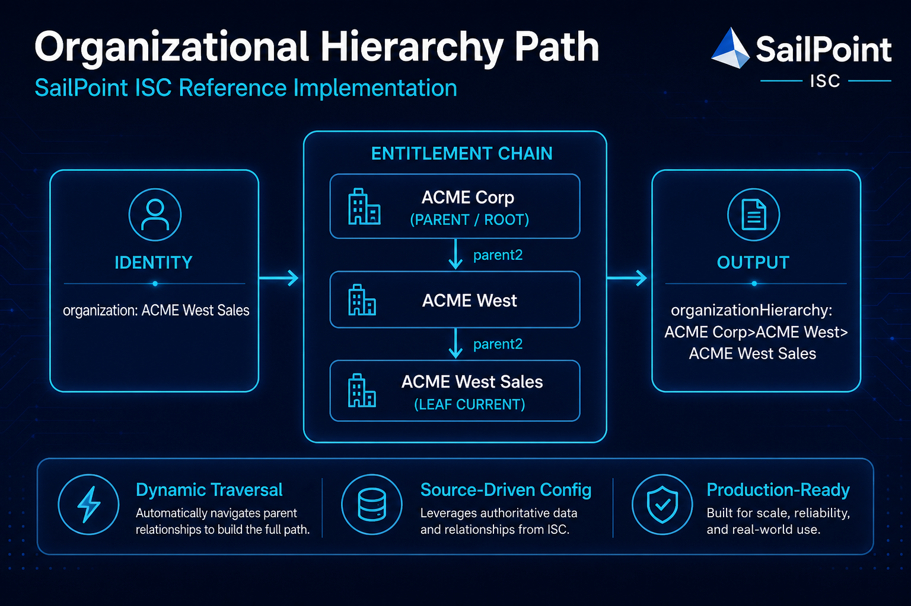
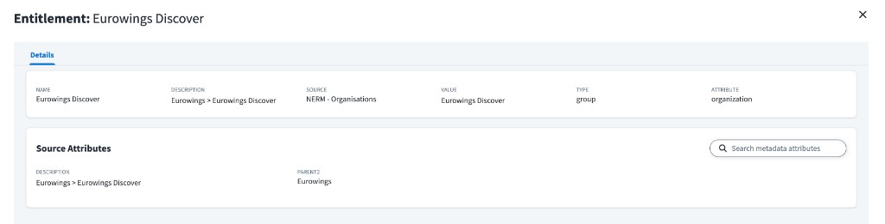
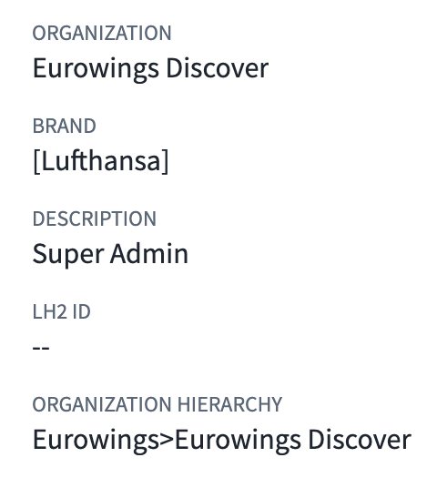
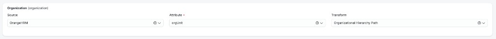

# Organizational Hierarchy Path



## Purpose

Generic cloud rule invoked by an ISC **Rule** transform that builds a consolidated organizational hierarchy path on each identity (e.g., `Business Unit>Division>Department`) by walking entitlement parent links configured on a source.

## Overview

Organizational hierarchies (e.g., department → division → business unit) are often flattened across sources. This rule reconstructs the full hierarchy path by walking up a chain of entitlements, where each entitlement exposes its parent organization in a designated source attribute.

The transform passes `sourceId|attributeValue` as the rule input. The rule is tenant- and source-agnostic — no code edits are required per environment. All environment specifics live in the transform configuration.

The result is a single identity attribute value like `Eurowings>Eurowings Discover`, built dynamically from the entitlement graph.

## Artifacts

- `Rule - Generic - Organizational Hierarchy Path.xml` — Generic cloud rule that computes the organizational hierarchy path.
- `Transform.json` — Rule transform that supplies `sourceId|attributeValue` as input to the rule.

## How It Works

1. The transform builds a composite input `${sourceId}|${attributeValue}` and passes it to the rule as `value`.
2. The rule parses `sourceId` and `attributeValue` from `value` (split on the first `|`).
3. Reads four source attribute configurations from the parsed `sourceId`:
   - **entitlementAccountAttribute** — the account attribute that holds the entitlement value on source accounts.
   - **parentOrganizationAttribute** — the entitlement attribute key that holds the parent organization value.
   - **entitlementDisplayAttribute** — the entitlement attribute key that holds the display name (e.g., `name`).
   - **hierarchySeparator** — the string used to join hierarchy levels (e.g., `>` or ` > `).
4. Walks **up** the entitlement chain starting from `attributeValue`: for each entitlement, calls `idn.getManagedAttributeDetails(sourceId, entitlementAccountAttribute, value, Type.Entitlement)` and reads the configured parent and display attributes from `ManagedAttributeDetails.getAttributes()`.
5. Adds each entitlement's display name (from `entitlementDisplayAttribute`) to the path.
6. Stops when an entitlement has no parent (parent attribute is null/empty) or when the maximum depth (20) is reached.
7. Reverses the path (root first, leaf last) and joins with the hierarchy separator.

## Example: NERM - Organisations

This pattern was validated against a **Web Services SaaS** source (`NERM - Organisations`) that aggregates organization entitlements from a NERM API.

### Source connector attributes

| Source attribute | Example value | Purpose |
|---|---|---|
| `entitlementAccountAttribute` | `organization` | Account/entitlement schema attribute used for `getManagedAttributeDetails` lookups |
| `parentOrganizationAttribute` | `parent2` | Entitlement metadata key for the parent organization value |
| `entitlementDisplayAttribute` | `name` | Entitlement metadata key for the display name |
| `hierarchySeparator` | `>` | Separator used when joining hierarchy levels |

### Transform configuration

| Transform placeholder | Example value | Purpose |
|---|---|---|
| `<SOURCE_ID>` | `6659e1f4-...` | UUID of the target source |
| `<ATTRIBUTE_NAME>` | `organization` | Identity attribute holding the user's organization entitlement value |

Group aggregation response mapping (Web Services SaaS `resMappingObj`):

| Entitlement key | API field |
|---|---|
| `name` | `attributes.organization_name` |
| `parent2` | `attributes.organization_organization` |

### Entitlement data

For the **Eurowings Discover** entitlement on source **NERM - Organisations**:

| Field | Value |
|---|---|
| Attribute | `organization` |
| Value | `Eurowings Discover` |
| Name | `Eurowings Discover` |
| parent2 | `Eurowings` |



The entitlement **Description** field may also contain a pre-built path (e.g., `Eurowings > Eurowings Discover`), but this rule **does not** use `getDescription()`. Parent traversal relies exclusively on the configured `parentOrganizationAttribute` (`parent2`).

Display names are read from the `name` entitlement attribute via `entitlementDisplayAttribute`. Do **not** use `ManagedAttributeDetails.getName()` — it returns the schema attribute name (`organization`), not the organization display name.

### Identity result

For an identity assigned to **Eurowings Discover**, the rule produces:

```
Eurowings>Eurowings Discover
```



| Identity attribute | Example value |
|---|---|
| `organization` | `Eurowings Discover` |
| `organizationHierarchy` | `Eurowings>Eurowings Discover` |

### Identity profile mapping

Map a new identity attribute (e.g., `organizationHierarchy`) in the identity profile:

| Setting | Value |
|---|---|
| Source | **Complex Data Source** |
| Transform | **Organizational Hierarchy Path** |



No source attribute selection is required on the mapping itself — the transform supplies the source ID and entitlement attribute value to the rule.

## Entitlement Parent Attribute Convention

Each entitlement must populate the attribute named by `parentOrganizationAttribute` with the **value** of its parent entitlement (the same value used in `getManagedAttributeDetails` lookups). Top-level entitlements should leave that attribute empty or null.

**Generic example** (`parentOrganizationAttribute` = `parent2`, `entitlementDisplayAttribute` = `name`):

| Entitlement Value | name | parent2 |
|---|---|---|
| `corp` | Corporate | *(empty — top level)* |
| `finance` | Finance | `corp` |
| `ap` | Accounts Payable | `finance` |
| `payroll` | Payroll | `ap` |

**Resulting hierarchy path** for an identity with entitlement `payroll`:

`Corporate>Finance>Accounts Payable>Payroll`

## Configuration

### Source Attributes

Define the following source attributes on the target source in IdentityNow (via the admin UI or connector configuration):

| Attribute | Description |
|---|---|
| `entitlementAccountAttribute` | Name of the account attribute that holds the entitlement value on source accounts. |
| `parentOrganizationAttribute` | Name of the entitlement attribute key that holds the parent organization value (e.g., `parent2`). |
| `entitlementDisplayAttribute` | Name of the entitlement attribute key that holds the display name (e.g., `name`). |
| `hierarchySeparator` | Separator string for the output path (e.g., `>`, ` > `, `/`). |

### Setup Steps

1. Create a new **Generic** cloud rule named **Organizational Hierarchy Path** and paste in the rule XML from `Rule - Generic - Organizational Hierarchy Path.xml` (no code edits required).
2. Create a **Rule** transform named **Organizational Hierarchy Path** from `Transform.json`, replacing `<SOURCE_ID>` with the UUID of your target source and `<ATTRIBUTE_NAME>` with the identity attribute that holds the entitlement value (e.g., `organization`). You can find the source UUID in the source's URL in the admin UI (e.g., `https://tenant.identitynow.com/ui/admin/#/sources/6659e1f4...`).
3. Configure the four source attributes on your source and map entitlement aggregation fields so `name` and `parent2` (or your chosen keys) are populated on each entitlement.
4. Ensure each entitlement's parent attribute contains its parent's **entitlement value**, not a display path or description string.
5. Create a new identity attribute (e.g., `organizationHierarchy`) mapped with source **Complex Data Source** and transform **Organizational Hierarchy Path**.

## Troubleshooting

| Symptom | Likely cause |
|---|---|
| `organization>organization` | Display name read from `getName()` instead of `entitlementDisplayAttribute`. Ensure `entitlementDisplayAttribute` is configured (e.g., `name`) and populated on entitlements. |
| `-` (default) | Missing source attribute, malformed transform input (missing `|`), or identity has no value in the mapped attribute. |
| Truncated path | Broken parent reference — `parentOrganizationAttribute` value does not match any entitlement value on the source. |
| Wrong order | Expected behavior: path is built leaf-to-root during traversal, then reversed to root-first before joining. |

## Notes

- The rule is generic and reusable across sources and tenants — configure source and attribute via the transform only.
- Entitlement lookups use [`getManagedAttributeDetails`](https://developer.sailpoint.com/rule-java-docs/sailpoint/rule/ManagedAttributeDetails.html) with [`ManagedAttribute.Type.Entitlement`](https://developer.sailpoint.com/rule-java-docs/sailpoint/object/ManagedAttribute.Type.html). Display names and parent values are read from the attributes map via `entitlementDisplayAttribute` and `parentOrganizationAttribute` — not from `getName()` or `getDescription()`.
- Cycle detection is built in — if two entitlements reference each other as parents, traversal stops safely.
- Maximum traversal depth is 20 levels to prevent runaway chains.
- If any required source attribute is missing or the transform input has no entitlement value, the rule returns `-` (the default value).
- This rule depends on the parent organization attribute being maintained correctly on each entitlement. Any broken parent reference will truncate the path at the break.
