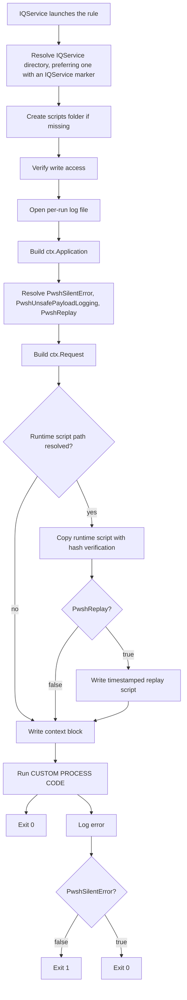

# PowerShell Rule Template

Copy-ready base for IQService PowerShell connector rules (Active Directory and Azure AD). You write only the rule-specific work; the template handles IQService directory lookup, request/application parsing through `$ctx`, logging, payload redaction, exit codes, and optional replay of a captured invocation.

SailPoint documentation: [Connector executed Rules](https://developer.sailpoint.com/docs/extensibility/rules/connector-rules)

## What you get

Every rule built from this template does the following on the IQService host, before your custom code runs:

| Feature | What it does | How you use it |
| :------ | :----------- | :------------- |
| Per-run log | Writes `<IQService>\scripts\<RuleName>_<timestamp>.log` with timestamps, identity, paths, and redacted `$env:Request` / `$env:Application` | Open the log after a provision. This is the authoritative failure record; IQService does not forward script output. |
| Script dump | Overwrites `<IQService>\scripts\<RuleName>.ps1` with a hash-verified copy of the runtime file IQService actually executed | Inspect what ran. **Do not execute this file to reproduce a call** — it has no Request/Application context. |
| **Replay** | When `PwshReplay` is true, writes `<IQService>\scripts\<RuleName>_<timestamp>.replay.ps1` for that run | Re-run the **same** IQService invocation on the host without waiting for another ISC provision. See [Replay](#replay). |
| Context dump | Logs rule type, operation, options, host identity, and payloads before custom code | Always on. Use it to confirm the rule ran, as whom, and with which attributes. |
| Input context | Converts `$env:Request` and `$env:Application` into `$ctx.Request` and `$ctx.Application` | Read account attributes and source settings directly without loading `Utils.dll` or parsing XML. |
| Redaction | Replaces passwords, tokens, secrets, and sync cookies with `[REDACTED]` in logs and replay files | Default. Set `PwshUnsafePayloadLogging` only for a short troubleshooting window. |
| Explicit exit | Always `exit 0` or `exit 1` | Stops Windows PowerShell from failing a successful run just because something wrote to the error stream. |
| Silent errors | `PwshSilentError` chooses whether IQService sees a failure | Default `false` (IQService reports failure). `true` logs the error and exits `0`. |

Use this as the starting point for:

| Rule type               | When it runs                |
| :---------------------- | :-------------------------- |
| `ConnectorBeforeCreate` | Before account creation     |
| `ConnectorBeforeModify` | Before account modification |
| `ConnectorBeforeDelete` | Before account deletion     |
| `ConnectorAfterCreate`  | After account creation      |
| `ConnectorAfterModify`  | After account modification  |
| `ConnectorAfterDelete`  | After account deletion      |

An example built from this template is [Active Directory Home Folders](../Active%20Directory%20Home%20Folders/README.md).

## Script

- **`PowerShell Rule Template.ps1`**: Copy this file. Change the constants at the top, replace `CUSTOM PROCESS CODE`, then upload the result as a connector rule. Leave the bootstrap and helper functions alone unless you are changing the template itself.

## Quick start

Do **not** copy the script onto each IQService host. IQService downloads the rule from ISC and runs a generated `Script_<GUID>.ps1`. You only need write access under `<IQService>\scripts` so the template can drop logs and replay files.

Use the [SailPoint Identity Security Cloud VS Code extension](https://marketplace.visualstudio.com/items?itemName=yannick-beot-sp.vscode-sailpoint-identitynow) to create the rule and edit the source.

### 1. Copy and fill in the template

1. Copy `PowerShell Rule Template.ps1` to a new file named after your rule.
2. Set `$ConnectorRuleType` to the ISC type (`ConnectorAfterCreate`, `ConnectorBeforeModify`, …).
3. Set `$ConnectorRuleName` to the exact display name you will use in ISC. Artifact filenames use this value.
4. Replace everything inside the `CUSTOM PROCESS CODE` section. Read inputs through `$ctx` or the `Get-RequestAttribute` / `Get-ApplicationAttribute` helpers. Keep the surrounding `try/catch` and `Exit-Rule` calls.
5. Leave `$PwshSilentError`, `$PwshUnsafePayloadLogging`, and `$PwshReplay` commented out unless you want the script to ignore the matching source attributes.

### 2. IQService host

On each host that may run the rule:

1. The IQService **Run As** account must be able to create and write `<IQService>\scripts`.
2. PowerShell execution policy must allow the generated runtime script to run.
3. Add `Utils.dll` / `ActiveDirectory` / other modules only inside `CUSTOM PROCESS CODE` if your rule needs them. The template does not load them.

### 3. Upload the connector rule

1. Open **Connector Rules** in the VS Code extension.
2. Create a rule whose **name** matches `$ConnectorRuleName` and whose **type** matches `$ConnectorRuleType`.
3. Paste or import your copied script.
4. Save to the tenant.

### 4. Attach it to the source

Edit **Native Rules** (`connectorAttributes.nativeRules`) and list **every** Before/After rule that source should run, not only the new one. Then set the template flags you want:

```json
{
  "connectorAttributes": {
    "nativeRules": ["Your Rule Name"],
    "PwshReplay": "true",
    "PwshSilentError": "false",
    "PwshUnsafePayloadLogging": "false"
  }
}
```

All three `Pwsh*` attributes default to `false` when omitted. Turn `PwshReplay` on while you are developing or diagnosing; turn it off in steady state so timestamped `.replay.ps1` files do not accumulate.

### 5. Run once and look at the artifacts

Provision (or wait for the matching Before/After operation). On the IQService host you should see:

```
C:\SailPoint\IQService-IDN\
  Script_<GUID>.ps1                          # IQService runtime copy (not yours to keep)
  scripts\
    Your Rule Name.ps1                       # dump of what ran (overwritten next time)
    Your Rule Name_20260825_040053123.log    # this run
    Your Rule Name_20260825_040053123.replay.ps1   # only if PwshReplay is true
```

If `$ConnectorRuleName` is empty, those names use `Script_<GUID>` instead.

## Rule input context

Bootstrap converts IQService's XML environment payloads into a reserved `$ctx` object before `CUSTOM PROCESS CODE` starts. Do not assign a new value to `$ctx`; read its properties and, only when necessary, update a specific option property.

### Quick start

```powershell
$operation = $ctx.Request.Operation
$nativeIdentity = $ctx.Request.NativeIdentity

$samAccountName = $ctx.Request.Attributes["sAMAccountName"]
$basePath = $ctx.Application["HomeFolderBasePath"]

# Helpers perform the same case-insensitive lookup and can supply a default.
$samAccountName = Get-RequestAttribute "sAMAccountName"
$basePath = Get-ApplicationAttribute "HomeFolderBasePath" "C:\Homes"
```

No `Utils.dll` is needed for these lookups.

### Request

`$ctx.Request` contains:

- `Operation`: `Create`, `Modify`, or `Delete` when supplied by IQService.
- `NativeIdentity`: the account's native identity.
- `Attributes`: a case-insensitive map from each `AttributeRequest` name to its value.
- `AttributeRequests`: every requested change in payload order. Each item has `Name`, `Operation`, and `Value`.

For Create rules, the short attribute map is normally enough:

```powershell
$mail = Get-RequestAttribute "mail"
$groups = Get-RequestAttribute "memberOf" @()
```

A Modify request can contain more than one change for the same name—for example, one group Add and one group Remove. `Attributes["memberOf"]` contains the value from the **last** matching entry. Use the full collection whenever the operation matters:

```powershell
foreach ($change in $ctx.Request.AttributeRequests) {
    if ($change.Name -ieq "memberOf") {
        Write-RuleLog -Level DEBUG -Message "memberOf operation: $($change.Operation)"
        foreach ($group in $change.Value) {
            # Handle this Add, Remove, or Set value.
        }
    }
}
```

The template does not calculate a final account state from Add and Remove operations.

### Application

`$ctx.Application` is a case-insensitive map of top-level source `connectorAttributes`:

```powershell
$basePath = $ctx.Application["homefolderbasepath"]  # casing does not matter
$enabled = Get-ApplicationAttribute "FeatureEnabled" "false"
```

Nested source maps stay nested. Their keys do not overwrite top-level settings.

### Value shapes

The same rules apply to request attributes and application settings:

- A simple value is text.
- A list is always an `object[]` array, including an empty or one-item list.
- A map is a case-insensitive hashtable.
- Lists and maps can contain each other.

```powershell
# Simple text
$name = Get-RequestAttribute "sAMAccountName"

# Always safe to loop, even when IQService supplied one value.
$proxyAddresses = Get-RequestAttribute "proxyAddresses" @()
foreach ($address in $proxyAddresses) {
    # ...
}

# These all remain object[] arrays with Count values of 0, 1, and 2.
$empty = $ctx.Application["EmptyList"]
$one = $ctx.Application["SingleList"]
$many = $ctx.Application["MultiList"]

# Nested map
$enabled = $ctx.Application["SomeSettings"]["Enabled"]

# List containing maps
$firstName = $ctx.Application["SomeSettings"]["Items"][0]["Name"]
```

The helpers return the original value shape; they do not convert arrays or maps to text. They return `$null` for a missing key unless the second argument supplies a default. An existing empty string or empty array is not treated as missing.

### Options and runtime details

Normal rule logic usually needs only `Request` and `Application`. Advanced code can also inspect:

- `$ctx.Options.PwshSilentError`, `$ctx.Options.PwshUnsafePayloadLogging`, and `$ctx.Options.PwshReplay`.
- The matching `*Source` properties, which contain `script`, `application`, `default`, or a rule-specific override source.
- `$ctx.Runtime.Phase`, `LogFile`, `EmergencyLogFile`, `ArtifactsDirectory`, `ScriptDumpPath`, and `ReplayScriptPath`.
- `$ctx.Runtime.BaseName`, `ScriptPath`, `ScriptResolved`, and `ScriptReason`.
- `$ctx.Runtime.IQServiceDirectory`, `IQServiceDirectorySource`, and `ReplayMode`.

The source configuration names remain `PwshSilentError`, `PwshUnsafePayloadLogging`, and `PwshReplay`. `$ctx.Options` contains their resolved values after script override, application value, and default precedence is applied.

### Raw XML and typed SailPoint objects

The original `$env:Request` and `$env:Application` strings remain available. Use them only when the normalized context does not cover an advanced requirement.

If code must construct SailPoint's typed `AccountRequest`—for example, to use behavior implemented by that class—load `Utils.dll` and parse `$env:Request` explicitly:

```powershell
Add-Type -Path (Join-Path $ctx.Runtime.IQServiceDirectory "Utils.dll")
$reader = New-Object System.IO.StringReader([string]$env:Request)
$xmlReader = [System.Xml.XmlTextReader]([sailpoint.utils.xml.XmlUtil]::getReader($reader))
$requestObject = New-Object Sailpoint.Utils.objects.AccountRequest($xmlReader)
```

Changing `$ctx.Request` does not rewrite `$env:Request` or the connector's typed request.

### Security

`$ctx.Request` and `$ctx.Application` can contain passwords, tokens, and other secrets. The template never writes the normalized objects automatically. Do not log a whole context section or helper result unless you know it is safe. The existing context log and replay writer continue to redact the raw XML unless `PwshUnsafePayloadLogging` is explicitly enabled.

Malformed input errors report the XML error without echoing the source payload.

### Migrating copied rules

Existing deployed scripts do not change. Migration is needed only when copying the new bootstrap into a rule that directly referenced the old internal variables.

- `$script:RuleLogFile` → `$ctx.Runtime.LogFile`
- `$script:RuleEmergencyLogFile` → `$ctx.Runtime.EmergencyLogFile`
- `$script:RuleArtifactsDirectory` → `$ctx.Runtime.ArtifactsDirectory`
- `$script:RuleRuntimeBaseName` → `$ctx.Runtime.BaseName`
- `$script:RuleRuntimeScriptPath` → `$ctx.Runtime.ScriptPath`
- `$script:RuleRuntimeScriptResolved` → `$ctx.Runtime.ScriptResolved`
- `$script:RuleRuntimeScriptReason` → `$ctx.Runtime.ScriptReason`
- `$script:RuleScriptDumpPath` → `$ctx.Runtime.ScriptDumpPath`
- `$script:RuleReplayScriptPath` → `$ctx.Runtime.ReplayScriptPath`
- `$script:RuleIQServiceDirectory` → `$ctx.Runtime.IQServiceDirectory`
- `$script:RuleIQServiceDirectorySource` → `$ctx.Runtime.IQServiceDirectorySource`
- `$script:RulePhase` → `$ctx.Runtime.Phase`
- `$script:RuleReplayMode` → `$ctx.Runtime.ReplayMode`
- `$script:PwshSilentError` and its source → `$ctx.Options.PwshSilentError` and `$ctx.Options.PwshSilentErrorSource`
- `$script:PwshUnsafePayloadLogging` and its source → `$ctx.Options.PwshUnsafePayloadLogging` and `$ctx.Options.PwshUnsafePayloadLoggingSource`
- `$script:PwshReplay` and its source → `$ctx.Options.PwshReplay` and `$ctx.Options.PwshReplaySource`

The old and new state variables are not kept together because two writable copies could disagree. To roll back, restore the previous script source; source-side `Pwsh*` attributes require no change.

## Replay

IQService runs your rule with `$env:Request` (the account plan) and `$env:Application` (source `connectorAttributes`). A later failure is hard to reproduce because you cannot ask ISC to send that exact payload again. Replay captures both, plus the script body, into one file you can run locally on the IQService host.

### When to use it

- A provision failed and you want to step through custom code with the same attributes.
- You changed the rule and want to re-test against yesterday's plan without creating another account.
- You need a self-contained artifact to attach to a ticket (redact first; see below).

### Enable it

Set `PwshReplay` to `true` on the source (recommended) **or** uncomment `$PwshReplay = $true` in the script (wins over the source). Reproduce **one** operation. The log line `ReplayScriptPath` names the file. Then set the flag back to `false` unless you want a replay file on every run.

### Run it

On the **IQService host**, as the IQService **Run As** account when the rule touches files or ACLs:

```powershell
powershell.exe -NoProfile -ExecutionPolicy Bypass -File "C:\SailPoint\IQService-IDN\scripts\Your Rule Name_20260825_040053123.replay.ps1"
```

Match the timestamp to the log you care about. The dump (`Your Rule Name.ps1`) is not a replay: running it skips Request/Application and will not behave like IQService.

The wrapper sets `SAILPOINT_RULE_REPLAY=1`. The captured environment values are restored before the original script starts, so bootstrap rebuilds `$ctx` exactly as it does for a live call. That run writes a **new** log and skips writing another dump or nested `.replay.ps1`.

Never upload a `.replay.ps1` as a connector rule.

### Redaction vs a faithful replay

| Capture settings | Replay is good for | Replay is not good for |
| :--------------- | :----------------- | :--------------------- |
| `PwshReplay=true` (default redaction) | Inspecting account attributes, path templates, most custom logic | Code that needs connector passwords, secret attributes, or other redacted values |
| `PwshReplay=true` and `PwshUnsafePayloadLogging=true` | Full behavioral match, including credential-backed API calls | Leaving the file on disk; treat it as secret |

The replay file header states whether payloads are **REDACTED** or **UNREDACTED**. For a faithful capture: enable unsafe logging, reproduce once, copy the `.replay.ps1` and matching log, then turn both flags off and delete the unsafe files.

Replay still needs the same host dependencies as the original rule (`Utils.dll`, modules, share access, and the same Windows identity when permissions matter).

## Configuration

### Script constants

Edit these at the top of each copied script.

| Constant             | Default                  | Description |
| :------------------- | :----------------------- | :---------- |
| `$ConnectorRuleType` | `"ConnectorAfterCreate"` | Must match the connector rule type in ISC. Written on every log line for identification. |
| `$ConnectorRuleName` | `""`                     | ISC rule display name. Prefix for dump, log, and replay filenames. Falls back to the runtime GUID when empty. |
| `$ScriptsSubfolder`  | `"scripts"`              | Folder under the IQService install directory for artifacts. |

Optional script overrides. If you **define** any of these (uncomment them), that value is used and the source attribute is ignored:

| Constant                    | Description |
| :-------------------------- | :---------- |
| `$PwshSilentError`          | Same as the source attribute. |
| `$PwshUnsafePayloadLogging` | Same as the source attribute. |
| `$PwshReplay`               | Same as the source attribute. |

Leave them commented out to take values from the source.

### Source attributes

Read from `$env:Application` (`connectorAttributes`). All three default to `false` when omitted.

| Attribute                  | Type      | Description |
| :------------------------- | :-------- | :---------- |
| `PwshReplay`               | `boolean` | When `true`, write a self-contained replay script for this run, timestamped to match the log. |
| `PwshSilentError`          | `boolean` | When `false`, an unhandled process error exits `1` and IQService reports the rule as failed. When `true`, the failure is logged and the script exits `0`. |
| `PwshUnsafePayloadLogging` | `boolean` | When `false`, Request and Application are redacted in the log **and** in the replay script. When `true`, raw payloads are stored in both. Short-lived troubleshooting only. |

## How IQService runs the rule

1. You upload the rule source to the tenant.
2. IQService copies it to a generated file such as `C:\SailPoint\IQService-IDN\Script_496b999e-a4b7-4b58-8abf-47da35b69b13.ps1`.
3. IQService executes that file with `$env:Request` and `$env:Application` set.
4. The template opens the log, builds `$ctx.Application`, resolves options, and builds `$ctx.Request`.
5. It writes the dump and (if enabled) replay script under `<IQService>\scripts`, logs the context block, then runs custom code.

The runtime filename is always `Script_<GUID>.ps1`, so it does not identify the rule. `$ConnectorRuleName` is what makes artifacts recognizable.

The dump is overwritten on each run of the same rule. Timestamped logs always accumulate. Replay scripts accumulate only while `PwshReplay` is true.

## Startup sequence



Logging opens first so input parsing and later failures still leave a file. Missing or malformed input leaves the matching `$ctx` section empty and is logged without echoing malformed payload text. The dump and replay script are debugging aids: if the runtime path cannot be resolved, that is a warning and the rule continues.

## Context block

Before `CUSTOM PROCESS CODE`, the log includes:

- Connector rule type and optional ISC rule name
- Account request operation (`Create`, `Modify`, or `Delete`)
- Local and UTC timestamps on every line
- Effective `Pwsh*` options and whether each came from script, application, or default
- PowerShell and OS versions, running identity, PID, execution policy, working directory
- IQService directory and how it was chosen, artifact paths
- Runtime script path (or why it could not be resolved), SHA256, and whether this run is a replay
- Request and application length, SHA256, and payload text

The context block does not serialize `$ctx.Request` or `$ctx.Application`; payload text still passes through the existing redaction logic.

## Failure handling

IQService treats any non-zero exit code as a failed connector script:

```
Create operation is successful but post script execution failed : After script returned non zero exit code : 1 :
```

The trailing message is usually empty. Use the rule log.

| Rule timing  | `PwshSilentError = false` (default) | `PwshSilentError = true` |
| :----------- | :---------------------------------- | :----------------------- |
| Before rules | The pending create/modify/delete is aborted | The pending operation proceeds; the failure is only in the log |
| After rules  | IQService reports failure; ISC may roll back depending on `rollbackCreatedAccountOnError` | The completed operation is kept; only the post-step failure is logged |

For After rules, exiting `1` does not undo the operation by itself. Rollback happens only if the source sets `rollbackCreatedAccountOnError` to `true`.

## Security

Default logging redacts:

- Connector credential attributes such as `IQServicePassword`, `password`, `secret`, `token`, and `encrypted`
- Request attributes whose names suggest secrets
- Request attributes marked with `<entry key="secret" value="true" />`
- Large connector cookie values such as directory-sync cookies

`PwshUnsafePayloadLogging = true` disables redaction. Restrict NTFS permissions on `<IQService>\scripts` and delete unsafe logs and `.replay.ps1` files when finished.

## Troubleshooting

### No log under `<IQService>\scripts`

1. Confirm the updated rule was uploaded to the tenant.
2. Confirm the rule name appears in `connectorAttributes.nativeRules`.
3. Search the host for `<ConnectorRuleName>_*.log`. A log in an unexpected folder means the resolved IQService directory was wrong; `IQServiceDirectorySource` in that log says how it was chosen.
4. Check `%TEMP%` for `<ConnectorRuleName>_<timestamp>.emergency.log` (or `Script_<GUID>_…` when the name is empty). `%TEMP%` is the **Run As** account's temp, not yours (`C:\Windows\Temp` for `LOCAL SYSTEM`).
5. Confirm that account can create `<IQService>\scripts`.

If nothing appears, the script never ran: not re-uploaded, not in `nativeRules`, blocked by execution policy or antivirus, or the uploaded body is malformed.

### No dump or replay file, but the log is there

`RuntimeScriptPath` is `<unresolved>` when IQService ran the rule body without a backing `.ps1`. Dump and replay need that path; logging and custom code do not.

### Script dump hash mismatch

The runtime file changed during copy, or the destination is not writable. Logged as a warning; the rule still runs.

### Operation reported failed even though custom logic succeeded

Keep custom code inside the provided `try/catch`. Do not add your own `exit`. Non-terminating errors you leave unhandled can still confuse later checks.

### Need raw payloads

Set `PwshUnsafePayloadLogging` to `true`, reproduce once, collect the log and `.replay.ps1`, then set it back to `false`.

### Request or application value is missing from `$ctx`

1. Look for `Error parsing account request` or `Error parsing application attributes` in the log.
2. Confirm the raw payload contains the key at the expected level. Application parsing intentionally ignores nested keys when building the top-level map.
3. For Modify requests with repeated names, inspect `$ctx.Request.AttributeRequests`; the short `Attributes` map keeps only the last matching value.
4. For an uncommon XML shape, inspect the redacted raw payload and use `$env:Request` or `$env:Application` as an advanced escape hatch.

### Replay does not match IQService

1. `PwshReplay` was true for **that** run.
2. You ran the `.replay.ps1` whose timestamp matches the log, not the dump.
3. The replay header says payloads are unredacted if the rule needs secrets.
4. You ran it on the IQService host, as the same identity when possible.
5. `Utils.dll` and any modules your custom code imports are still present.

## Extending the template

Inside `CUSTOM PROCESS CODE`:

```powershell
$operation = $ctx.Request.Operation
$samAccountName = Get-RequestAttribute "sAMAccountName"
$basePath = Get-ApplicationAttribute "HomeFolderBasePath"

Write-RuleLog -Level DEBUG -Message "Operation '$operation' for '$samAccountName'"
```

Use direct `$ctx` access for nested values and `$ctx.Request.AttributeRequests` for operation-sensitive Modify logic. See [Raw XML and typed SailPoint objects](#raw-xml-and-typed-sailpoint-objects) only when common input access is not enough. Use `Write-RuleLog` instead of `Out-File` so timestamps, phases, and emergency-log fallback stay consistent.

## Development verification

Run the fixture and regression checks from the repository root:

```powershell
powershell.exe -NoProfile -ExecutionPolicy Bypass -File ".\ISC\PowerShell Rule Template\tests\Test-RuleContext.ps1"
```

On macOS or Linux with PowerShell installed:

```powershell
pwsh -NoProfile -File "./ISC/PowerShell Rule Template/tests/Test-RuleContext.ps1"
```

The test script covers supported application roots, simple/list/nested values, Create and repeated Modify inputs, helper defaults, malformed-input safety, option precedence, redaction, replay, exit handling, and the Home Folders migration. When PSScriptAnalyzer is installed, it also checks both rule scripts against the Windows PowerShell 5.1 syntax profile.

## References

- [Active Directory Home Folders](../Active%20Directory%20Home%20Folders/README.md) — example rule built from this template
- [SailPoint Identity Security Cloud VS Code extension](https://marketplace.visualstudio.com/items?itemName=yannick-beot-sp.vscode-sailpoint-identitynow)
- [Connector executed Rules](https://developer.sailpoint.com/docs/extensibility/rules/connector-rules)
- [Before and after operations on source account Rule](https://developer.sailpoint.com/docs/extensibility/rules/connector-rules/before-and-after-rule-operations)
