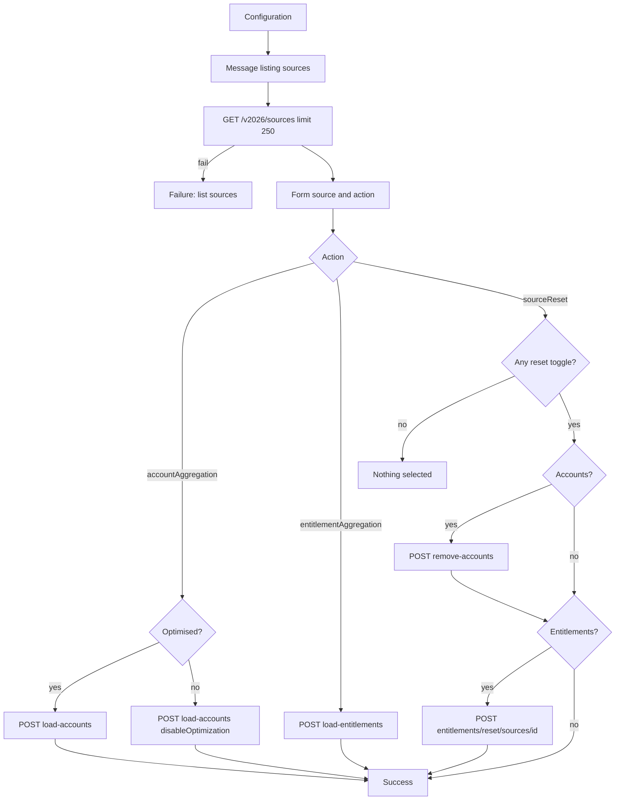

# Source Management

## Purpose

Interactive ISC process that lets an operator pick an existing source and run one of:

- **Account Aggregation** (optimised or full)
- **Entitlement Aggregation**
- **Source Reset** (accounts and/or entitlements in ISC)

This package is a reusable export. Tenant IDs, OAuth Parameter Storage bindings, and owners are placeholders. Re-bind them after import.

## Overview

1. The workflow lists up to **250** sources (`GET /v2026/sources?limit=250&sorters=name`).
2. The operator selects a source and an action. Matching option toggles enable on the form:
   - Account Aggregation → **Optimised** (default Yes)
   - Source Reset → **Accounts** / **Entitlements** (default No), plus a warning
3. The workflow calls the matching source API and reports Status/Detail on failure.

| Action | Toggle | API |
|---|---|---|
| Account Aggregation | Optimised = Yes | `POST /v2026/sources/{id}/load-accounts` (optimised / empty body) |
| Account Aggregation | Optimised = No | `POST /v2026/sources/{id}/load-accounts` with `{"disableOptimization": true}` |
| Entitlement Aggregation | — | `POST /v2026/sources/{id}/load-entitlements` |
| Source Reset | Accounts = Yes | `POST /v2026/sources/{id}/remove-accounts` |
| Source Reset | Entitlements = Yes | `POST /v2026/entitlements/reset/sources/{id}` |

Both reset toggles may be Yes; accounts run first, then entitlements. Source Reset with both toggles No ends with an error message and calls no API.

ISC Search has no sources index, so the source picker is filled from the list API (`FORM_INPUT`), not `SEARCH_V2`.

## Artifacts

| File | Type | Purpose |
|---|---|---|
| `Forms - Source Management.json` | Form export (array) | Source Management form for VS Code form import |
| `Workflow - Source Management.json` | Workflow export | Interactive Source Management process |
| `Source Management.sp-config.json` | Combined SP-Config | Form + workflow in one import package |

> **Form import format:** The SailPoint VS Code extension expects a **JSON array** (`[{ version, self, object }, …]`). Import `Forms - Source Management.json` first. Fields must sit inside a **SECTION**.
>
> `object.owner` is required (`{ type: IDENTITY, id, name }`). Point `YOUR_OWNER_IDENTITY_ID` / `YOUR_OWNER_IDENTITY_NAME` at a valid identity before importing.

### Exported objects

- **Workflow:** `Source Management` (disabled by default)
- **Form definition:** `Source Management`

## Architecture

**Trigger:** `idn:interactive-process-launched` (interactive process event). Update the workflow ID filter after import.

## Workflow configuration

HTTP actions take credentials from **Parameter Storage**, not inline client secrets. Create the parameters in the tenant, then bind the placeholder IDs.

| Variable | Placeholder | Purpose |
|---|---|---|
| url | `https://{tenant}.api.identitynow-demo.com` | ISC API base (no trailing slash) |

Also replace:

| Placeholder | Where |
|---|---|
| `YOUR_OAUTH_PARAMETER_ID` | OAuth 2.0 Client Credentials (`type` `1.4`) on every HTTP action |
| `YOUR_OAUTH_SCOPES_PARAMETER_ID` | OAuth scopes (`type` `3.1`) on every HTTP action |
| `YOUR_WORKFLOW_ID` | Workflow `id` and interactive-process trigger filter |
| `YOUR_OWNER_IDENTITY_ID` / `YOUR_OWNER_IDENTITY_NAME` | Workflow and form owners |
| Form definition ID | After form import, ISC assigns a new ID — update **Form: Source and action** |

Preferred scopes include source and entitlement manage rights. On some tenants `sp:scopes:all` is required for `remove-accounts` / entitlement reset (documented scope gaps).

### emea-tes-team example

Working bind values from tenant `emea-tes-team` (`company24509-poc`). Copy the pattern, not the ids, unless you are targeting that tenant.

| Setting | Example |
|---|---|
| API url | `https://company24509-poc.api.identitynow-demo.com` |
| OAuth client credentials (`1.4`) | `b1ac0177-b66b-4ada-840e-73f500f4822b` (`Mr Robot - PAT`; token URL `{api}/oauth/token`, credentials in **HEADER**) |
| OAuth scopes (`3.1`) | `4b5bad41-562e-4622-b3df-1cd7b1e5ccb2` (`sp:scopes:all`) |

Secrets stay in Parameter Storage. The export never stores the client secret.

## Forms

### Source Management

| Field | Type | Notes |
|---|---|---|
| Source | SELECT | Required `FORM_INPUT` `sources` from `GET /v2026/sources` (`label` = name, `value` = id) |
| Action | SELECT | Required static options; `value` is camelCase (`accountAggregation`, …) for the workflow |
| Optimised | TOGGLE | Default Yes; in `account-aggregation-section`, shown only for Account Aggregation |
| Accounts | TOGGLE | Default No; in `source-reset-section`, shown only for Source Reset |
| Entitlements | TOGGLE | Default No; in `source-reset-section`, shown only for Source Reset |
| Reset warning | DESCRIPTION | In `source-reset-section`, shown only for Source Reset |

Visibility follows the SOD remediation pattern: optional fields live in their own **sections**, and conditions only **SHOW** those sections (no HIDE). ISC keeps SHOW-targeted sections hidden until the rule matches. Conditions compare Action against the option **label** (e.g. `Account Aggregation`); the workflow still branches on `formData.action` technical values.

## Installation

Import order matters. Workflows reference form definition IDs from this export; after import, ISC assigns new form IDs — update the workflow form step to match.

1. Import **`Forms - Source Management.json`**.
2. Import **`Workflow - Source Management.json`** (or the combined `Source Management.sp-config.json`).
3. Set form and workflow owner identities if import rejected empty/placeholder owners.
4. Bind Parameter Storage OAuth (`1.4`) and scopes (`3.1`), and set API `url`.
5. Update the form definition ID on the workflow form step and the interactive-process trigger filter / workflow `id`.
6. Create an **interactive process** that launches this workflow and grant it to operators who may aggregate or reset sources.
7. Leave the workflow **disabled** until configuration is verified, then enable it.

## Operation notes

- The source dropdown stores the source **ID**. Success and error messages show that ID (the SELECT label is not always available in `formData`).
- Tenants with more than 250 sources will not list every source. Narrow with filters in a fork of this package if needed.
- Account and entitlement aggregations are accepted asynchronously; this workflow does not wait for completion.
- Account reset can fail when a source owner account still exists on the source. The failure message surfaces Status and Detail.
- Entitlement reset removes entitlements and access profiles tied to that source in ISC. It does not delete objects in the connected system.

## Test plan

- [ ] Source list fails → Status/Detail; no mutation
- [ ] Account Aggregation + Optimised Yes → `load-accounts` without `disableOptimization`
- [ ] Account Aggregation + Optimised No → `load-accounts` with `disableOptimization: true`
- [ ] Entitlement Aggregation → `load-entitlements`
- [ ] Source Reset, both toggles No → error message; no API
- [ ] Source Reset Accounts only → `remove-accounts` only
- [ ] Source Reset Entitlements only → entitlements reset only
- [ ] Source Reset both → accounts then entitlements
- [ ] HTTP 4xx/5xx (including “cannot reset while source owner account exists”) → error message; no silent success
- [ ] Optimised toggle enabled only for Account Aggregation; Accounts/Entitlements only for Source Reset

## Security

- Do not commit real OAuth client secrets. Keep them in Parameter Storage.
- Restrict the interactive process to operators authorised to aggregate and reset sources.
- Treat Source Reset as destructive for ISC data; prefer demos and non-production tenants for validation.
