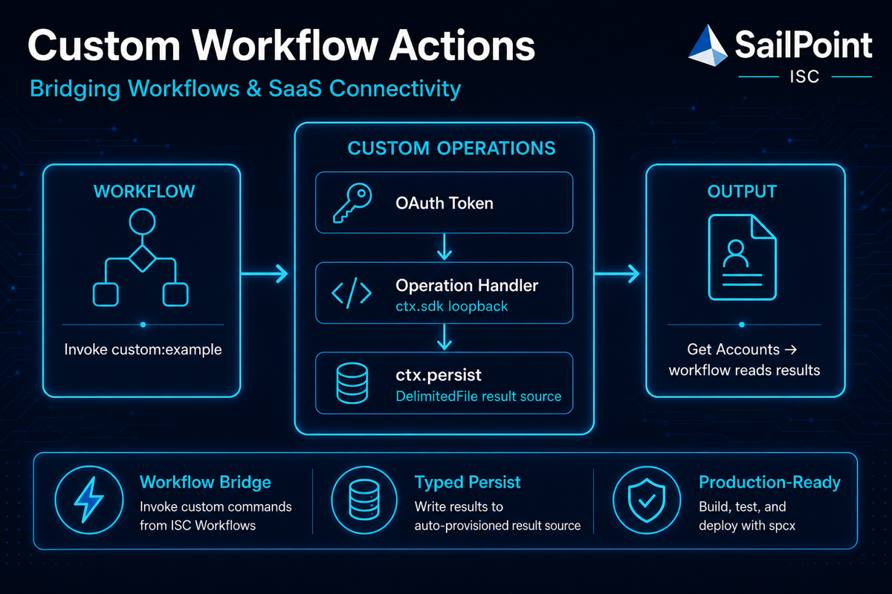

# saas-custom-operations

<p align="center">
  
</p>

## Purpose

Foundation template for SailPoint ISC **custom operations**: invoke commands from workflows, call back into ISC APIs, and persist typed results to an auto-provisioned DelimitedFile source for downstream **Get Accounts** steps. This connector is **not** an aggregation source—it is a runtime for workflow-driven custom logic.

## How it works

```
Workflow / API invoke
        │
        ▼
  Resolve sourceName → sourceId (create DelimitedFile if missing)
        │
        ▼
  Custom operation handler  ──►  ctx.sdk (ISC loopback)
        │
        ▼
  ctx.persist(...)  ──►  Reconcile schema → account create / upsert
        │
        ▼
  ctx.res.send(...)  ──►  Command response to caller
```

Each invocation receives a standard envelope (`config` + `input`), resolves the result source by name, builds a volatile `RequestContext`, runs your handler, and optionally writes typed output to the result source so downstream workflow steps can read results with **Get Accounts**.

## Prerequisites

### Result source (auto-provisioned)

Configure a **source name** in connector config (`sourceName`). On each invocation the framework:

1. Looks up an ISC source with that name
2. Creates a DelimitedFile source with CSV provisioning if missing (owner = token identity), applying the **base account schema** (core attrs plus the **invoking operation's** output fields)
3. Reconciles the account schema before each `ctx.persist` for the current operation's output fields (add-only for attributes from other operations on first use)

Core attributes are always ensured on the schema: `id` (identity), `status`, `date`, `details` (human-readable outcome text), and `operationName` (invoking custom command, e.g. `custom:sod-remediation`).

**Token scopes:** The access token must allow source read/create/update and account create on the result source. PAT or OAuth client credentials used in workflows need `sp:manage:source`, `sp:manage:source-schema`, and account provisioning scopes for the tenant.

Manual source setup is not required. `npm run templates` generates `account-schema.json` as reference documentation showing the union of all operation output fields; at runtime, auto-created result sources receive core attrs plus the invoking operation's fields, with per-persist reconciliation when other operations write attributes.

## Workflow export

The `workflows/` directory contains an ISC **Export Job** snapshot you can import for the reference **SaaS Custom Operations Call** workflow:

| File | Contents |
|---|---|
| `workflows/SaaS Custom Operations.json` | Example **WORKFLOW** — invoke `custom:example`, then read results with **Get Accounts** |

The workflow demonstrates:

- Configuration variables → OAuth token → connector invoke → **Get Accounts** filtered by `requestId`
- `config.sourceName` passed on invoke (the connector creates the DelimitedFile result source on first use)

No separate result source import is required. The framework resolves `sourceName` at runtime, creates the DelimitedFile source when missing, and reconciles account schema on each `ctx.persist`.

### Importing the workflow

1. In ISC Admin, open **Global → Import / Export → Import**.
2. Upload `workflows/SaaS Custom Operations.json`.
3. Review and confirm import of the workflow object.
4. Update workflow **Configuration** step variables for your tenant:
   - **API URL** — e.g. `https://your-tenant.api.identitynow.com`
   - **SaaS Custom Operations Source Name** — name for the auto-provisioned result source (e.g. `SaaS Custom Operations`; passed as invoke `config.sourceName`)
   - **SaaS Custom Operations Connector ID** — your deployed custom connector ID
5. Configure the **Get Access Token** step with a valid OAuth client (Basic auth reference).
6. Enable the workflow and trigger it (external HTTP trigger) or run steps manually while testing.

> **Note:** Export files are tenant-specific snapshots. Object IDs, owners, and OAuth references in the JSON will differ after import — treat the workflow as a template and re-point configuration to your connector and credentials.

## Build and deploy

```bash
npm install
npm test
npm run build
npm run pack-zip    # produces a deployable connector package via spcx
```

Upload the packaged connector to ISC and note the connector ID for workflow configuration and invoke calls.

## Usage

### Invoke payload

Custom operations use the standard SaaS connector invoke shape. See `invoke-payload.json` for a workflow-ready example:

```json
{
    "connectorRef": "{{$.defineVariable.saaSCustomOperationsConnectorID}}",
    "tag": "latest",
    "type": "custom:example",
    "input": {
        "requestId": "req-123",
        "message": "Hello, world!"
    },
    "config": {
        "apiUrl": "{{$.defineVariable.aPIURL}}",
        "token": "{{$.getAccessToken.body.access_token}}",
        "sourceName": "{{$.defineVariable.saaSCustomOperationsSourceName}}"
    }
}
```

| Section | Fields | Description |
|---|---|---|
| `type` | command name | Must match a command in `connector-spec.json` (e.g. `custom:example`) |
| `connectorRef` | connector UUID | Workflow variable (e.g. `{{$.configuration.saaSCustomOperationsConnectorID}}`); ignored by `call:op` and spcx local debug |
| `tag` | `"latest"` | Connector package tag; required for ISC platform invoke |
| `config` | `apiUrl`, `token`, `sourceName` | ISC loopback credentials and result source name (auto-provisioned at runtime) |
| `input` | `requestId` + operation params | Per-invocation data; `requestId` correlates persisted accounts |

Workflow-ready examples under `payloads/*-workflow.json` use ISC template variables for `connectorRef` and `config` connection fields. Local `call:op` payloads use concrete `type`, `config`, and `input` only (`connectorRef` and `tag` are optional and ignored).

The framework strips `requestId` from operation input and exposes it on `ctx.requestId`. All other `input` fields are passed to your handler.

### Custom operations

Each registered command documents its invoke contract, payloads, and workflow integration in a co-located README under `src/operations/<slug>/`:

| Command | Documentation |
|---|---|
| `custom:example` | [src/operations/example/README.md](src/operations/example/README.md) |
| `custom:governance-group-emails` | [src/operations/governance-group-emails/README.md](src/operations/governance-group-emails/README.md) |
| `custom:access-model-sod-remediation` | [src/operations/access-model-sod-remediation/README.md](src/operations/access-model-sod-remediation/README.md) |
| `custom:access-model-sod-remediation-apply` | [src/operations/access-model-sod-remediation-apply/README.md](src/operations/access-model-sod-remediation-apply/README.md) |
| `custom:preventive-sod-check` | [src/operations/preventive-sod-check/README.md](src/operations/preventive-sod-check/README.md) |
| `custom:sod-remediation` | [src/operations/sod-remediation/README.md](src/operations/sod-remediation/README.md) |

When you add a new operation, copy `src/operations/_template/` (including `README.md`), implement the handler, and add a row to this table.

### Local development

```bash
npm run build && npm run dev
```

Post a test payload to the local connector runtime:

```bash
curl -X POST http://localhost:3000/ \
  -H "Content-Type: application/json" \
  -d @invoke-payload.json
```

Replace template variables in `invoke-payload.json` with real values when testing locally (`connectorRef` is ignored by `spcx run`; `config` and `input` must be concrete).

The POST body uses three top-level fields — `type` (command name), `config` (connection settings), and `input` (per-invocation payload including `requestId`):

```json
{
    "type": "custom:example",
    "config": {
        "apiUrl": "https://your-tenant.api.identitynow.com",
        "token": "<access-token>",
        "sourceName": "SaaS Custom Operations",
        "testMode": true
    },
    "input": {
        "requestId": "local-dev-001",
        "message": "Hello from spcx"
    }
}
```

#### Default request logging

Every invoke during `npm run debug` logs an **Incoming request** section to stdout before the handler runs. The output matches the readable format used by `npm run call:op` (section headers and spread JSON). The log includes `type`, `input`, and resolved `config` when available. **`config.token` is always redacted** as `[REDACTED]` — other config fields are shown as received.

### Persist inhibition (`config.testMode`)

Set `config.testMode: true` (or export `SPCX_TEST_MODE=1` for config-less runs) to run handler logic without writing accounts or mutating source schema on ISC. `ctx.res.send` behaves normally; each inhibited `ctx.persist` / `ctx.verifyPersisted` call is logged to the console with a `[test-mode]` prefix.

| Config provided | ISC behavior | Writes |
|---|---|---|
| Yes (full `apiUrl`, `token`, `sourceName`) | Read-only status check + list-only source lookup; fails on missing/invalid token | Inhibited (logged) |
| Partial (`apiUrl` without `token`, or the reverse) | Rejected with incomplete connection config — no offline fallback | N/A (invoke fails) |
| No | All ISC calls skipped | Inhibited (logged) |

Run from an invoke payload:

```bash
npm run call:op -- payloads/custom-example-offline.json
npm run call:op -- payloads/custom-example.json   # requires valid token in config
```

Offline payloads (no `config` block) automatically enable persist inhibition (`testMode`) in the local runner. You can also export `SPCX_TEST_MODE=1` when invoking handlers outside the runner.

```json
{
  "type": "custom:example",
  "input": { "requestId": "offline-001", "message": "hello" }
}
```

Config-present dry-run payload:

```json
{
  "type": "custom:example",
  "config": {
    "apiUrl": "https://your-tenant.api.identitynow.com",
    "token": "<access-token>",
    "sourceName": "SaaS Custom Operations",
    "testMode": true
  },
  "input": { "requestId": "payload-001", "message": "dry run" }
}
```

Partial config (e.g. `{ "testMode": true }` only) is rejected — provide full connection fields or omit config entirely.

The local runner (`npm run call:op`) resolves handlers from the codegen-exported `OPERATION_HANDLERS` map in `src/operations/auto-registry.ts`. After you add an auto-discovered custom operation and run `npm run build` (or `npm run codegen:schemas`), local invoke works without editing `scripts/call-op.ts`.

### Invoke against a deployed connector

With the SailPoint CLI:

```bash
sail conn invoke raw -c {connectorId} -f invoke-payload.json
```

Or from a workflow HTTP action (as in the reference workflow export):

```
POST {apiUrl}/beta/platform-connectors/{connectorId}/invoke
Authorization: Bearer {access_token}
Content-Type: application/json

{ ... invoke payload ... }
```

### Reading results in a workflow

After invoke, read persisted output from the result source using **Get Accounts** filtered by native identity:

- Filter: `nativeIdentity eq "{requestId}"` (or a child id such as `{requestId}:detail`)
- Map operation output attributes, `status`, `date`, `operationName`, and optional `details` from account attributes
- On failure, the framework upserts a result account with `status: failed`, `operationName`, and `details` set to the error message (same text as invoke `{ error }`), so Get Accounts works for failed invocations too

The reference workflow export demonstrates this pattern in the **Read SaaS Custom Operation Result** step.

## Extending the connector

### 1. Add an operation handler

Copy `src/operations/_template/` to `src/operations/<slug>/` and implement your handler in `index.ts`. Copy and fill in `README.md` for invoke payloads and workflow integration. Declare `input` and `output` on an `OperationSignature` interface — the build generates a matching schema sidecar at `index.schema.ts`.

**Layout:** every custom operation lives in `src/operations/<slug>/index.ts` with a co-located `README.md`. Domain modules, seeds, and operation-specific tests stay in the same folder. See [Custom operations](#custom-operations) for links to each operation's README. Generic ISC helpers live under `src/isc/<api-grouping>/` — one subdirectory per ISC API surface (forms, sources, accounts, violations, controls, identity-history, access-profiles, roles, identity-access, token-identity, public-identities, recommendations, governance-groups, access-requests, events-search, sod-prediction). Account **schemas** are managed via `sources/` (SourcesApi); account **instances** via `accounts/` (AccountsApi). Each API folder MUST include an `index.ts` that exports its public API; consumers import from the folder entry (e.g. `../../isc/violations`). Shared pre-SDK HTTP transport lives in `src/isc/http/`. Cross-API orchestration belongs in identity-access only. Framework orchestration stays in `src/framework/`.

Persist output attribute names MUST use the `{slug}:` prefix where `slug` is the command without `custom:` (e.g. `custom:my-operation` → `my-operation:result`).

**Auto-discovery (recommended):** add a `command` string literal to your interface. Codegen registers the handler, syncs `connector-spec.json`, and wires the schema registry — no manual `index.ts` entry required.

```typescript
import { customOperation, OperationSignature } from '../../framework'

export interface MyOperation extends OperationSignature {
    command: 'custom:my-operation'
    input: {
        accountId?: string
    }
    output: {
        'my-operation:result': string
        'my-operation:detail'?: string
    }
}

export const myOperation = customOperation<MyOperation>(
    async (ctx, input) => {
        console.log(`[${ctx.requestId}] starting`, input)

        await ctx.persist(ctx.requestId, { 'my-operation:result': 'result-value' })
        await ctx.persist(`${ctx.requestId}:detail`, { 'my-operation:detail': 'step-output' }, 'success')

        ctx.res.send({ status: 'success' })
    }
)
```

Run `npm run codegen:schemas` (also runs on `npm run build`) to generate `<slug>/index.schema.ts`, update `auto-registry.ts`, and sync `connector-spec.json`.

**Manual registration:** omit `command` from the interface, register in `index.ts`, import the generated sidecar, and pass it explicitly:

```typescript
import { myOperationSchema } from './my-slug/index.schema'

export const myOperation = customOperation<MyOperation>(
    async (ctx, input) => { /* ... */ },
    { operationSchema: myOperationSchema }
)
```

```typescript
// src/operations/index.ts
export function registerCommands(connector: Connector): Connector {
    return registerAutoOperations(connector).command('custom:my-operation', myOperation)
}
```

Add the command to `connector-spec.json` manually when using the manual path (auto-discovery syncs it for you).

### 2. Rebuild and deploy

Rebuild, repackage, and redeploy. Invoke with `"type": "custom:my-operation"` and any additional fields in `input`.

### RequestContext API

Volatile context assembled per invocation by `customOperation`. Typed handlers receive `ctx` inferred from `OperationSignature.output`.

**Context fields**

| Member | Description |
|---|---|
| `ctx.requestId` | Correlation id from invoke `input` |
| `ctx.apiUrl` | ISC API base URL from invoke `config` |
| `ctx.token` | Access token from invoke `config` (Bearer prefix stripped) |
| `ctx.sourceName` | Configured result source name (resolved/created at runtime) |
| `ctx.sourceId` | Resolved ISC source ID after `sourceName` lookup |
| `ctx.operationSchema` | Current command output field contract used for schema reconciliation |
| `ctx.persist(...)` | Write results to the result source (auto-provisioned DelimitedFile) |
| `ctx.verifyPersisted(...)` | Batch verify deferred writes |
| `ctx.res` | Connector SDK response object — call `ctx.res.send(...)` |

**`ctx.sdk` clients** (pre-configured `sailpoint-api-client` instances)

| Member | Description |
|---|---|
| `ctx.sdk.accounts` | Account create, update, and read used by `ctx.persist` |
| `ctx.sdk.sources` | Result source lookup, creation, and schema management |
| `ctx.sdk.forms` | Custom Forms definition search/create and form instance create |
| `ctx.sdk.identityHistory` | Identity assigned access / entitlement history |
| `ctx.sdk.accessProfiles` | Access profile entitlement expansion |
| `ctx.sdk.roles` | Role entitlement expansion |
| `ctx.sdk.tasks` | Async task status polling (used by persist provisioning wait) |
| `ctx.sdk.governanceGroups` | Workgroup lookup and member listing |
| `ctx.sdk.accessRequests` | Access request status listing |
| `ctx.sdk.search` | ISC Search API (events index) |
| `ctx.sdk.sodViolations` | SoD violation prediction |

Prefer thin wrappers under `src/isc/<api-grouping>/` over calling SDK methods directly from handlers when the helper is reusable.

### Persist API

```typescript
interface MyOperation extends OperationSignature {
    input: { ... }
    output: { 'my-operation:fieldName': string, ... }  // namespaced with operation slug
}

customOperation<MyOperation>(async (ctx, input) => { ... })
ctx.persist(id, attributes?, status?, options?)
ctx.verifyPersisted(ids)
```

- **`OperationSignature`** — one interface with `input` and `output` using inline TypeScript type literals (aliases and imported types are not parsed by codegen)
- **Output keys** — persist attribute names use `{slug}:` prefix matching the command (without `custom:`)
- **`customOperation<T>(handler, options?)`** — types `input` and `ctx.persist` from `T`; pass the generated `{handler}Schema` sidecar for schema reconciliation
- **`ctx.persist`** — formats values using typed inference (numbers/booleans native, objects JSON-serialized); reconciles schema before write
- **`id`** — native account identity (often `ctx.requestId` or a derived child id like `` `${ctx.requestId}:detail` ``)
- **`attributes`** — only keys declared in the operation output schema; typed per `OperationSignature.output`
- **`status`** — optional, defaults to `"success"`
- **`details`** — optional STRING on success persists for informative text; on terminal failure the framework sets `details` to the normalized error message automatically
- **`operationName`** — framework-managed STRING set on every persist to the invoking custom command (`context.commandType`); handlers cannot override
- **`date`** — always set automatically to the current timestamp
- **`options.verify`** — optional, defaults to `true`; set to `false` to skip inline read-back verification

By default, `persist` reads the account back from ISC and verifies attributes before resolving. Pass `{ verify: false }` to defer verification, then call `verifyPersisted([...ids])` before the handler completes. Unknown attribute keys are rejected before the write.

Persistence uses probe-first upsert: `createAccountV1` when the native identity is absent on the result source, or `putAccountV1` when an account already exists. Both paths wait for the async provisioning task to complete, then read the account back for verification.

ISC enforces account value storage limits on result sources: **128 characters** for the persist identity (`id` / nativeIdentity) and **256 characters** per STRING attribute value (including JSON-serialized objects and each element of STRING arrays). Values exceeding a limit are truncated before write and a `[persist] truncated …` warning is logged — persist still succeeds with the shortened value.

## Development

```bash
npm install          # install dependencies
npm test             # run Vitest suite with coverage
npm run build        # codegen sidecars, then bundle to dist/ via ncc (packaging)
npm run codegen:schemas  # regenerate *.schema.ts sidecars from OperationSignature
npm run dev          # run locally with spcx (tsc watch → .dev-dist/)
npm run debug        # same as dev without source maps
npm run pack-zip     # build deployable connector package
npm run templates    # generate operator artifacts (see below)
```

### Invoke config

Custom operation invokes accept optional fields on the `config` object alongside `apiUrl`, `token`, and `sourceName`:

| Field | Required | Description |
|---|---|---|
| `logUrl` | No | When set, the framework POSTs one JSON log event per `ctx.log` call (and at incoming request logging) to this URL. Console output is always emitted. Failures to POST do not fail the operation. |
| `testMode` | No | When true, persist and schema writes are inhibited (see test mode behavior elsewhere in this doc). |

External log events use this JSON shape:

```json
{
  "timestamp": "2026-08-18T10:00:00.000Z",
  "level": "info",
  "requestId": "wf-run-8842",
  "command": "custom:example",
  "message": "step complete",
  "detail": { "optional": "structured payload" }
}
```

Token, bearer, and other sensitive keys in `detail` are redacted before POST. Whitespace-only `logUrl` values are treated as unset.

### Operation logging (`ctx.log`)

Handlers wrapped with `customOperation` receive `ctx.log` with `info`, `warn`, and `error(message, detail?)`. Every line is prefixed with `[requestId]` on stdout. When `config.logUrl` is set, the same calls also fire-and-forget POST the JSON event above.

```typescript
ctx.log.info('discovered policies', { count: policies.length })
ctx.log.warn('source missing — using placeholder')
ctx.log.error('form create failed', { formName: input.formName })
```

See `payloads/custom-example.json` for a connected dry-run payload that includes optional `logUrl`.

### Operator templates

Run `npm run templates` after adding or modifying operations under `src/operations/`. The generator introspects auto-discovered and manually registered handlers and writes local-only artifacts to `./templates/` (gitignored). Markdown guides follow the step structure of the **SaaS Custom Operations Call** workflow embedded in `workflows/SaaS Custom Operations.json`:

| File | Purpose |
|---|---|
| `account-schema.json` | Reference account schema — core attrs plus union of all operation output fields (runtime auto-create is operation-scoped) |
| `access-token.md` | Shared OAuth client-credentials guide with tenant placeholders |
| `workflow-invocation.md` | Per-operation invoke body, read-result, and child-identity steps |

Re-run whenever you add an operation or change an operation's `OperationSignature` or `ctx.persist` patterns. Discovery includes auto-registered ops (`command` literal on the interface) and manual index.ts registrations.

## Project structure

```
src/
  framework/          # RequestContext, persist, source provisioning, schema inference, SDK factory
  isc/                # ISC SDK loopback helpers (identity access, experimental HTTP, generic forms)
    forms/            # Parameterized Custom Forms primitives (seed load, ensure definition, create instance)
    sources/          # Generic SourcesApi wrappers (find, create, schema read/patch)
  operations/         # Custom operation handlers (add yours here)
    _template/        # Authoring scaffold — copy directory when adding operations
      index.ts
      README.md
    example/
      index.ts
      README.md
      index.schema.ts # Auto-generated — do not edit manually
    sod-remediation/  # Example domain-heavy operation layout
      index.ts
      README.md
      index.schema.ts # Auto-generated — do not edit manually
    auto-registry.ts  # Auto-generated command + schema registration
    index.ts          # Calls registerAutoOperations; append manual .command() as needed
  index.ts            # Connector entry point
scripts/
  call-op.ts                  # Local invoke runner (`npm run call:op`)
  generate-templates.ts       # Operator artifact generator (`npm run templates`)
  generate-operation-schemas.ts
  templates/                  # Generator modules (account-schema, workflow-invocation, …)
connector-spec.json   # Declared commands and sourceConfig (ISC loopback settings)
invoke-payload.json   # Example invoke body for local / CLI testing
payloads/             # Invoke payloads — local (`call:op`) and workflow-ready (`*-workflow.json`)
workflows/
  SaaS Custom Operations.json              # ISC export (example workflow)
  SOD Remediation - Violation Response.json
  SOD Remediation - Action.json
templates/            # Generated operator artifacts (gitignored; output of npm run templates)
```


